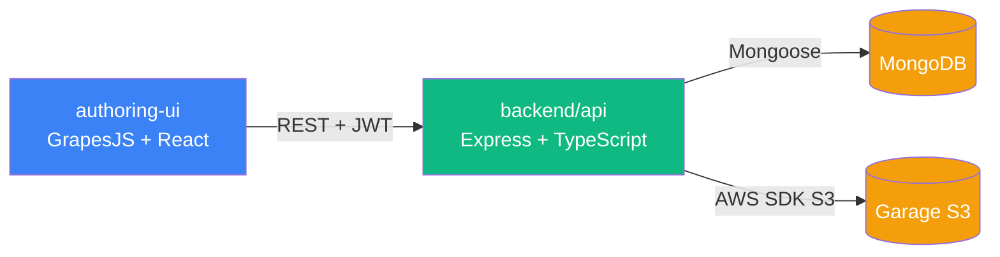

# eLearn Studio — Technical Documentation Skill

## Audience Profile

The reader is a **developer, DevOps engineer, or LMS integrator** who:
- Is comfortable with Docker, TypeScript, REST APIs, and command-line tools
- Wants to understand the system quickly and start working
- Prefers examples over explanations — show the command, then explain if needed
- Is likely reading on GitHub or in a code editor, not a rendered site

Never write for a non-technical audience in these documents.
Never explain what Docker or TypeScript is.

---

## Voice & Tone

**Direct.** Get to the point immediately. No preamble like "In this section we will explore...".

**Imperative.** Use commands: "Run", "Add", "Configure", "Replace" — not "You should run", "It is recommended to add".

**Precise.** Use exact names: `docker compose up`, not "start the containers". `PUT /courses/:id`, not "the update endpoint". `packages/authoring-ui/src/`, not "the frontend folder".

**Neutral.** No enthusiasm, no marketing language. "Garage is an S3-compatible object store" — not "Garage is an amazing, powerful storage solution".

**Consistent terminology** — always use these exact terms, never synonyms:
- Course (never "project" or "book")
- Slide (never "page" or "screen")
- Widget (never "component" or "element" when referring to course content objects)
- Action Sequence (never "script" or "behavior")
- Garage (never "MinIO" — MinIO is not used in this project)
- Runtime Player (never "player" alone when ambiguous)
- Authoring UI (never "frontend" alone when referring to the GrapesJS editor)

---

## Document Structure Rules

### README.md
1. Badges line (CI, license, version)
2. One-sentence description
3. Screenshot or architecture diagram — immediately visible without scrolling
4. Quick Start — maximum 6 commands to get running
5. Feature list — bullet points, one line each
6. Package structure — tree with one-line descriptions
7. Links to docs

**No long prose in README.** If it needs more than 2 sentences to explain, it belongs in a dedicated doc.

### Setup / Installation docs
Always follow this order:
1. Prerequisites (with exact versions)
2. Installation steps (numbered, one action per step)
3. Verification (how to confirm it worked — expected output shown)
4. Configuration reference (table: variable | default | description)
5. Troubleshooting (most common errors + fix)

### API Reference docs
Each endpoint entry must have:
- HTTP method + path in a heading: `### POST /courses`
- One-line description
- Auth requirement: `Requires: Bearer token` or `Public`
- Request: headers table + body schema (TypeScript interface or JSON example)
- Response: status codes table + body example
- Error cases: status + message
- `curl` example — always include one

### Developer Guide sections
Start every section with:
- What this section covers (1 sentence)
- When you need this (1 sentence)
Then: code, commands, diagrams. Prose only to connect the pieces.

### Architecture docs
Lead with a Mermaid diagram, then explain each component in the diagram.
Never describe architecture in prose without a diagram alongside.

---

## Mermaid Diagram Rules

Use Mermaid for ALL diagrams — never external images, never ASCII art.

**Diagram type selection:**
| Situation | Diagram type |
|---|---|
| System components + data flows | `graph LR` or `graph TD` |
| API request/response sequence | `sequenceDiagram` |
| Database / data model | `erDiagram` |
| Deployment / infrastructure | `graph TD` with subgraphs |
| Package dependencies | `graph LR` |
| CI/CD pipeline | `flowchart LR` |
| State machine | `stateDiagram-v2` |

**Style rules for Mermaid:**
- Keep diagrams focused — max 12 nodes per diagram. Split into multiple if larger.
- Use subgraphs to group related components
- Label all edges with the data or action flowing between nodes
- Use `classDef` to color-code by layer: frontend (blue), backend (green), storage (orange), infrastructure (grey)
- Always test that the diagram renders before finalizing

**Renderer compatibility — required for PyCharm's Markdown preview (the strictest renderer in the toolchain):**
- **Never put `;` inside a sequence-diagram message label.** Mermaid treats `;` as a statement separator, so `A->>B: foo(); bar()` breaks the parser with an `Expecting SOLID_OPEN_ARROW … got NEWLINE` error. Use `,` for chained calls, or split into two message lines.
- **Never use HTML entities** (`&lpar;`, `&rpar;`, `&#40;`, `&amp;`, …) inside node labels or edge labels. Older renderers emit them as literal text. Use the actual character inside a quoted label instead.
- **Quote any label that contains** `(` `)` `,` `:` `?` `#` `'` `—` (em-dash) `·` (middle dot) `→` (arrow) or a leading digit. Square-bracket nodes (`N["label (x)"]`), decision diamonds (`D{"ready?"}`), subgraph titles (`subgraph id["Title — hint"]`), and edge labels all accept double-quoted strings. Leave simple alphanumeric labels unquoted.
- Sequence-diagram message text and `Note over` / `Note right of` labels are free-form until end-of-line — em-dashes, commas, and parentheses are fine there. The `;` rule still applies.
- Before committing any doc with mermaid, verify rendering in **both** GitHub's preview and PyCharm's Markdown preview. PyCharm catches things GitHub silently accepts.

**Example pattern for architecture diagrams:**


---

## Code & Command Formatting

**Always specify the language** in fenced code blocks:
````
```typescript
```bash
```yaml
```json
```

**Shell commands:**
- Show the exact directory context when it matters:
  ```bash
  # From monorepo root
  pnpm install
  
  # From backend/api
  pnpm test
  ```
- Show expected output for verification steps:
  ```bash
  docker compose ps
  # Expected:
  # NAME        STATUS    PORTS
  # api         running   0.0.0.0:3001->3001/tcp
  # mongo       running   27017/tcp
  # garage      running   0.0.0.0:3900->3900/tcp
  ```

**TypeScript interfaces for schemas** — prefer over JSON examples for request/response bodies:
```typescript
// Preferred
interface CreateCourseRequest {
  title: string
  description?: string
}

// Only when showing actual data values
{
  "title": "Introduction to Safety Procedures",
  "description": "Annual compliance training"
}
```

---

## What to Avoid

- **No passive voice** for instructions: ~~"The file should be edited"~~ → "Edit the file"
- **No version numbers** for Docker images unless pinning is intentional — use `latest` or the project's standard
- **No "simply", "just", "easily"** — these are condescending
- **No TODO comments** in documentation — either write it or note it as "not yet implemented"
- **No MinIO** — it is not in this project. Garage only.
- **No localhost hardcoded** in examples that might run in CI or production — use env vars or note the default
- **No screenshots in developer/API docs** except for Grafana dashboards — use code and diagrams instead

---

## Port Reference (always use these exact ports in docs)

| Service | Port | URL |
|---|---|---|
| authoring-ui | 3000 | http://localhost:3000 |
| backend/api | 3001 | http://localhost:3001 |
| Grafana | 3002 | http://localhost:3002 |
| Garage S3 API | 3900 | http://localhost:3900 |
| Garage Admin API | 3903 | http://localhost:3903 |
| Loki | 3100 | http://localhost:3100 |
| Tempo | 3200 | http://localhost:3200 |
| MongoDB | 27017 | mongodb://localhost:27017 |
| Prometheus | 9090 | http://localhost:9090 |
| Moodle | 8081 | http://localhost:8081 |
| OTel HTTP | 4318 | http://localhost:4318 |
| cAdvisor | 8082 | http://localhost:8082 |

---

## Checklist Before Finishing Any Technical Doc

- [ ] All commands are copy-pasteable (no placeholders left unreplaced)
- [ ] All Mermaid diagrams render without errors
- [ ] No `;` inside sequence-diagram message labels (use `,` instead)
- [ ] No HTML entities (`&lpar;`, `&rpar;`, `&#40;`, …) in mermaid labels
- [ ] Labels containing `(`, `)`, `,`, `:`, `?`, `—`, `·`, `→` are wrapped in double quotes
- [ ] Port numbers match the reference table above
- [ ] No MinIO references anywhere
- [ ] Links to other docs use relative paths, not absolute URLs
- [ ] `openapi.json` and `generated.ts` are mentioned as generated files (not committed)
- [ ] Code examples have language specifiers on fenced blocks
