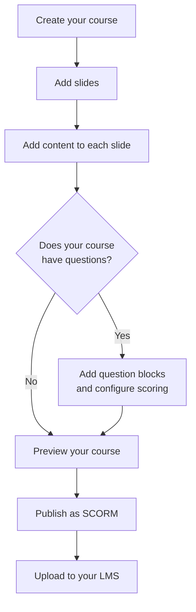

# eLearn Studio — User Guide Documentation Skill

## Audience Profile

The reader is a **trainer, instructional designer, or educator** who:
- Creates e-learning courses professionally or as part of their teaching role
- Is comfortable with tools like PowerPoint, Google Slides, or similar authoring tools
- Has NO expectation of knowing what Docker, JSON, TypeScript, or APIs are
- Cares about outcomes: "Can I create the course I need?"
- Is likely reading on a screen while also working in the application

**Write as if the reader has never seen eLearn Studio before,
but has years of experience designing training materials.**

---

## Voice & Tone

**Friendly and clear.** Like a knowledgeable colleague explaining the tool, not a manual written by engineers.

**Task-oriented.** Every section answers: "What am I trying to do, and how do I do it?"
Lead with the goal, then the steps.

**Encouraging without being patronizing.** Assume competence in instructional design.
Never assume technical knowledge.

**Present tense, active voice:**
- ✅ "Click the **+** button to add a new slide"
- ❌ "A new slide will be added by clicking the **+** button"
- ❌ "The user should click the **+** button"

**Second person, direct address:** "You", "your course", "your slides" — the reader is always "you".

---

## Vocabulary Rules

### Always use — e-learning world terms
| Use this | Never use this |
|---|---|
| Course | Project, book, application |
| Slide | Page, screen, frame |
| Question | Widget (for questions), component |
| Element / content block | Widget (when talking to users) |
| Simulation | Sim, scenario recorder |
| Learning Management System (LMS) | Backend, server |
| Publish / Export | Deploy, package, build |
| Score / Result | Data, payload |
| Save | Persist, commit |
| Preview | Render, serve |

### Forbidden in user docs — never use these words
- Widget (use "element", "content block", "question", or the specific name)
- API, endpoint, REST, JSON, YAML, TypeScript, JavaScript
- Docker, container, database, MongoDB, Garage, S3
- Backend, frontend, monorepo, package, bundle
- OTLP, Prometheus, Grafana, Loki (observability is invisible to users)
- Debug, console, terminal, command line
- Repository, git, commit, branch
- null, undefined, boolean, string, array

### Technical standards — explain or use user-friendly names
| Technical term | How to write it for users |
|---|---|
| SCORM 1.2 | SCORM 1.2 (first use: "SCORM 1.2, the most widely supported format") |
| SCORM 2004 | SCORM 2004 |
| AICC | AICC |
| xAPI / TinCan | xAPI |
| LMS | LMS (first use: "your Learning Management System, or LMS") |
| ZIP file | ZIP file (never "package") |

---

## Document Structure Rules

### Section structure (every user guide section)
1. **Brief intro** (1–2 sentences): what this feature does and when you'd use it
2. **Screenshot** (if available from T500): shows the real UI before explaining it
3. **Step-by-step instructions**: numbered, one action per step
4. **Tips** (optional): practical advice from real use
5. **What to do if it doesn't work** (optional): for common user mistakes

### Step-by-step instructions
- Numbered list, one action per number
- Bold the UI element being clicked/selected: "Click **Publish**"
- Use arrows for menu navigation: **File → Export → SCORM 1.2**
- Keep each step to one sentence if possible
- Show expected result after key steps: "The slide appears in the list on the left."

**Example of a well-written step sequence:**
```
1. Click the **+** button at the top of the slide list.
   A new blank slide appears and is automatically selected.
2. Double-click the slide title ("Slide 2") to rename it.
3. Type your slide title and press **Enter** to confirm.
```

### Screenshots
Every screenshot must have:
- A descriptive caption below it: *The Block Manager panel showing available content types*
- Alt text suggestion in a comment for accessibility
- Reference to the task-specific filename from T500: ``

When referencing a specific element in a screenshot, use a callout or number it in the caption:
*The Publish button (1) and Preview button (2) are in the top right toolbar*

### Tips and warnings
Use these callout styles consistently:

```
> 💡 **Tip:** You can reorder slides by dragging them up or down in the slide list.

> ⚠️ **Important:** Always click **Save** before closing the browser tab.
> eLearn Studio auto-saves every 2 seconds, but saving manually
> ensures your latest changes are preserved.

> ℹ️ **Note:** The Done button is required in your course for scores
> to be recorded in your LMS.
```

---

## Mermaid Diagram Rules for User Docs

Use Mermaid sparingly in user docs — only when a diagram helps the user
understand a workflow they need to follow. Never for technical architecture.

**Appropriate diagram types for user docs:**
| Situation | Diagram type |
|---|---|
| Step-by-step workflow the user follows | `flowchart TD` |
| Decision: which feature to use | `flowchart TD` with decision diamonds |
| Course structure overview | `graph TD` |
| Simulation modes comparison | `flowchart LR` |

**Style rules for user-facing Mermaid:**
- Use plain language for node labels — no technical terms
- Keep it simple: max 8 nodes
- Use `flowchart` not `graph` for user workflows (more readable)
- Avoid subgraphs in user docs — they add complexity
- Always include a caption explaining what the diagram shows

**Example of an appropriate user-doc diagram:**

*The course creation workflow from start to publishing*

---

## How to Write About Specific Features

### Questions and scoring
Never say "configure the question widget properties".
Say: "Set up your question — choose the correct answer and how many points it's worth."

Explain scoring in terms of learning outcomes:
- ✅ "If a learner gets this question wrong, they can try again up to 3 times."
- ❌ "Set maxAttempts to 3 in the extended properties panel."

### Simulations
The two simulation types have user-friendly names:
- **Screenshot Simulation** → "Software Walkthrough" (shows learners how to use a real application)
- **Phaser Simulation** → "Interactive Scenario" (animated scenarios, process flows, diagrams)

Explain simulations in terms of the learning experience:
- ✅ "A Software Walkthrough guides learners through the steps of a real task,
  letting them practice at their own pace before doing it for real."
- ❌ "The Playwright-based simulation recorder captures CDP events..."

### SCORM publishing
Explain SCORM in terms of what the learner and LMS admin experience:
- ✅ "When you publish as SCORM, your LMS can track whether each learner
  has completed the course and what score they achieved."
- ❌ "The packager generates an imsmanifest.xml with the CMI data model."

Which format to choose — write a simple decision guide:
- SCORM 1.2 → "Works with almost every LMS. Choose this if you're not sure."
- SCORM 2004 → "Choose this if your LMS administrator recommends it."
- AICC → "Choose this only if your LMS specifically requires AICC format."

### The Actions Editor
This is the most technical-feeling feature for users. Frame it as "course logic":
- ✅ "Course logic lets you control what happens when a learner does something —
  for example, showing a hint when they click the wrong answer,
  or jumping to a different slide based on their score."
- ❌ "Action sequences are event-driven behaviors attached to widget objects."

---

## What to Avoid

- **No numbered headings** (## 1. Getting Started) — use descriptive headings only
- **No "simply" or "just"** — these minimize the user's effort when things feel hard
- **No acronyms without first expansion**: first use = "Learning Management System (LMS)", after = "LMS"
- **No future tense for current features**: ~~"You will be able to add slides"~~ → "You can add slides"
- **No passive voice for instructions**: ~~"Slides can be reordered"~~ → "Reorder slides by dragging"
- **No long paragraphs** — maximum 3 sentences before a break or list
- **No code blocks** — ever. Not even filenames. Refer to them as "the ZIP file", "the exported file"
- **No references to the file system** — users don't care where files are stored

---

## Section Length Guidelines

| Section type | Target length |
|---|---|
| Introduction paragraph | 2–3 sentences |
| Feature overview | 1 paragraph + 1 screenshot |
| Step-by-step procedure | 3–8 numbered steps |
| Tips block | 1–3 tips maximum |
| Full guide section | 400–800 words + screenshots |

If a section exceeds 800 words, split it into two sections.

---

## Checklist Before Finishing Any User Guide Section

- [ ] No technical vocabulary (widget, API, JSON, Docker, etc.)
- [ ] Every procedure uses numbered steps
- [ ] UI elements in bold: **Save**, **Publish**, **+ Add Slide**
- [ ] Screenshots have descriptive captions
- [ ] Tips use the callout format (💡 ⚠️ ℹ️)
- [ ] SCORM and LMS explained in plain language on first use
- [ ] "Simulation" types use the user-friendly names (Software Walkthrough / Interactive Scenario)
- [ ] No passive voice in instructions
- [ ] Section is under 800 words or has been split
