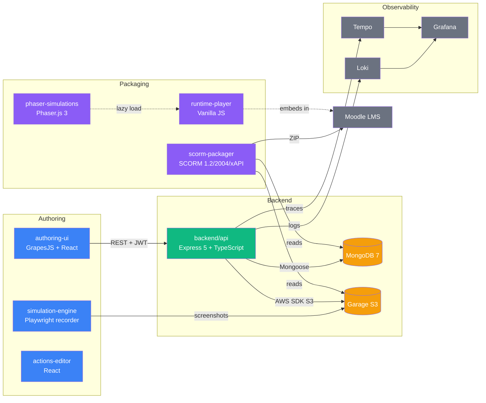
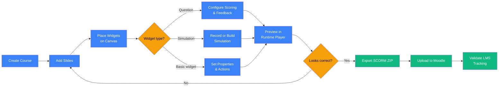
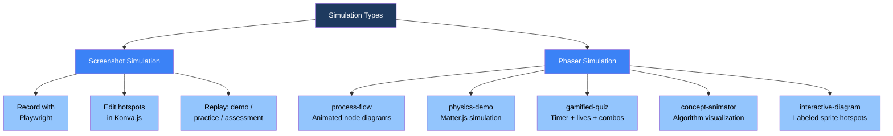

# eLearn Studio

[](https://github.com/canocampus/elearn-studio/actions/workflows/ci.yml)
[](LICENSE)
[](https://pnpm.io/)
[](https://www.typescriptlang.org/)
[](https://docs.docker.com/desktop/)

Open-source, web-based e-learning authoring platform inspired by ToolBook 11.5 — build software simulations, rich quizzes, and interactive courses, then publish to any LMS via SCORM 1.2 / SCORM 2004 / AICC / xAPI.

---


*Authoring UI — GrapesJS-based slide editor with Block Manager, Layer Manager, and Properties panel*

---

## System Architecture



---

## Quick Start

**Prerequisites:** [Docker Desktop](https://docs.docker.com/desktop/) (Engine ≥ 24), [Node.js](https://nodejs.org/) ≥ 20 LTS, [pnpm](https://pnpm.io/) ≥ 9

```bash
git clone https://github.com/canocampus/elearn-studio
cd elearn-studio
cp docker/.env.example docker/.env
docker compose -f docker/docker-compose.dev.yml up -d
pnpm install
pnpm dev
```

Services after startup:

| Service | URL |
|---|---|
| Authoring UI | http://localhost:3000 |
| Backend API | http://localhost:3001 |
| Grafana (observability) | http://localhost:3010 |

---

## Features

- **Visual slide editor** — drag-and-drop canvas (GrapesJS), layer manager, style panel, 1024×768 fixed layout
- **Widget library** — text, image, button, shape, media player, score display, navigation controls
- **Multiple Choice questions** — per-question scoring, weighted attempts, instant feedback
- **True/False and Fill-in-the-Blank questions** — full scoring engine with partial credit support
- **Screenshot simulations** — record any desktop workflow with Playwright; replay as hotspot-driven practice
- **Phaser simulations** — process flows, physics demos, gamified quizzes, concept animators, interactive diagrams
- **Action Sequences** — visual event→action builder (show/hide, navigate, score, branch on condition)
- **SCORM 1.2 and SCORM 2004 export** — compliant ZIP packages, imsmanifest.xml, sequencing rules
- **AICC and xAPI export** — same packager pipeline, different manifest/statement formats
- **Moodle 4.x validation** — local Docker LMS for smoke-testing packages before release
- **Observability stack** — structured logs (Pino → Loki), distributed traces (OTel → Tempo), dashboards (Grafana)
- **Garage S3 asset storage** — all media, screenshots, and Phaser sprites stored in S3-compatible object store
- **JWT authentication** — register/login, Bearer token on all API routes

---

## Project Structure

```
elearn-studio/
├── packages/
│   ├── authoring-ui/          # React 18 + Vite + GrapesJS — visual slide editor
│   ├── runtime-player/        # Vanilla JS — embeds in LMS iframes, loads widgets
│   ├── scorm-packager/        # SCORM 1.2 / 2004 / AICC / xAPI ZIP builder
│   ├── question-engine/       # Pure TypeScript — scoring and evaluation library
│   ├── actions-editor/        # React component — event→action visual builder
│   ├── simulation-engine/     # Playwright recorder + screenshot sim player
│   └── phaser-simulations/    # Phaser.js 3 — advanced simulation widget library
├── backend/
│   ├── api/                   # Node.js 20 + Express 5 + TypeScript REST API
│   ├── models/                # Mongoose schemas (Course, Slide, Widget, Asset)
│   └── storage/               # Garage S3 client + bucket management
├── docker/
│   ├── docker-compose.dev.yml # Dev stack: MongoDB, Garage, observability
│   └── docker-compose.yml     # Production-ready compose with Moodle
├── e2e/                       # Playwright E2E test suite (@elearn-studio/e2e)
└── docs/                      # All documentation + screenshot capture scripts
```

---

## Tech Stack

| Layer | Technology | Role |
|---|---|---|
| **Frontend** | React 18, GrapesJS, Zustand, Vite | Authoring UI, visual editor, state management, bundling |
| **Simulation** | Phaser.js 3, Konva.js, Playwright | Phaser sims, hotspot editor, screenshot recorder |
| **Backend** | Node.js 20, Express 5, TypeScript 5, Mongoose | REST API, route handling, data access layer |
| **Storage** | MongoDB 7, Garage S3 | Course document store, asset and screenshot storage |
| **Packaging** | scorm-again, SCORM 1.2/2004, AICC, xAPI | LMS-compliant ZIP output for all major standards |
| **Observability** | Pino → Loki, OpenTelemetry → Tempo, Prometheus, Grafana | Structured logs, distributed traces, metrics, dashboards |

---

## Course Authoring Workflow



---

## Simulation Types



---

## Documentation

| Document | Audience | Description |
|---|---|---|
| [User Guide](docs/user-guide/index.md) | Course authors | End-to-end guide for building, previewing, and publishing courses |
| [Setup Guide](docs/setup-guide.md) | All / first-time setup | Prerequisites, Docker setup, environment variables, first-run checklist |
| [Contributing Guide](docs/contributing-guide.md) | Contributors | Development workflow, tests, CI requirements, OpenAPI client regeneration |
| [API Reference](docs/api-reference.md) | Backend developers | REST endpoints, request/response schemas, authentication |
| [Observability Guide](docs/observability-guide.md) | DevOps / operators | Grafana dashboards, LogQL examples, trace correlation |
| [Architecture](CLAUDE.md) | Architects / senior devs | Full system architecture, data model, GrapesJS and Phaser integration details |

---

## License

eLearn Studio is released under the [MIT License](LICENSE).

Bundled components:
- **GrapesJS** — MIT
- **Phaser.js 3** — MIT
- **Garage** (Docker service only, not bundled) — AGPL-3.0. Running Garage as a separate Docker service carries no licensing obligations for eLearn Studio code.
