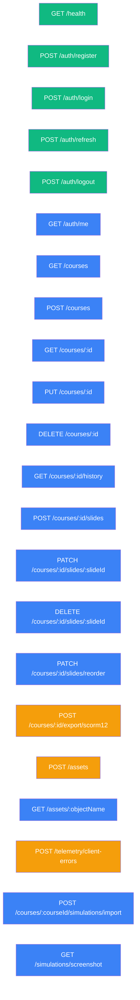

# API Reference

Covers the eLearn Studio REST API — all endpoints, auth, error handling, and request/response schemas.

---

## Base URL

```
http://localhost:3001
```

All paths below are relative to the base URL.

---

## Resource Map



**Legend:** green = public, blue = requires Bearer token, orange = requires Bearer token + rate limited

---

## Authentication

Most endpoints require a Bearer token in the `Authorization` header:

```
Authorization: Bearer <accessToken>
```

Obtain an access token via `POST /auth/login`. Access tokens are JWTs with a short expiry. Use `POST /auth/refresh` to issue a new access token using the `refreshToken` httpOnly cookie.

---

## Response Envelope

All endpoints return JSON in one of two shapes:

**Success:**
```typescript
interface SuccessEnvelope<T> {
  success: true
  data: T
}
```

> **Note:** A small number of endpoints that return no meaningful payload (e.g. `POST /auth/logout`) omit the `data` field entirely and return `{ success: true }`. This is intentional — the response type is documented per-endpoint.

**Error:**
```typescript
interface ErrorEnvelope {
  success: false
  error: string
}
```

**Paginated (history endpoint only):**
```typescript
interface PaginatedEnvelope<T> {
  success: true
  data: T[]
  meta: {
    total: number
    limit: number
    skip: number
  }
}
```

---

## Common Status Codes

| Status | Meaning |
|---|---|
| `200` | OK |
| `201` | Created |
| `302` | Redirect (asset retrieval) |
| `400` | Bad request — invalid input or missing required field |
| `401` | Unauthorized — missing, invalid, or expired token |
| `403` | Forbidden — action not allowed (e.g., registration disabled) |
| `404` | Not found |
| `409` | Conflict — resource already exists |
| `413` | Payload too large — file exceeds size limit |
| `415` | Unsupported media type — MIME type not allowed |
| `429` | Too many requests — rate limit exceeded |
| `500` | Internal server error |
| `503` | Service unavailable — storage backend unreachable |

---

## Rate Limits

| Endpoint | Limit | Window | Key |
|---|---|---|---|
| `POST /assets` | 20 requests | 15 min | per user |
| `POST /courses/:id/export/scorm12` | 5 requests | 15 min | per user |
| `POST /telemetry/client-errors` | 30 requests | 1 min | per user |

Rate-limited responses include `RateLimit-*` headers (draft-7 format).

---

## Sections

| File | Endpoints |
|---|---|
| [health.md](./health.md) | `GET /health` — liveness probe |
| [auth.md](./auth.md) | `/auth/*` — login, register, refresh, logout, me |
| [courses.md](./courses.md) | `/courses/*` — CRUD + slide atomic operations |
| [assets.md](./assets.md) | `/assets/*` — upload, retrieve |
| [export.md](./export.md) | `/courses/:id/export/*` — SCORM package generation |
| [history.md](./history.md) | `/courses/:id/history` — audit log |
| [simulations.md](./simulations.md) | `/courses/:id/simulations/*`, `/simulations/*` — simulation import + screenshot proxy |
| [telemetry.md](./telemetry.md) | `/telemetry/*` — client error reporting |

---

## Swagger UI

Interactive API explorer is available at:

```
http://localhost:3001/docs
```

Development only — returns 404 in production.

The spec is also available as JSON at `http://localhost:3001/openapi.json` and committed to the repository at `backend/api/openapi.json`.
