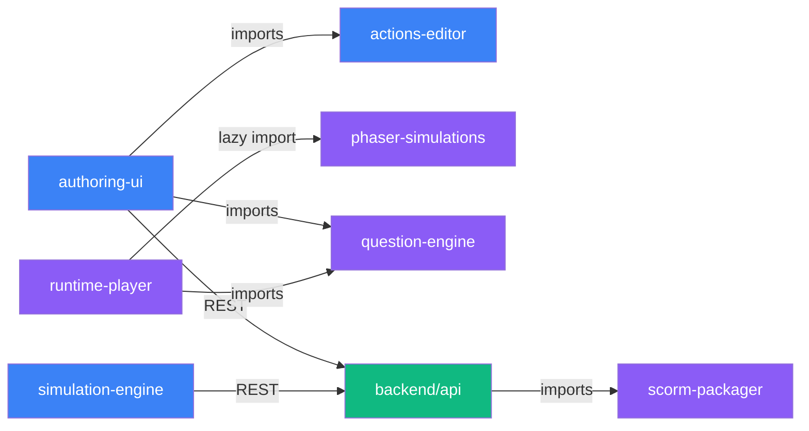
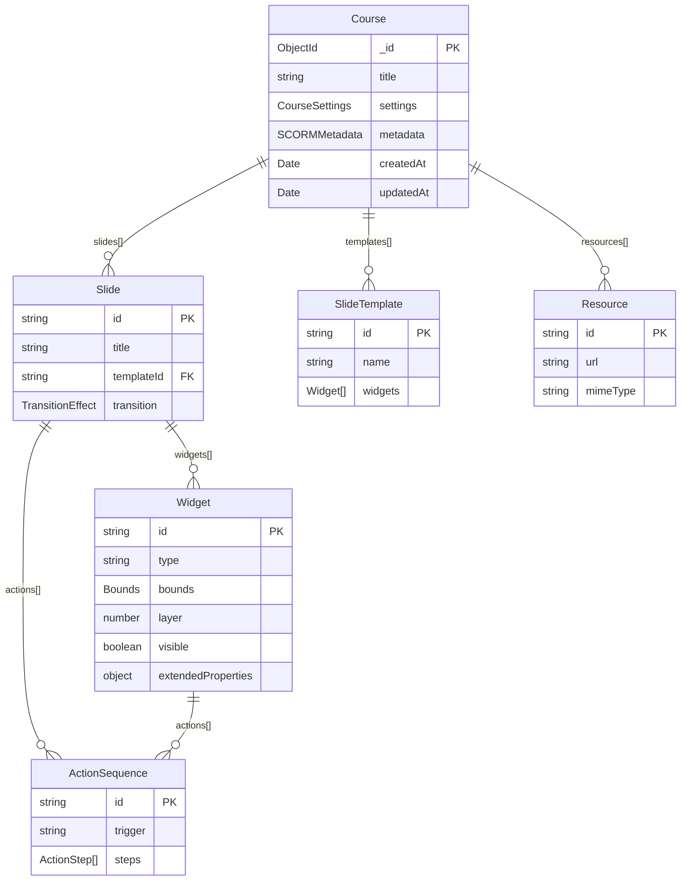
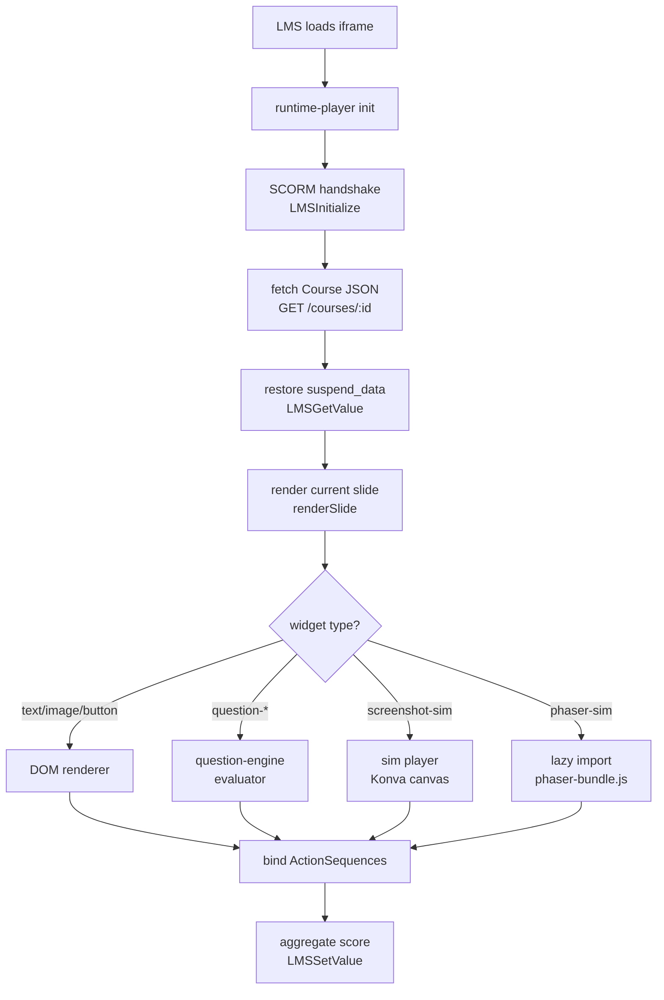
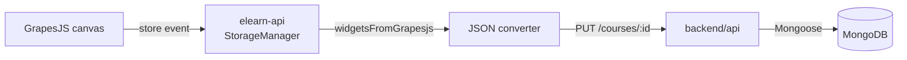

# Architecture

Covers the monorepo package structure, data model, and runtime widget rendering pipeline.

---

## Package Dependency Graph



**Package responsibilities:**

| Package | Build output | Key dependency |
|---|---|---|
| `authoring-ui` | Vite SPA bundle | GrapesJS, Zustand, TipTap |
| `actions-editor` | React component library | Zustand |
| `simulation-engine` | Express sub-router + Playwright runner | CDP, Playwright |
| `question-engine` | TypeScript ESM library | — |
| `scorm-packager` | TypeScript ESM library | archiver, scorm-again |
| `runtime-player` | Vanilla JS IIFE bundle | scorm-again, pipwerks |
| `phaser-simulations` | IIFE bundle (`phaser-bundle.js`) | Phaser.js 3 |
| `backend/api` | Node.js app | Express 5, Mongoose, AWS SDK |

---

## Data Model (ER)



**Widget type discriminated union** (key types):

```typescript
type Widget =
  | TextWidget
  | ImageWidget
  | ButtonWidget          // type: 'button' | 'done-button'
  | ShapeWidget
  | QuestionWidget        // type: 'question-mc' | 'question-tf' | 'question-fill' | ...
  | MediaWidget           // type: 'media-player'
  | AudioNarrationWidget  // type: 'audio-narration'
  | ProgressBarWidget     // type: 'progress-bar'
  | VolumeControlWidget   // type: 'volume-control'
  | NavigationWidget      // type: 'nav-buttons'
  | ScoreWidget
  | ScreenshotSimWidget   // type: 'screenshot-sim'
  | PhaserSimWidget       // type: 'phaser-sim'

interface BaseWidget {
  id: string
  type: string
  bounds: { x: number; y: number; width: number; height: number }
  layer: number
  visible: boolean
  actions: ActionSequence[]
  extendedProperties: Record<string, unknown>
}
```

**ActionSequence DSL:**

```typescript
interface ActionSequence {
  id: string
  trigger: 'click' | 'load' | 'complete' | 'score-pass' | 'score-fail' | string
  steps: ActionStep[]
}

type ActionStep =
  | { action: 'navigate'; target: 'next' | 'prev' | 'first' | 'last' | string }
  | { action: 'show'; widgetId: string }
  | { action: 'hide'; widgetId: string }
  | { action: 'set-variable'; name: string; value: unknown }
  | { action: 'branch-if'; condition: Condition; then: ActionStep[]; else?: ActionStep[] }
  | { action: 'submit-score'; score: number }
```

---

## Runtime Player Widget Rendering Pipeline

How a saved Course JSON becomes interactive HTML in the LMS iframe:



**Key files in `packages/runtime-player/src/`:**

| File | Responsibility |
|---|---|
| `index.ts` | Entry point — SCORM init, slide navigation, `updateProgressBars()`, `applyVolumeToSlide()` |
| `widgets/phaserSimWidget.ts` | Mounts/unmounts `phaser-bundle.js` lazily per slide |
| `sim/` | Screenshot simulation player (Konva-based) |
| `questions/` | Delegates evaluation to `question-engine` |
| `actions/` | Executes Action Sequence DSL steps |
| `suspend.ts` | Serialises/deserialises progress (schema v:2 — includes `visitedSlides`) to SCORM suspend_data |

**GrapesJS Storage Manager flow (authoring side):**



The Storage Manager in `packages/authoring-ui/src/editor/storageManager.ts` intercepts every GrapesJS save and converts the component tree to the Widget schema before sending to the API. Raw HTML is never persisted.
