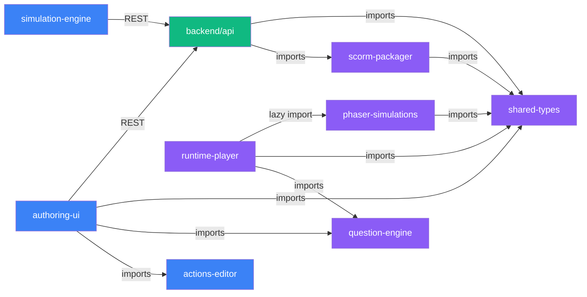
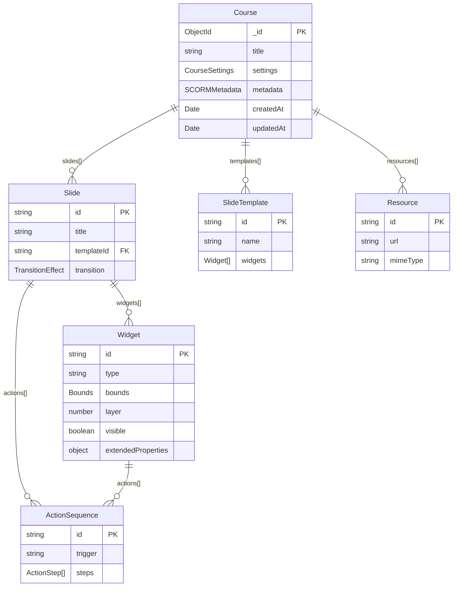
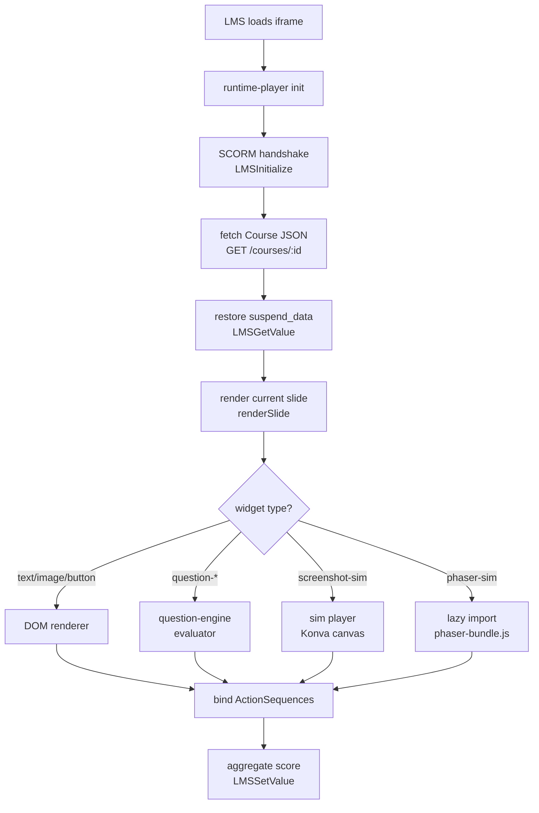
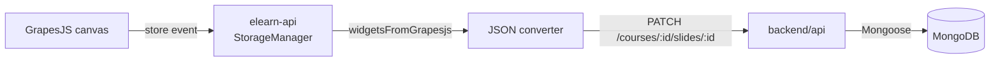
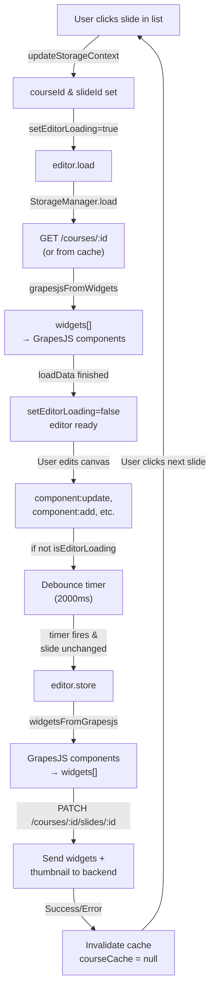

# Architecture

Covers the monorepo package structure, data model, and runtime widget rendering pipeline.

---

## Package Dependency Graph



**Package responsibilities:**

| Package | Build output | Key dependency |
|---|---|---|
| `shared-types` | TypeScript type definitions (CJS + ESM) | — |
| `authoring-ui` | Vite SPA bundle | GrapesJS, Zustand, TipTap, shared-types |
| `actions-editor` | React component library | Zustand, shared-types |
| `simulation-engine` | Express sub-router + Playwright runner | CDP, Playwright |
| `question-engine` | TypeScript ESM library | shared-types |
| `scorm-packager` | TypeScript ESM library | archiver, scorm-again, shared-types |
| `runtime-player` | Vanilla JS IIFE bundle | scorm-again, pipwerks, shared-types |
| `phaser-simulations` | IIFE bundle (`phaser-bundle.js`) | Phaser.js 3, shared-types |
| `backend/api` | Node.js app | Express 5, Mongoose, AWS SDK, shared-types |

---

## Data Model (ER)



**Widget type discriminated union** (key types):

Defined in `packages/shared-types/src/widgets.ts`:

```typescript
type Widget =
  | TextWidget
  | ImageWidget
  | ButtonWidget          // type: 'button' | 'done-button'
  | ShapeWidget
  | QuestionWidget        // type: 'question-mc' | 'question-tf' | 'question-fill' | ...
  | MediaWidget           // type: 'media-player'
  | AudioNarrationWidget  // type: 'audio-narration'
  | ProgressBarWidget     // type: 'progress-bar'
  | VolumeControlWidget   // type: 'volume-control'
  | NavigationWidget      // type: 'nav-buttons'
  | ScoreWidget
  | ScreenshotSimWidget   // type: 'screenshot-sim'
  | PhaserSimWidget       // type: 'phaser-sim'

interface BaseWidget {
  id: string
  type: string
  bounds: { x: number; y: number; width: number; height: number }
  layer: number
  visible: boolean
  actions: ActionSequence[]
  extendedProperties: Record<string, unknown>
}
```

**ActionSequence DSL:**

Defined in `packages/shared-types/src/actions.ts`:

```typescript
interface ActionSequence {
  id: string
  trigger: 'click' | 'load' | 'complete' | 'score-pass' | 'score-fail' | string
  steps: ActionStep[]
}

type ActionStep =
  | { action: 'navigate'; target: 'next' | 'prev' | 'first' | 'last' | string }
  | { action: 'show'; widgetId: string }
  | { action: 'hide'; widgetId: string }
  | { action: 'set-variable'; name: string; value: unknown }
  | { action: 'branch-if'; condition: Condition; then: ActionStep[]; else?: ActionStep[] }
  | { action: 'call-sequence'; sequenceName: string }
  | { action: 'submit-score'; score: number }
```

---

## State Management (Zustand)

All authoring UI state is managed via **Zustand stores** in `packages/authoring-ui/src/store/`. These are memory-only (no localStorage) because:
- LMS iframes do not have persistent storage (security sandbox)
- Course data persists to MongoDB via the backend API, not the browser
- User sessions are ephemeral within the LMS

### Stores Overview

| Store | Key State Fields | Key Actions | Side Effects |
|---|---|---|---|
| **authStore** | `accessToken`, `user` | `setAuth()`, `clearAuth()` | Token refresh managed by httpOnly cookie; store holds access token only |
| **editorStore** | `editor`, `course`, `currentSlideIndex`, `isSaving`, `saveError`, `leftTab`, `rightTab`, `selectedComponentType`, `selectedWidgetId` | `setCourse()`, `setCurrentSlideIndex()`, `setIsSaving()`, `setSaveError()`, `setLeftTab()`, `setRightTab()`, etc. | Syncs with GrapesJS Storage Manager on save; cache invalidated on successful store() |
| **actionsStore** | `widgetId`, `sequences[]`, `selectedEvent`, `variableNames[]`, `sharedSequences[]` | `setWidget()`, `addSequence()`, `addAction()`, `updateAction()`, `moveAction()`, etc. | In-memory editing of action sequences; flushed to course document via GrapesJS Storage Manager |
| **simStore** | `config`, `selectedStepIndex`, `panelOpen`, `editingComponentId` | `openPanel()`, `closePanel()`, `updateStep()`, `reorderStep()`, `deleteStep()` | Manages screenshot simulation editor state; config flushed on close |
| **phaserSimStore** | `previewOpen`, `editingComponentId`, `config` | `openPreview()`, `closePreview()` | Renders Phaser simulation preview modal; config snapshot persists only during preview session |

### Pattern: Component to Store

All stores follow the same pattern — components read via hooks, call actions to update state, which triggers re-renders:

```typescript
// Reading state
import { useEditorStore } from '../store/editorStore'

function SlideThumbnail() {
  const course = useEditorStore((s) => s.course)
  const currentSlideIndex = useEditorStore((s) => s.currentSlideIndex)
  return (
    <div>
      <h3>{course?.slides[currentSlideIndex]?.title}</h3>
    </div>
  )
}

// Updating state
function SlideNavigator() {
  const { setCurrentSlideIndex } = useEditorStore.getState()
  
  const handleNext = () => {
    setCurrentSlideIndex(currentSlideIndex + 1)
  }
}
```

### Why No localStorage

The authoring UI runs inside an LMS iframe, which:
- Cannot reliably persist data across sessions (sandbox restrictions vary)
- Has its own session management (logout clears the iframe)
- Should not store sensitive course data (JWT tokens, course JSON)

**Solution:** Only the backend holds course state. The browser cache is ephemeral. If the user refreshes, the app reloads from the backend API — no local restore needed.

---

## Runtime Player Widget Rendering Pipeline

How a saved Course JSON becomes interactive HTML in the LMS iframe:



**Widget Visibility and Actions:**

Widgets with `visible: false` are rendered in the DOM with `style="display:none"` and `data-hidden="true"` attributes. This is critical for action execution: when a `show` action fires, the widget's DOM element already exists and can be shown by toggling its display property. If widgets were omitted from the DOM entirely, the `show` action would fail at runtime.

**Key files in `packages/runtime-player/src/`:**

| File | Responsibility |
|---|---|
| `index.ts` | Entry point — SCORM init, slide navigation, `updateProgressBars()`, `applyVolumeToSlide()`, `renderWidget()` (with visibility handling) |
| `widgets/phaserSimWidget.ts` | Mounts/unmounts `phaser-bundle.js` lazily per slide |
| `sim/` | Screenshot simulation player (Konva-based) |
| `questions/` | Delegates evaluation to `question-engine` |
| `actions/` | Executes Action Sequence DSL steps, including `show` and `hide` |
| `suspend.ts` | Serialises/deserialises progress (schema v:2 — includes `visitedSlides`) to SCORM suspend_data |

**GrapesJS Storage Manager flow (authoring side):**



The Storage Manager in `packages/authoring-ui/src/editor/storageManager.ts` intercepts every GrapesJS save and converts the component tree to the Widget schema before sending to the API. Raw HTML is never persisted. All type definitions come from the centralized `@elearn-studio/shared-types` package.

For the internal structure of the `authoring-ui` package — EditorCanvas lifecycle, Zustand stores, Backbone subscription hooks, unified-save routing, Props empty-state router, and the preview `postMessage` handshake — see [09 — Authoring UI Architecture](./09-authoring-ui-architecture.md).

---

## GrapesJS Storage Integration

### Why a Custom Storage Manager is Critical

GrapesJS by default saves **raw HTML** — losing all component model state (type, actions, extended properties, layer order). This is incompatible with eLearn Studio's Course/Slide/Widget JSON schema.

**The Problem:**
```html
<!-- GrapesJS default save (HTML) — loses all metadata -->
<div style="position: absolute; left: 100px; top: 50px; width: 200px;">
  <h1>My Question</h1>
  <p>Choose one:</p>
</div>

<!-- What we need (JSON) — preserves full model -->
{
  "type": "question-mc",
  "id": "q-123",
  "bounds": { "x": 100, "y": 50, "width": 200, "height": 300 },
  "layer": 5,
  "visible": true,
  "actions": [...],
  "extendedProperties": {
    "options": ["A", "B", "C"],
    "correctIndex": 1,
    "scoring": { "weight": 100, "attempts": -1 }
  }
}
```

**The Solution:** Register a custom `elearn-api` Storage Manager that:
1. **On load:** Fetches Course JSON from the backend → converts widgets to GrapesJS components
2. **On store:** Reads GrapesJS component tree → converts back to widgets → sends JSON to backend

See `packages/authoring-ui/src/editor/storageManager.ts` for the implementation.

### Load/Store Lifecycle

```mermaid
flowchart LR
  SL[Slide loaded\nEditorCanvas] -->|updateStorageContext| CTX[context: courseId,\nslideId]
  CTX -->|setEditorLoading=true| LOAD[editor.load]
  LOAD -->|StorageManager.load| API1["GET /courses/:id\n(from cache or API)"]
  API1 -->|grapesjsFromWidgets| GJS[GrapesJS component\ntree in canvas]
  GJS -->|setEditorLoading=false| READY[Editor ready for\nuser edits]
  
  USER[User edits canvas\ncomponent:update event] -->|not if isEditorLoading| DEBOUNCE["Debounce 2s\n(AUTOSAVE_DEBOUNCE_MS)"]
  DEBOUNCE -->|Race guard: snapshot context| STORE[editor.store\nif context unchanged]
  STORE -->|widgetsFromGrapesjs| CONV[Convert GrapesJS\ncomponents to widgets]
  CONV -->|PATCH /courses/:id/slides/:id| API2[Backend updates\nMongoDB]
  API2 -->|on success or error| INVALIDATE["Invalidate cache\ncourseCache = null"]
  INVALIDATE -->|next editor.load| API1
```



**Key sequence:**
1. **User switches slide** → `updateStorageContext()` sets new course/slide IDs → `editor.load()` called
2. **Load begins** → `setEditorLoading(true)` suppresses spurious component events
3. **StorageManager.load()** fetches course, finds slide, converts widgets to GrapesJS components
4. **Components loaded** → `setEditorLoading(false)` allows autosave to listen again
5. **User edits** → component:update fires → debounce timer starts
6. **2 seconds pass** → `editor.store()` called → widgetsFromGrapesjs converts back to JSON
7. **API response** → cache invalidated → next load fetches fresh state

### The `isEditorLoading` Gate (Critical)

```typescript
// packages/authoring-ui/src/editor/initEditor.ts
let _isEditorLoading = false

export function setEditorLoading(loading: boolean): void {
  _isEditorLoading = loading
}

// In debounce handler:
const triggerAutosave = () => {
  if (getEditorLoading()) return  // <-- IGNORE all events during load
  // ... start debounce timer
}

// In EditorCanvas component:
// BEFORE load
setEditorLoading(true)
await editor.load()
// AFTER load
setEditorLoading(false)
```

**Why this exists:**
GrapesJS fires `component:add`, `component:update`, and `component:remove` events for **every component reconstructed** during `editor.load()` — even though the user didn't edit anything. Without this gate, the autosave would fire immediately after every slide switch, sending redundant PATCH requests and delaying the UI.

**The problem this solves:**
GrapesJS calls `loadData()` AFTER `storage:end:load` fires. If we relied on storage events alone, component events would arrive **after** we cleared the loading flag. The flag must be explicitly managed by EditorCanvas before/after `editor.load()`.

### Autosave Debounce

The autosave mechanism has three moving parts:

**1. Event listeners on the editor:**
```typescript
editor.on('component:update', triggerAutosave)
editor.on('component:update:content', triggerAutosave)
editor.on('component:add', triggerAutosave)
editor.on('component:remove', triggerAutosave)
```

**2. Debounce timer (2 seconds):**
```typescript
const AUTOSAVE_DEBOUNCE_MS = 2000

let autosaveTimer: ReturnType<typeof setTimeout> | null = null

const triggerAutosave = () => {
  if (getEditorLoading()) return  // Ignore during load
  if (autosaveTimer !== null) clearTimeout(autosaveTimer)
  
  const snapshot = getStorageContext()  // <-- Race guard
  autosaveTimer = setTimeout(async () => {
    autosaveTimer = null
    const current = getStorageContext()
    
    // Abort if user switched slides during debounce
    if (current.courseId !== snapshot.courseId || 
        current.slideId !== snapshot.slideId) {
      return
    }
    
    // Proceed with save
    await editor.store()
  }, AUTOSAVE_DEBOUNCE_MS)
}
```

**Why debounce is necessary:**
- **Without debounce:** Every keystroke fires `component:update` → immediate network PATCH → many redundant API calls
- **Without race guard:** User switches slides while debounce timer is active → stale data saved to wrong slide

The 2-second window gives users time to finish an editing action (typing text, resizing a box) before the network round-trip starts.

### Course Cache Pattern

```typescript
// In storageManager.ts
let courseCache: { courseId: string; doc: CourseDoc } | null = null

async function load() {
  const { courseId, slideId } = storageContext
  
  // Hit cache if courseId matches
  if (courseCache?.courseId === courseId) {
    course = courseCache.doc
  } else {
    // Cache miss — fetch from backend
    course = await courseApi.getCourse(courseId)
    courseCache = { courseId, doc: course }
  }
  
  // Find target slide and convert
  const slide = course.slides.find((s) => s.id === slideId)
  return grapesjsFromWidgets(slide.widgets)
}

async function store() {
  // ... save widgets ...
  
  // Invalidate cache so next load fetches fresh state
  courseCache = null
}
```

**Why it exists:**
- **Performance:** Switching between slides in the same course avoids redundant GET requests
- **Invalidation strategy:** Cache is cleared on every successful/failed store() to ensure the next load reflects the saved state

**When it's invalidated:**
- After `store()` completes (whether success or error) — stale cache can cause data loss
- Explicit call to `invalidateCourseCache()` when course structure changes (slide added/deleted)

### Converter Functions

Two bidirectional converters in `packages/authoring-ui/src/editor/converters.ts`:

**`grapesjsFromWidgets(widgets: BaseWidget[]): GrapesJsComponentDef[]`**
- Restores layout from `bounds` / `layer` / `visible` fields
- Restores decorative styles (font, color, background, border) from `properties.style`
- Pre-renders question widget previews into `def.content`
- Sets `elearnActions` and `extendedProperties` as custom GrapesJS fields (not HTML attributes)

**`widgetsFromGrapesjs(components: Component[]): BaseWidget[]`**
- Extracts bounds from CSS (left/top/width/height)
- Captures `z-index` as layer, `display: none` as visible=false
- Merges GrapesJS content/src with properties
- Filters out GrapesJS internal attributes (actions, style, id, class, src)
- Preserves `elearnActions` and `extendedProperties` from the GrapesJS model

The converters ensure **lossy conversion is impossible** — all Widget metadata survives the round-trip.

### Full Flow Diagram


