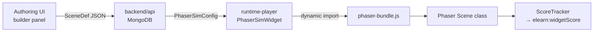

# Adding Phaser Simulation Types

Covers adding a new Phaser simulation type end-to-end: `SceneDef`, scene class, authoring builder, and runtime registration.

When you need this: you're implementing a new simulation type that doesn't fit the existing `process-flow`, `interactive-diagram`, `gamified-quiz`, `physics-demo`, or `concept-animator` categories.

---

## Architecture overview



Key files in `packages/phaser-simulations/src/`:

| File | Responsibility |
|---|---|
| `types.ts` | `SimType`, `SimMode`, `SceneDef` union, `PhaserSimConfig` |
| `PhaserSimWidget.ts` | Lifecycle: `mount()`, `destroy()` — delegates to scene |
| `ModeController.ts` | Demo/practice/assessment behavioural rules |
| `ScoreTracker.ts` | Accumulates step scores, dispatches `elearn:widgetScore` |
| `scenes/` | One `*Scene.ts` + `*Logic.ts` pair per simulation type |

---

## Step 1 — Define the SceneDef type

Add to `packages/phaser-simulations/src/types.ts`:

```typescript
// New scene definition for a "timeline" simulation type
export interface TimelineSceneDef {
  simType: 'timeline'
  events: TimelineEvent[]
  startYear: number
  endYear: number
}

export interface TimelineEvent {
  id: string
  year: number
  title: string
  description: string
  imageUrl?: string
}

// Add to the SimType union
export type SimType =
  | 'process-flow'
  | 'interactive-diagram'
  | 'gamified-quiz'
  | 'physics-demo'
  | 'concept-animator'
  | 'timeline'   // ← add here

// Add to the SceneDef union
export type SceneDef =
  | ProcessFlowSceneDef
  | InteractiveDiagramSceneDef
  | GamifiedQuizSceneDef
  | PhysicsDemoSceneDef
  | ConceptAnimatorSceneDef
  | TimelineSceneDef   // ← add here
```

---

## Step 2 — Write the Logic class

The Logic class separates game-rules from Phaser rendering. It uses `ModeController` and `ScoreTracker`:

```typescript
// packages/phaser-simulations/src/scenes/TimelineLogic.ts

import { ModeController } from '../ModeController'
import { ScoreTracker } from '../ScoreTracker'
import type { TimelineSceneDef, TimelineEvent } from '../types'

export class TimelineLogic {
  private controller: ModeController
  private tracker: ScoreTracker
  private sceneDef: TimelineSceneDef
  private currentIndex = 0

  constructor(sceneDef: TimelineSceneDef, mode: string, widgetId: string, passingScore: number) {
    this.sceneDef = sceneDef
    this.controller = new ModeController(mode as 'demo' | 'practice' | 'assessment')
    this.tracker = new ScoreTracker(widgetId, passingScore)
  }

  currentEvent(): TimelineEvent {
    return this.sceneDef.events[this.currentIndex]
  }

  canAdvance(): boolean {
    return this.currentIndex < this.sceneDef.events.length - 1
  }

  advance(): void {
    if (this.canAdvance()) {
      this.currentIndex++
    }
  }

  recordAnswer(eventId: string, correct: boolean): void {
    if (this.controller.isScored()) {
      this.tracker.addStep(eventId, correct ? 10 : 0, 10)
    }
  }

  complete(): void {
    this.tracker.complete()
  }

  isAutoAdvance(): boolean {
    return this.controller.isAutoAdvance()
  }
}
```

---

## Step 3 — Write the Scene class

```typescript
// packages/phaser-simulations/src/scenes/TimelineScene.ts

import Phaser from 'phaser'
import { TimelineLogic } from './TimelineLogic'
import type { PhaserSimConfig } from '../types'

export class TimelineScene extends Phaser.Scene {
  private logic!: TimelineLogic
  private config!: PhaserSimConfig
  private eventText!: Phaser.GameObjects.Text
  private nextBtn!: Phaser.GameObjects.Text

  constructor(config: PhaserSimConfig) {
    super({ key: 'TimelineScene' })
    this.config = config
  }

  create(): void {
    const { sceneDef, mode, widgetId, passingScore } = this.config
    this.logic = new TimelineLogic(sceneDef as import('../types').TimelineSceneDef, mode, widgetId, passingScore)

    this.eventText = this.add.text(40, 80, '', {
      fontSize: '16px', color: '#cdd6f4', wordWrap: { width: 720 },
    })

    this.nextBtn = this.add.text(700, 450, '▶ Next', {
      fontSize: '14px', color: '#89b4fa',
    }).setInteractive({ useHandCursor: true })

    this.nextBtn.on('pointerup', () => this.onNext())

    this.renderCurrentEvent()

    if (this.logic.isAutoAdvance()) {
      this.time.addEvent({ delay: 3000, loop: true, callback: this.onNext, callbackScope: this })
    }
  }

  private renderCurrentEvent(): void {
    const ev = this.logic.currentEvent()
    this.eventText.setText(`${ev.year}: ${ev.title}\n\n${ev.description}`)
    this.nextBtn.setVisible(this.logic.canAdvance())
  }

  private onNext(): void {
    if (this.logic.canAdvance()) {
      this.logic.advance()
      this.renderCurrentEvent()
    } else {
      this.logic.complete()
    }
  }
}
```

---

## Step 4 — Register the scene in PhaserSimWidget

In `packages/phaser-simulations/src/PhaserSimWidget.ts`, add the new scene to `buildScene()`:

```typescript
import { TimelineScene } from './scenes/TimelineScene'

private async buildScene(Phaser: typeof import('phaser'), config: PhaserSimConfig) {
  switch (config.sceneDef.simType) {
    case 'process-flow':     return /* ProcessFlowScene */
    case 'interactive-diagram': return /* InteractiveDiagramScene */
    case 'gamified-quiz':    return /* GamifiedQuizScene */
    case 'timeline':
      return new TimelineScene(config)  // ← add here
    default:
      return this.makePlaceholderScene(config)
  }
}
```

---

## Step 5 — Add the authoring builder panel

In `packages/authoring-ui/src/editor/registerPhaserSimBlock.ts`, add the new type to the `simType` trait options:

```typescript
editor.Components.addType('phaser-sim', {
  model: {
    defaults: {
      traits: [
        {
          name: 'simType',
          label: 'Simulation type',
          type: 'select',
          options: [
            { id: 'process-flow',        name: 'Process Flow' },
            { id: 'interactive-diagram', name: 'Interactive Diagram' },
            { id: 'gamified-quiz',       name: 'Gamified Quiz' },
            { id: 'concept-animator',    name: 'Concept Animator' },
            { id: 'timeline',            name: 'Timeline' },  // ← add here
          ],
        },
        // ... other traits
      ],
    },
  },
})
```

If the builder requires a dedicated authoring UI (more than traits), add a React panel in `packages/authoring-ui/src/components/sidebar/` following the same pattern as `QuestionPropertiesPanel.tsx`.

---

## ModeController rules reference

| Rule | demo | practice | assessment |
|---|---|---|---|
| Auto-advance | ✅ | ❌ | ❌ |
| Requires input | ❌ | ✅ | ✅ |
| Scored | ❌ | ✅ | ✅ |
| Can skip | ✅ | ✅ | ❌ |
| Show feedback | ✅ | ✅ | ❌ |
| Can retry | ✅ | ✅ | ❌ |

---

## ScoreTracker API

```typescript
const tracker = new ScoreTracker(widgetId, passingScore)

// Record a step result (call during the simulation)
tracker.addStep(stepId: string, score: number, maxScore: number): void

// Get current total
tracker.getPercentage(): number  // 0–100

// End the simulation — dispatches window CustomEvent 'elearn:widgetScore'
// The runtime-player listens to this event and forwards the score to SCORM
tracker.complete(): void
```

---

## Checklist

- [ ] `packages/phaser-simulations/src/types.ts` — `SimType` union + `SceneDef` interface
- [ ] `packages/phaser-simulations/src/scenes/<Type>Logic.ts` — game rules
- [ ] `packages/phaser-simulations/src/scenes/<Type>Scene.ts` — Phaser rendering
- [ ] `packages/phaser-simulations/src/PhaserSimWidget.ts` — `buildScene()` switch
- [ ] `packages/authoring-ui/src/editor/registerPhaserSimBlock.ts` — `simType` options
- [ ] `packages/authoring-ui/src/components/sidebar/` — builder panel (if needed)
- [ ] Unit tests for Logic class in `packages/phaser-simulations/src/__tests__/`
- [ ] `pnpm --filter phaser-simulations run build` — verify bundle builds
