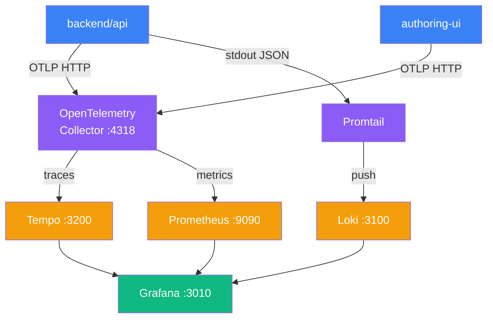

# Observability

Covers the log/trace/metric pipeline, Grafana dashboards, and how to extend the stack.

---

## Observability Stack



All observability configuration is in `docker/observability/`:

| File | Purpose |
|---|---|
| `otel-collector-config.yaml` | OTel Collector receivers, processors, exporters |
| `prometheus.yml` | Scrape targets |
| `promtail-config.yaml` | Log scrape paths and label extraction |
| `tempo.yaml` | Trace storage and retention |
| `grafana/datasources/` | Auto-provisioned Prometheus, Loki, Tempo data sources |
| `grafana/dashboards/` | Auto-provisioned dashboard JSON files |

---

## Grafana — http://localhost:3010

Default credentials: `admin` / `admin` (change on first login in production).

### Pre-provisioned dashboards

| Dashboard | What it shows |
|---|---|
| API Overview | Request rate, error rate, latency p50/p95/p99 |
| Course Export | SCORM export duration, queue depth, error count |
| Container Resources | CPU, memory, network per container (cAdvisor) |

### Querying logs in Loki

Open **Explore → Loki** and use LogQL:

```logql
# All logs from backend/api in the last hour
{job="backend-api"} | json

# Errors only for a specific request ID
{job="backend-api"} | json | level="error" | requestId="<uuid>"

# Slow SCORM exports (> 5s)
{job="backend-api"} | json | message="export complete" | duration > 5000
```

The `backend/api` logger emits structured JSON. Key fields:

| Field | Description |
|---|---|
| `level` | `debug` / `info` / `warn` / `error` |
| `requestId` | UUID — correlates all log lines for a single HTTP request |
| `traceId` | Links to a Tempo trace |
| `message` | Log message |
| `duration` | Duration in milliseconds (response-level logs only) |

### Viewing traces in Tempo

Open **Explore → Tempo** and search by:

- **Trace ID** — paste from a log line's `traceId` field
- **Service name** — `backend-api` or `authoring-ui`
- **Duration** — filter to traces > 1s to find slow requests

Each trace spans the full HTTP request lifecycle including MongoDB queries and Garage S3 uploads.

---

## Adding a new metric

**In `backend/api`** — use the `prom-client` singleton in `src/lib/metrics.ts`:

```typescript
import { Registry, Counter, Histogram } from 'prom-client'

// Add to the existing metrics module
export const myOperationTotal = new Counter({
  name: 'elearn_my_operation_total',
  help: 'Count of my_operation calls',
  labelNames: ['status'],
})

export const myOperationDuration = new Histogram({
  name: 'elearn_my_operation_duration_seconds',
  help: 'Duration of my_operation in seconds',
  buckets: [0.01, 0.05, 0.1, 0.5, 1, 5],
})
```

Instrument the code:

```typescript
const end = myOperationDuration.startTimer()
try {
  await doMyOperation()
  myOperationTotal.inc({ status: 'success' })
} catch (err) {
  myOperationTotal.inc({ status: 'error' })
  throw err
} finally {
  end()
}
```

The `/metrics` endpoint (scraped by Prometheus) exports all registered metrics automatically.

---

## Adding a new Grafana dashboard panel

1. Open Grafana at http://localhost:3010.
2. Navigate to your target dashboard and click **Edit** (or create a new dashboard).
3. Add a panel. For a counter rate:
   ```promql
   rate(elearn_my_operation_total[5m])
   ```
4. Configure the panel title, visualization type, and thresholds.
5. Click **Save dashboard**.
6. Export the dashboard JSON: **Dashboard settings → JSON Model → Copy to clipboard**.
7. Save to `docker/observability/grafana/dashboards/<name>.json`.

The dashboard is provisioned automatically on the next `docker compose up`.

---

## Production deployment

In production, connect your own managed Grafana to these endpoints exposed by the stack:

| Endpoint | Protocol | Data |
|---|---|---|
| `http://<host>:9090` | Prometheus remote read | Metrics |
| `http://<host>:3100` | Loki HTTP API | Logs |
| `http://<host>:3200` | Tempo HTTP API | Traces |

Configure each as a data source in your Grafana instance. Do not expose these ports directly to the internet — use a reverse proxy with authentication.

Alternatively, configure the OTel Collector to push to a hosted observability platform (Grafana Cloud, Datadog, etc.) by replacing the exporters in `otel-collector-config.yaml`.
