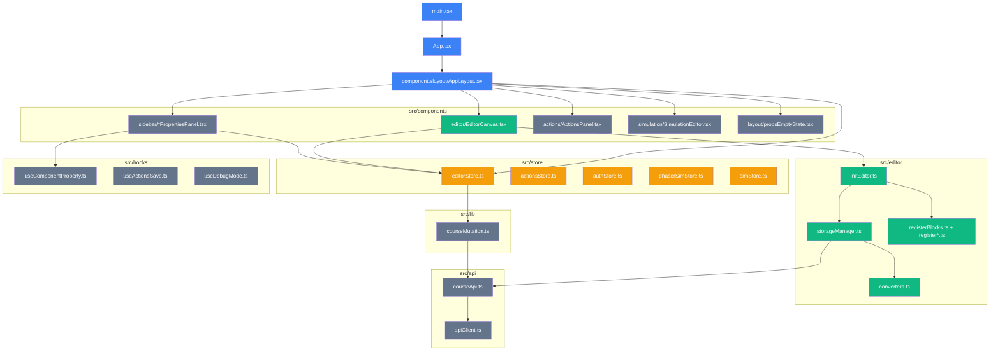
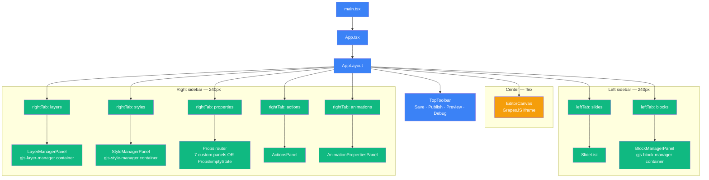
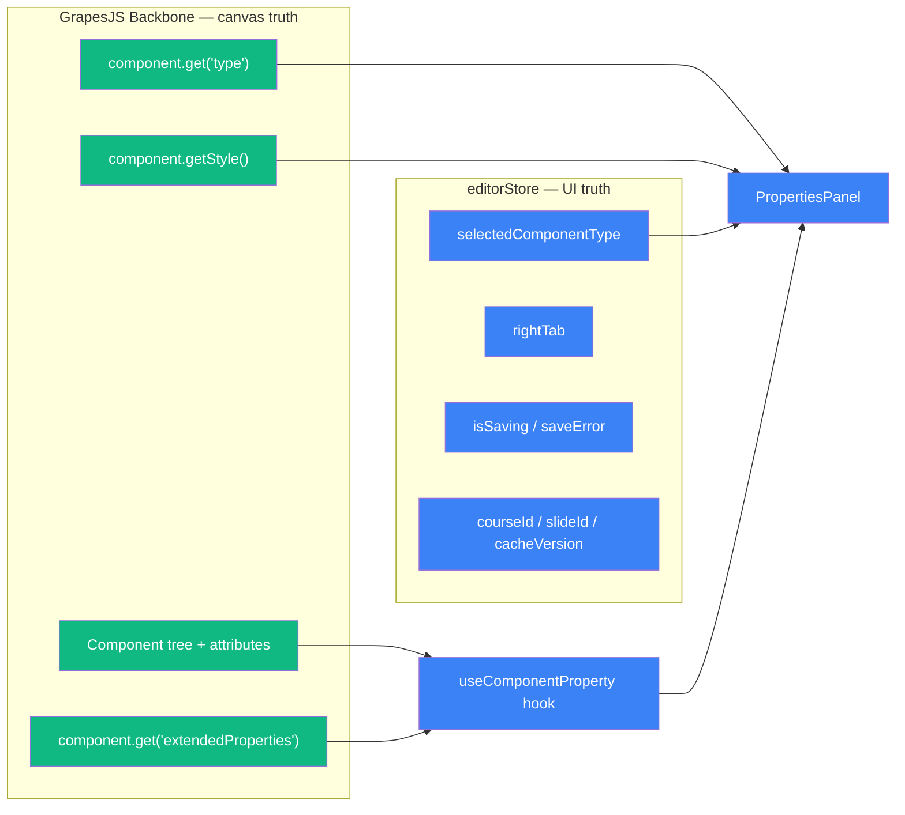
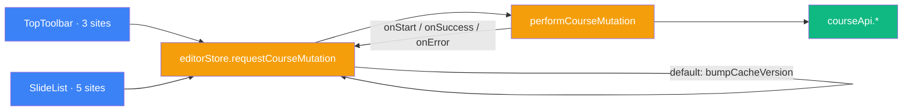
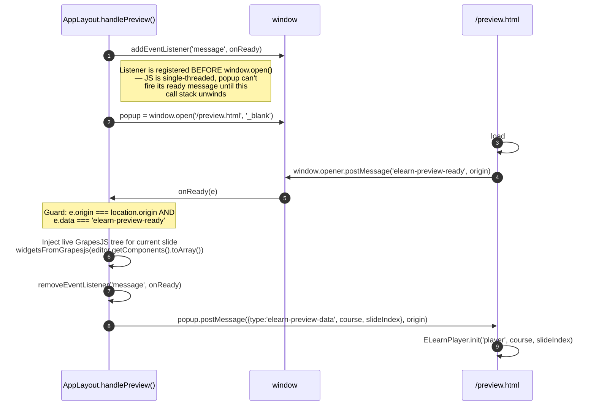
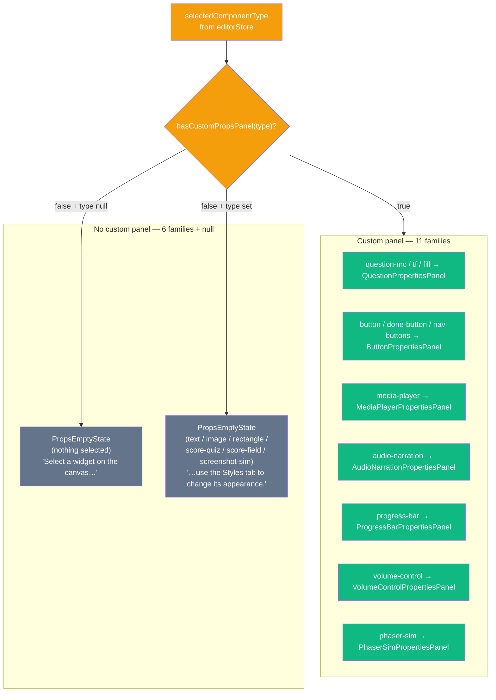

# 09 — Authoring UI Architecture

Internal architecture of `packages/authoring-ui`: how React, GrapesJS, Zustand, Backbone, and the storage manager fit together.

Read this when editing anything inside `packages/authoring-ui/src/` — canvas lifecycle, stores, hooks, empty-state router, preview handshake. The scope is the package, not the monorepo. For the cross-package data flow see [01 — Architecture](./01-architecture.md); for the server-side save pipeline see [08 — Persistence Flow](./08-persistence-flow.md).

---

## Stack

| Tool | Version | Role |
|---|---|---|
| Vite | ^5.3 | Dev server + production bundler |
| React | ^18.3 (StrictMode on) | UI framework |
| TypeScript | ^5.5 | Static types |
| GrapesJS | ^0.21.13 | Visual canvas editor (Backbone-based) |
| Zustand | ^4.5 | Global UI / editor state |
| TipTap | ^2.4 | Inline rich-text editing inside GrapesJS RTE |
| Konva + react-konva | ^9.3 / ^18.2 | `SimulationEditor` 2D canvas |
| MSW | ^2.12 (DEV only) | API mocks for unit tests and offline dev |
| Vitest | ^1.6 | Unit + integration tests |

---

## Package map



| Folder | Responsibility |
|---|---|
| `src/` | `main.tsx` entry, `App.tsx` router shell |
| `src/components/layout/` | `AppLayout`, `TopToolbar`, `PublishDialog`, `propsEmptyState` — the 3-column shell and top bar |
| `src/components/editor/` | `EditorCanvas` — the React wrapper around GrapesJS |
| `src/components/sidebar/` | 7 `*PropertiesPanel.tsx` + `BlockManagerPanel` / `LayerManagerPanel` / `StyleManagerPanel` / `SlideList` |
| `src/components/actions/` | Action Sequence editor (`ActionsPanel`, `ActionItemEditor`) |
| `src/components/simulation/` | Konva-based `SimulationEditor` and Phaser preview modal |
| `src/components/ui/` | Shared widgets: `Toast`, `ErrorBoundary`, `SaveErrorBanner` |
| `src/editor/` | GrapesJS adapters: `initEditor`, `storageManager`, `converters`, `register*Blocks` |
| `src/store/` | 5 Zustand slices (see table below) |
| `src/hooks/` | `useComponentProperty` / `useExtendedProperty` Backbone subscriptions + `useActionsSave`, `useDebugMode` |
| `src/lib/` | `courseMutation.ts` (pure), `errorReporter.ts` |
| `src/api/` | `courseApi.ts` + generated OpenAPI types + `apiClient.ts` (auth-aware fetch) |
| `src/types/` | Authoring-local types (`ELearnComponent`, `questions`, `phaserSim`, `course`) |

---

## UI composition



Three GrapesJS manager containers (`#gjs-block-manager`, `#gjs-layer-manager`, `#gjs-style-manager`) are rendered **before** `EditorCanvas` mounts so GrapesJS can call `appendTo` and attach its native DOM into them during init.

---

## GrapesJS instance lifecycle

`EditorCanvas` owns the GrapesJS instance with two effects. Effect 1 keys on `courseId`: init + teardown. Effect 2 keys on `[courseId, slideId]`: slide-switch load + pre-switch save.

```mermaid
sequenceDiagram
  autonumber
  participant RC as EditorCanvas (React)
  participant IE as initEditor.ts
  participant ES as editorStore (Zustand)
  participant GJS as GrapesJS editor
  participant SM as storageManager
  participant API as backend API

  Note over RC: Effect 1 — runs on [courseId]
  RC->>IE: initEditor({container, courseId, slideId, onReady})
  IE->>GJS: grapesjs.init({storageManager: {type: 'elearn-api', autoload:false, autosave:false}})
  IE->>SM: registerStorageManager(editor, provider)
  IE->>ES: setEditorContext({courseId, slideId})
  IE->>GJS: editor.setDevice('slide')
  IE->>GJS: on('component:add' → set draggable:true, position:absolute)
  IE->>GJS: on('block:drag:stop' → addStyle({left, top}))
  IE->>GJS: on('component:update' → triggerAutosave)
  IE-->>RC: {editor, cleanup, hasPendingChanges, requestSave}
  RC->>ES: setEditor(editor); setRequestSave(requestSave)
  RC->>GJS: on('component:selected' → setSelectedComponentType, setRightTab)
  RC->>GJS: window.addEventListener('beforeunload', onBeforeUnload)

  Note over RC: Effect 2 — runs on [courseId, slideId]
  alt StrictMode twin invocation<br/>same (courseId, slideId) already in-flight
    RC->>RC: await lastLoadPromiseRef; setIsReady(true); return
  else Genuine change
    RC->>RC: setIsReady(false)<br/>containerRef.setAttribute('data-editor-ready','false')
    opt shouldSaveBeforeSwitch
      RC->>GJS: stopCommand('text-edit')
      RC->>ES: requestSave({timeoutMs: 5000})
    end
    RC->>ES: setEditorContext({courseId, slideId})
    RC->>IE: setEditorLoading(true)
    RC->>GJS: editor.load()
    GJS->>SM: load() — reads from courseCache or GETs /courses/:id
    SM-->>GJS: {pages:[{component:{components}}], styles:[]}
    GJS->>GJS: loadData(result) — cascades component:add × N
    Note over IE: triggerAutosave early-return while _isEditorLoading === true
    GJS-->>RC: load() promise resolves
    RC->>IE: setEditorLoading(false)
    RC->>RC: setIsReady(true); data-editor-ready='true'
  end

  Note over RC: Autosave loop (steady state)
  GJS->>IE: component:update event
  IE->>IE: triggerAutosave() — debounce 2s,<br/>guards: getEditorLoading() + isRteActive
  IE->>ES: requestSave()
  ES->>SM: performSave(editor, hooks)
  SM->>GJS: editor.store()
  GJS->>SM: storageManager.store()
  SM->>API: PATCH /courses/:id/slides/:sid {widgets, thumbnail}
  API-->>SM: 200 OK
  SM->>SM: courseCache update in place (T640.1)

  Note over RC: Effect 1 cleanup (unmount OR courseId change)
  RC->>RC: removeEventListener('beforeunload')
  RC->>IE: cleanup() — clearTimeout(autosaveTimer) +<br/>removeEventListener('dragstart') + unsubscribeCacheInvalidate
  RC->>GJS: editor.destroy()
  RC->>RC: lastLoadContextRef.current = null (TD-009 lifecycle correction)
  RC->>ES: setEditor(null); setRequestSave(null)
```

Four races captured in this sequence, all pinned by regression tests:

- **TD-009 race #1 — StrictMode concurrent loads.** The `lastLoadContextRef` short-circuits the second Effect 2 invocation so only one `editor.load()` is ever in flight.
- **TD-009 race #2 — Autosave timer fires mid-load.** `triggerAutosave` re-checks `getEditorLoading()` inside the `setTimeout` callback, not only at event time.
- **TD-009 race #3 — Stale `data-editor-ready` attribute.** `setIsReady(false)` is paired with an imperative `containerRef.setAttribute('data-editor-ready','false')` so observers (Playwright, external code) see the flip synchronously.
- **T639.8 destroy/load race.** `initEditor` monkey-patches `em.loadData` to return early when `em.destroyed === true`, so an in-flight load that resolves after `editor.destroy()` does not crash on the Backbone-cleared `storables` array.

---

## Source-of-truth split — Zustand vs Backbone

Canvas content lives in GrapesJS's Backbone model; UI state lives in Zustand. Reading from the wrong one causes stale data on Undo/Redo (Backbone state changes without re-rendering React) or keystroke-level global re-renders (syncing every character into Zustand).



| Data | Read from | Reason |
|---|---|---|
| Which panel to render in the sidebar | `selectedComponentType` (Zustand) | Cross-cutting routing — tolerates 1-render lag |
| Within-panel sub-form routing (e.g. `button` vs `nav-buttons` inside `ButtonPropertiesPanel`) | `selected.get('type')` (Backbone) | Must be synchronous; Zustand can lag 5–20 ms |
| All component property values | `useComponentProperty` / `useExtendedProperty` (Backbone subscription) | Authoritative. A Zustand mirror would cause keystroke-level global re-renders |

Canonical pattern enforced in every PropertiesPanel:

```typescript
export function ButtonPropertiesPanel() {
  const editor = useEditorStore(s => s.editor)
  const selectedComponentType = useEditorStore(s => s.selectedComponentType)

  if (!editor || !selectedComponentType || !isButtonWidgetType(selectedComponentType)) {
    return null
  }

  const selected = editor.getSelected()
  if (!selected) return null

  // Backbone double-check for within-panel routing (T648)
  const type = selected.get('type') as string

  // Property values via the hook — never selected.get('prop') in the render body
  const [content, updateContent] = useComponentProperty(selected, 'content', '')

  // ...
}
```

The rule (T648): **never mix Backbone and Zustand for the same datum within a panel.** The early guards read Zustand; all property values read Backbone via the hook.

---

## Unified persistence

All save paths funnel through `requestSave()`. Layer 1 (`performSave` in `storageManager.ts`) is pure: no Zustand, no React, standardised error narrowing, optional timeout. Layer 2 (`requestSave` in `initEditor.ts`) wires `performSave` into `useEditorStore` so every caller shares the same UI-state feedback (`isSaving`, `saveError`).

```mermaid
sequenceDiagram
  autonumber
  participant CALLER as Caller<br/>(5 sites)
  participant ES as editorStore.requestSave
  participant PS as performSave(editor, hooks)
  participant GJS as editor.store()
  participant SM as storageManager.store()
  participant API as PATCH /courses/:id/slides/:sid

  Note over CALLER: Entry points — all reach requestSave
  CALLER->>ES: requestSave({timeoutMs?})

  Note right of CALLER: 1. triggerAutosave (initEditor.ts)<br/>debounce 2s + guards<br/>2. saveAndLoad (EditorCanvas.tsx)<br/>pre-nav, timeout 5s<br/>3. SaveErrorBanner retry<br/>4. useActionsSave<br/>5. SimulationEditor.handleSave

  ES->>PS: performSave(editor, {onStart, onSuccess, onError, timeoutMs})
  PS->>ES: onStart() → setIsSaving(true); setSaveError(null)
  PS->>GJS: editor.store() (optionally Promise.race timeout)
  GJS->>SM: storageManager.store()
  SM->>API: PATCH payload {widgets, thumbnail}
  API-->>SM: 200 OK
  SM->>SM: courseCache update in place
  PS->>ES: onSuccess() → setIsSaving(false)
  PS-->>CALLER: resolve

  alt Error path
    API-->>SM: 4xx / 5xx
    SM-->>GJS: throw
    GJS-->>PS: throw
    PS->>ES: onError(msg) → setIsSaving(false); setSaveError(msg)
    PS-->>CALLER: throw (caller may catch)
  end
```

Course-meta operations (add/delete/reorder slide, update course settings) use a parallel but distinct primitive because they do not need the GrapesJS editor:



`requestCourseMutation` is a plain Zustand action (non-nullable from app start) rather than an editor-bound closure, so early clicks — e.g. an E2E fixture's `Add Slide` immediately after page load — cannot hit a null window. See the post-mortem in [`decisions/2026-04-18-course-mutation.md`](../../decisions/2026-04-18-course-mutation.md).

Full save pipeline to the backend (converter → API → Mongoose → MongoDB) is detailed in [08 — Persistence Flow](./08-persistence-flow.md). ADRs: [`decisions/2026-04-17-request-save.md`](../../decisions/2026-04-17-request-save.md), [`decisions/2026-04-18-course-mutation.md`](../../decisions/2026-04-18-course-mutation.md).

---

## Zustand stores

| Store | File | Responsibility |
|---|---|---|
| `editorStore` | `src/store/editorStore.ts` | Editor instance, course doc, current slide index, selection, save state, tab state, storage context (`courseId`, `slideId`, `cacheVersion`), `requestSave`, `requestCourseMutation` |
| `actionsStore` | `src/store/actionsStore.ts` | Per-widget Action Sequence DSL edit buffer |
| `authStore` | `src/store/authStore.ts` | JWT access + refresh tokens, user profile |
| `phaserSimStore` | `src/store/phaserSimStore.ts` | Phaser-sim preview modal state |
| `simStore` | `src/store/simStore.ts` | Konva screenshot-simulation editor state |

Two fields on `editorStore` are load-bearing for the unified-persistence pattern:

| Field | Type | Nullable | Set by | Read by |
|---|---|---|---|---|
| `requestSave` | `((opts?) => Promise<void>) \| null` | Yes — null until Effect 1 runs | `setRequestSave(requestSave)` inside EditorCanvas Effect 1 | `triggerAutosave`, `saveAndLoad`, `SaveErrorBanner` retry, `useActionsSave`, `SimulationEditor.handleSave` |
| `requestCourseMutation` | `<R>(apiCall, opts?) => Promise<R \| undefined>` | No — plain store action | Defined in `editorStore.ts` | `TopToolbar` (3 sites), `SlideList` (5 sites) |

---

## Hooks

| Hook | File | Signature | Key notes |
|---|---|---|---|
| `useComponentProperty<T>` | `src/hooks/useComponentProperty.ts` | `(component \| null, key, defaultValue) → [value, update, getLatest]` | Null-safe (T648). Subscribes to `change:${key}`. `getLatest()` returns a ref-backed latest value (T639/T649) — use it in callbacks to avoid stale closures |
| `useExtendedProperty<T>` | `src/hooks/useComponentProperty.ts` | `(component \| null, subKey, defaultValue) → [value, update, getLatest]` | Reads `extendedProperties[subKey]`. **Shallow replace contract (TD-005)**: `update(patch)` REPLACES the sub-key entirely; use `updateEp({ ...getLatest(), ...patch })` for partial nested updates. Dev-only `console.warn` fires when a replace would drop sibling keys |
| `useActionsSave` | `src/hooks/useActionsSave.ts` | `() → saveActions` | Persists widget-level Action Sequences via `requestSave()` |
| `useDebugMode` | `src/hooks/useDebugMode.ts` | `() → isDebug` | `?debug=1` URL flag — toggles inspector overlays |

Canonical patch-merge (T639):

```typescript
// ✅ CORRECT — getLatest() reads the most-recent committed value (ref-backed)
function update(patch: Partial<ExtendedProps>) {
  updateEp({ ...getLatest(), ...patch })
}

// ❌ WRONG — `ep` from closure may be stale across two updates in the same render cycle
function update(patch: Partial<ExtendedProps>) {
  updateEp({ ...ep, ...patch })
}
```

---

## Preview handshake

The Preview button opens `/preview.html` in a new tab and delivers the full course JSON via `postMessage`. `localStorage` is never used — the runtime player must be self-contained (Critical Rule 5).



The opener injects the live GrapesJS component tree (not `course.slides[i].widgets` from the Zustand store) because GrapesJS edits go through `storageManager → backend` and do not update the store — the store holds the initial fetch.

Both sides origin-check every message. Opener: `e.origin !== origin` rejects cross-origin messages. Popup: `e.origin !== origin` rejects reverse-direction spoofing.

E2E regression guard: `e2e/tests/preview-handshake.spec.ts` (TD-002). Source: [`AppLayout.tsx::handlePreview`](../../packages/authoring-ui/src/components/layout/AppLayout.tsx) + [`preview.html`](../../packages/authoring-ui/public/preview.html).

---

## Props tab empty-state router (TD-010)

The Props tab in the right sidebar routes between 7 custom panels and a centralised empty-state. Before TD-010, the 6 unrelated panels each rendered their own "Select a X widget" fallback and stacked placeholders below the real one.



AppLayout renders all 7 panels under the `hasCustomPropsPanel` branch; each panel returns `null` when its type predicate does not match, so at most one panel is visible at a time. The invariant is pinned by `packages/authoring-ui/src/__tests__/layout/PropsTabRouting.test.tsx` (101 tests) and `PropsEmptyState.test.tsx` (6 tests).

`propsEmptyState.tsx` lives as a standalone module — not inside `AppLayout.tsx` — so unit tests can import `hasCustomPropsPanel` + `<PropsEmptyState>` without pulling `SimulationEditor → react-konva → konva` into the Vitest module graph.

---

## Key files

| Purpose | Path |
|---|---|
| Entry point | `packages/authoring-ui/src/main.tsx` |
| App shell | `packages/authoring-ui/src/App.tsx` |
| 3-column layout + Props router | `packages/authoring-ui/src/components/layout/AppLayout.tsx` |
| GrapesJS React wrapper | `packages/authoring-ui/src/components/editor/EditorCanvas.tsx` |
| GrapesJS init + autosave + custom commands | `packages/authoring-ui/src/editor/initEditor.ts` |
| Custom `elearn-api` storage type + `performSave` + cache | `packages/authoring-ui/src/editor/storageManager.ts` |
| Widget converters (GrapesJS ↔ Widget JSON) | `packages/authoring-ui/src/editor/converters.ts` |
| Block + component type registration | `packages/authoring-ui/src/editor/registerBlocks.ts` + `register*Blocks.ts` |
| Backbone subscription hooks | `packages/authoring-ui/src/hooks/useComponentProperty.ts` |
| Editor / course / UI Zustand slice | `packages/authoring-ui/src/store/editorStore.ts` |
| Pure course-meta mutation primitive | `packages/authoring-ui/src/lib/courseMutation.ts` |
| Empty-state router helpers | `packages/authoring-ui/src/components/layout/propsEmptyState.tsx` |
| Preview popup receiver | `packages/authoring-ui/public/preview.html` |
| REST client (auth-aware) | `packages/authoring-ui/src/api/apiClient.ts` + `courseApi.ts` |

---

## Related docs

- [01 — Architecture](./01-architecture.md) — monorepo package graph and cross-package data flow
- [03 — Adding Widget Types](./03-adding-widget-types.md) — GrapesJS Block + Component + converter + runtime renderer workflow
- [08 — Persistence Flow](./08-persistence-flow.md) — server-side pipeline from `editor.store()` to MongoDB, including `courseCache`
- Project-root `CLAUDE.md` — T648 / T639 / T650 / T651 / TD-007 / TD-010 rules with inline code samples
- Project-root `GRAPESJS_REACT_PATTERNS.md` — the 4 mandatory patterns (lifecycle, event bridge, Backbone subscription, unified save)
- ADRs — [`decisions/2026-04-17-request-save.md`](../../decisions/2026-04-17-request-save.md), [`decisions/2026-04-18-course-mutation.md`](../../decisions/2026-04-18-course-mutation.md), [`decisions/2026-04-17-editor-loading-flag.md`](../../decisions/2026-04-17-editor-loading-flag.md)
