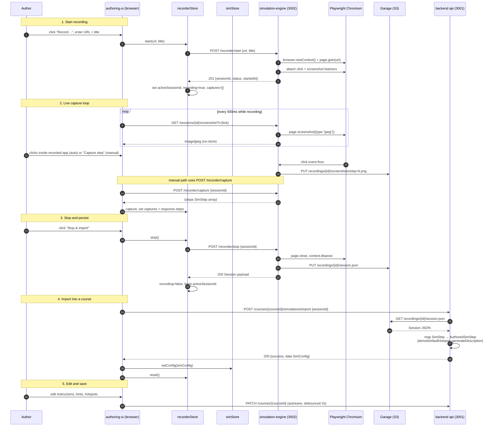

# 11 — Simulation Recorder Architecture

The Simulation Recorder lets an author capture a real application's UI as a sequence of click + screenshot pairs that becomes a Software Walkthrough. This page documents the runtime architecture: the four processes involved, the call sequence, the data shapes at each boundary, and the lifecycle of a recording session.

> **Scope.** This page covers the recorder pipeline only. The Software Walkthrough authoring UI (step list, hotspot canvas, step form) is documented from a user-facing angle in [user-guide/13](../user-guide/13-software-walkthrough.md); the broader authoring-ui internals are in [09 — Authoring UI Architecture](./09-authoring-ui-architecture.md).

---

## Topology

Four processes participate. Their ports and responsibilities:

| Process | Default port | Role |
|---|---|---|
| `authoring-ui` | 3000 | React 18 + Vite. Owns the launcher dialog, live overlay, sessions picker, and `recorderStore` / `simStore` Zustand stores. |
| `backend/api` | 3001 | Express 5. Owns course persistence and the `/courses/:id/simulations/import` endpoint that converts a recorder session into an authored `SimConfig`. |
| `simulation-engine` | 3002 | Express 5 + Playwright. Spawns one Chromium instance per active recording session, listens for `click` events, captures JPEG screenshots, and persists finished sessions to Garage. |
| `Garage` (S3-compatible) | 3900 | Object storage. Holds raw step screenshots and the `session.json` manifest under `recordings/{sessionId}/`. |

The browser only talks to `authoring-ui` over HTTP/WebSocket and to `simulation-engine` over HTTP (CORS allow-origin pinned to the authoring-ui origin via `SIMULATION_ENGINE_ALLOWED_ORIGIN`). All Garage access is server-side; the browser never touches S3 directly.

---

## End-to-end call sequence

The diagram below traces a complete record → import → save flow, from the author clicking **Record…** to the freshly imported steps landing in `simStore.config`.



Numbering matches the five lifecycle phases described in [Lifecycle](#lifecycle) below.

---

## Stores

Two Zustand stores split the recorder state by ownership lifetime.

### `recorderStore`

Lives only while a recording session is active or pending import. Defined in `packages/authoring-ui/src/store/recorderStore.ts`.

```typescript
interface RecorderState {
  activeSessionId: string | null   // backend session id; null between reset() calls
  recording:       boolean         // true between successful start and successful stop
  captures:        SimStep[]       // recorder step list, replaced on each capture response
  error:           string | null   // last narrowed error message
  isBusy:          boolean         // in-flight start/capture/stop request

  start:   (url: string, title?: string) => Promise<void>
  capture: () => Promise<void>
  stop:    () => Promise<Session | undefined>
  reset:   () => void
}
```

Behavioural notes:

- `start` is a no-op while `recording` or `isBusy` (defends against double-clicks).
- `capture` and `stop` are no-ops without an active session.
- `stop` only flips `recording: false` on success — a failed stop leaves the backend session alive so the user can retry.
- `activeSessionId` is intentionally **not** cleared on a successful `stop`. The caller still needs the id to call `importSimulation(sessionId)`. A subsequent `reset()` returns the store to its initial shape.
- The store narrows thrown errors via `performCourseMutation` (the same primitive `editorStore.requestCourseMutation` uses), so `error` is always a user-surfaceable string. Components decide how to render it (inline banner in the launcher, toast after the live view closes, etc.). The store does **not** call Toast directly because it cannot use React hooks.

### `simStore`

Owns the authored `SimConfig` for the simulation block currently being edited (the Software Walkthrough overlay). Defined in `packages/authoring-ui/src/store/simStore.ts`.

The recorder integrates via `setConfig(config)`. After a successful import, `SessionsPickerDialog` calls `setConfig(simConfig)` to swap the authored data without re-opening the overlay (`openPanel` is for first-open; `setConfig` is for replacing data while the panel is already mounted). Hotspot edits, step reordering, and field updates after that point are pure `simStore` mutations — the recorder is no longer involved.

> **Boundary.** `recorderStore` ends at the point `simStore.setConfig(...)` is called. From then on the steps are authored content owned by `simStore` and persisted as part of the course via the standard autosave path (`PATCH /courses/:id`). The recorder session in Garage is decoupled from the course — it can be deleted without affecting authored steps (the screenshots are re-keyed under the asset library when the user uploads them in `StepForm`, not referenced by S3 path from the simulation block).

---

## Data shapes at each boundary

Three distinct shapes flow through the pipeline. Each has a clear ownership boundary; conflating them is the most common source of bugs.

### `SimStep` (recorder output)

What `simulation-engine` produces and writes into `session.json`. Click + screenshot only — no learner-facing fields.

```typescript
type RecorderEventType =
  | 'click' | 'dblclick' | 'rightclick'
  | 'keydown' | 'input' | 'change'

interface SimStep {
  id:           string
  order:        number
  eventType:    RecorderEventType
  selector:     string                     // CSS selector of the clicked element
  targetText?:  string                     // visible text near the click
  coordinates?: { x: number; y: number }   // page-relative click position
  value?:       string                     // for input/change events
  key?:         string                     // for keydown events
  screenshotKey: string                    // recordings/{sid}/screenshots/step-N.png
  description:  string                     // auto-generated, e.g. "Click 'Submit'"
  timestamp:    string                     // ISO 8601
}
```

Defined in `packages/simulation-engine/src/recorder/types.ts` and mirrored client-side in `packages/authoring-ui/src/types/recorder.ts`. The shape is identical; the duplication is intentional — the authoring-ui build stays decoupled from `simulation-engine`'s server-only deps (Playwright, AWS SDK).

> **Naming asymmetry.** The same shape appears in `backend/api/src/types/simulation.ts` under the alias `RawSimStep`. The `Raw` prefix only exists inside the `backend/api` package, where it disambiguates the recorder's output from the `AuthoredSimStep` produced by the import mapper. Outside `backend/api`, the canonical name is `SimStep`. If you grep across packages, expect to find both names referring to the same JSON-serialised object.

> **Event types.** The recorder currently only emits `click` events through to the persisted shape. Other event types are reserved for a future extension; do not assume they are populated.

### `Session` and `SessionSummary` (Garage manifest)

`Session` is the full recording — what `POST /recorder/stop` returns and what is fetched during import. `SessionSummary` is the lightweight projection returned by `GET /recorder/sessions` for the picker UI.

```typescript
type SessionStatus = 'recording' | 'finished' | 'error'

interface Session {
  id:          string
  url:         string
  title:       string
  status:      SessionStatus
  startedAt:   string
  finishedAt?: string
  steps:       SimStep[]
}

interface SessionSummary {
  id:          string
  url:         string
  title:       string
  status:      SessionStatus
  startedAt:   string
  finishedAt?: string
  stepCount:   number   // replaces steps[] for the listing UI
}
```

### `AuthoredSimStep` and `SimConfig` (post-import authored data)

The shape `simStore` holds. Adds learner-facing fields (instruction, feedback, hints, mode-specific fields) plus the hotspot rectangle that the Software Walkthrough runtime hit-tests against. Produced by `backend/api`'s `POST /courses/:id/simulations/import` route, which maps each recorder `SimStep` (the import code refers to it as `RawSimStep` — see naming asymmetry above) to `AuthoredSimStep` with safe defaults (`deriveDefaultHotspot` produces an 80×40 rectangle centred on the captured click coordinates; `interactionType` defaults to `'click'`).

```typescript
interface SimHotspot {
  x:         number
  y:         number
  width:     number
  height:    number
  tolerance: number
}

type SimInteractionType = 'click' | 'hover' | 'type'

interface AuthoredSimStep {
  id:                 string
  order:              number
  description:        string
  instruction:        string
  hint:               string
  correctFeedback:    string
  incorrectFeedback:  string
  demoDelay:          number     // ms before auto-advance in demo mode
  maxAttempts:        number     // -1 = unlimited
  screenshotKey:      string
  screenshotUrl:      string     // backend-proxied URL for the canvas
  hotspot:            SimHotspot
  interactionType:    SimInteractionType
  expectedText?:      string     // only when interactionType === 'type'
}

type SimMode = 'demo' | 'practice' | 'assessment'

interface SimConfig {
  mode:         SimMode
  passingScore: number          // 0-100
  steps:        AuthoredSimStep[]
}
```

> **No `sessionId` on `SimConfig`.** A recorder session is the input to import, not part of the authored data. The earlier draft of `SimConfig` carried a `sessionId` field; it was removed because authored simulations must be editable, copyable, and durable independently of any recorder session that may have been deleted from Garage. If you need traceability, store the session id in your own audit channel — not on the authoring config.

### Boundary summary

| Boundary | Producer | Consumer | Shape | Encoding |
|---|---|---|---|---|
| Live capture | `simulation-engine` | `recorderStore.captures` | `SimStep[]` | JSON over HTTP |
| Stop persists | `simulation-engine` → Garage | future imports | `Session` | JSON file at `recordings/{id}/session.json` |
| Listing | Garage → `simulation-engine` | `SessionsPickerDialog` | `SessionSummary[]` | JSON over HTTP |
| Import | Garage → `backend/api` → `authoring-ui` | `simStore.setConfig` | `SimConfig` | JSON over HTTP, `SimStep → AuthoredSimStep` mapping in the API route |
| Save | `simStore.config` | `backend/api` MongoDB | `SimConfig` embedded in slide JSON | autosave PATCH every ~2s |

---

## HTTP surface (simulation-engine)

All paths are relative to `http://localhost:3002` by default (configurable via `VITE_SIMULATION_ENGINE_URL` on the client and `PORT` on the server).

| Method | Path | Body / Query | Response | Used by |
|---|---|---|---|---|
| `POST` | `/recorder/start` | `{url, title?}` | `201 {sessionId, status, startedAt}` | `recorderStore.start` |
| `POST` | `/recorder/capture` | `{sessionId}` | `200 {steps SimStep[]}` | `recorderStore.capture` |
| `POST` | `/recorder/stop` | `{sessionId}` | `200 Session` | `recorderStore.stop` |
| `GET`  | `/recorder/sessions` | — | `200 {sessions SessionSummary[], total}` | `SessionsPickerDialog` |
| `GET`  | `/recorder/sessions/:id` | — | `200 Session` | `recorderApi.getSession` |
| `DELETE` | `/recorder/sessions/:id` | — | `204` | E2E cleanup (TD-014.23) |
| `GET`  | `/recorder/sessions/:id/screenshot` | — | `200 image/jpeg` (`Cache-Control: no-store`) | `RecorderLiveView` polling |

All endpoints validate `sessionId` against `^[a-z0-9-]+$/i` before using it as an S3 key segment (path-traversal defence). `POST /recorder/start` additionally validates the target URL: `http`/`https` only, no `localhost` or RFC-1918 ranges (SSRF defence per audit C-02), and a 2048-character limit (per audit H-02).

---

## Lifecycle

The lifecycle is partitioned into the five phases referenced in the sequence diagram.

### 1. Start

`recorderStore.start(url, title)` posts to `/recorder/start`. The simulation-engine launches a fresh Chromium context (subject to `RECORDER_MAX_BROWSERS`, default 3 — additional starts return 429), navigates to the URL, attaches a click listener that pushes `SimStep` entries to the in-memory session, and returns the session id. The store sets `activeSessionId`, `recording: true`, and clears `captures`.

### 2. Live capture

While recording, two channels feed the UI:

- **Screenshot polling.** `RecorderLiveView` polls `GET /sessions/{id}/screenshot?t={tick}` every `POLL_INTERVAL_MS` (500ms). The backend responds with a fresh JPEG and `Cache-Control: no-store`. The cache-buster query is **mandatory** for two independent reasons documented in `recorderApi.ts`: (a) some MITM proxies disregard `no-store`; (b) `` only re-fetches when its `src` string identity changes, even with `no-store`. Cost: ~50 KB JPEG at 2 req/s ≈ ~100 KB/s per active viewer — acceptable for local-only recorder operation; not multi-tenant.
- **Step capture.** Either implicit (the recorded application's user clicks fire automatically through Playwright's listener) or explicit (`POST /recorder/capture` from the **Capture step** button). The capture response returns the **full** step list — `recorderStore.capture` replaces `captures` rather than appending, so out-of-order responses cannot resurrect a stale subset.

### 3. Stop

Three exit paths are exposed in the live view, each with single-responsibility semantics (decision: `decisions/2026-04-24-recorder-stop-semantics.md`):

| Button | Effect |
|---|---|
| **Stop & import** | `stopRecording` → persist `session.json` → resolve `Session` → caller can `importSimulation(sessionId)` |
| **Stop** | `stopRecording` → persist `session.json` → caller does **not** import (the session lives in Garage for later picker use) |
| **Discard** | confirm → `stopRecording` → `deleteSession(sessionId)` (404-silent — already-deleted is treated as success) |

`stop` only flips `recording: false` on success. A failed stop leaves the backend session alive; the user can retry without losing captured steps.

### 4. Import

`importSimulation(courseId, sessionId)` calls `POST /courses/:courseId/simulations/import`. The backend reads `session.json` from Garage (404 if missing, 422 if corrupted JSON, 503 on storage network errors), maps each `SimStep` (locally aliased as `RawSimStep`) to `AuthoredSimStep`, and returns a fresh `SimConfig`. The frontend calls `simStore.setConfig(simConfig)` and then `recorderStore.reset()`.

### 5. Author and save

Once in `simStore`, the steps are owned by the authoring overlay. Edits propagate via the standard autosave path (`triggerAutosave` → debounced 2s → `PATCH /courses/:id`). The simulation block's component definition embeds the `SimConfig` directly in the slide JSON; nothing references the original recorder session.

---

## Threading and resource model

- **One Playwright context per session.** `simulation-engine` enforces `RECORDER_MAX_BROWSERS` (default 3) at start time. Exceeding the cap returns 429 to the client; the launcher surfaces this as an inline error.
- **Idle timeout.** `RECORDER_TIMEOUT_MS` (default 5 min) bounds an idle session. After timeout the simulation-engine closes the context and returns 404 on subsequent `capture` / `stop` calls. The store surfaces this as a stale-session error.
- **Cleanup on stop.** `stopRecording` closes the page and disposes the Playwright context before persisting `session.json`. Even on an error path, the engine attempts context disposal — orphan browsers are not expected. If they appear, that is a recorder bug, not a normal failure mode.
- **No shared state across processes.** The simulation-engine has no Mongo dependency; it talks to Garage only. The backend/api has no Playwright dependency. The two are decoupled by a JSON file in S3.

---

## Configuration

Server-side environment variables (see `packages/simulation-engine/src/config.ts`):

| Variable | Default | Purpose |
|---|---|---|
| `PORT` | `3002` | HTTP listen port |
| `SIMULATION_ENGINE_ALLOWED_ORIGIN` | `http://localhost:3000` | CORS allow-origin (single origin only — no wildcards in production) |
| `GARAGE_ENDPOINT` / `GARAGE_PORT` / `GARAGE_REGION` / `GARAGE_BUCKET` | `localhost` / `3900` / `garage` / `elearn-assets` | S3-compatible target for `recordings/...` |
| `GARAGE_ACCESS_KEY` / `GARAGE_SECRET_KEY` | — (required) | S3 credentials |
| `RECORDER_HEADLESS` | `true` | Playwright headless flag |
| `RECORDER_MAX_BROWSERS` | `3` | Concurrent active sessions cap |
| `RECORDER_TIMEOUT_MS` | `300000` | Idle session timeout |
| `RECORDER_POLL_MS` | `400` | Internal screenshot capture interval |
| `RECORDER_DEBOUNCE_MS` | `150` | Click-event debounce |

Client-side (Vite, see `packages/authoring-ui/.env.example`):

| Variable | Default | Purpose |
|---|---|---|
| `VITE_SIMULATION_ENGINE_URL` | `http://localhost:3002` | Recorder service base URL |
| `VITE_API_URL` | `http://localhost:3001` | Course API base URL (for import) |

---

## Failure modes

| Surface | HTTP | UI behaviour |
|---|---|---|
| Cap exceeded on start | `429` | Launcher shows "Maximum concurrent recording sessions reached"; user can retry after another author stops a session. |
| URL rejected (SSRF / scheme / length) | `400` | Launcher inline error; URL field highlighted. |
| Session timed out / not found on capture or stop | `404` | Live view shows "Stop failed: Session not found"; the user can `Discard` to clean local state. |
| Storage network error during import | `503` | Sessions picker shows "Storage unavailable"; user retries later. |
| `session.json` corrupted | `422` | Import surfaces "Session file is corrupted"; the session is unusable but other sessions are unaffected. |
| Backend MITM proxy serves stale screenshot | — | Cache-buster query on `` defeats it (see `recorderApi.ts` docstring). |

---

## See also

- [09 — Authoring UI Architecture](./09-authoring-ui-architecture.md) — broader authoring-ui internals (canvas lifecycle, autosave, Backbone/Zustand split)
- [08 — Persistence Flow](./08-persistence-flow.md) — autosave debounce + course PATCH path used after import
- [user-guide/13](../user-guide/13-software-walkthrough.md) — author-facing walkthrough of the same feature
- `decisions/2026-04-24-recorder-stop-semantics.md` — three-button exit-path rationale (Stop & import / Stop / Discard)
