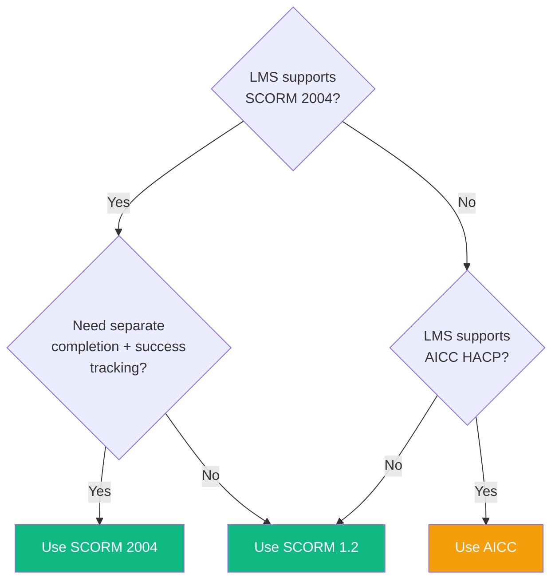

# SCORM & LMS Integration Guide

Covers packaging eLearn Studio courses for LMS delivery — SCORM 1.2, SCORM 2004, and AICC — and importing them into Moodle.

---

## What is SCORM?

SCORM (Sharable Content Object Reference Model) is a set of standards for e-learning content. A SCORM package is a ZIP file that an LMS can import, launch, and track. The LMS injects a JavaScript API object into the iframe window; the runtime player uses it to report scores, completion, and position.

eLearn Studio packages courses into a ZIP containing:

- `imsmanifest.xml` — tells the LMS what's in the package and how to launch it
- `index.html` — the course entry point
- `player.js` — the Runtime Player bundle
- `assets/` — any media referenced by the course
- `phaser-bundle.js` — only present when the course contains Phaser simulations

---

## Which Standard to Choose

| Standard | When to use | API endpoint |
|---|---|---|
| **SCORM 1.2** | Default choice. Widest LMS compatibility. | `POST /courses/:id/export/scorm12` |
| **SCORM 2004 4th Ed.** | When your LMS supports it and you need separate `completion_status` + `success_status`. | Packager library implemented; REST endpoint not yet exposed — use `packSCORM2004()` directly |
| **AICC** | Legacy LMSes that predate SCORM (uses HTTP HACP instead of JavaScript API). | Packager library implemented; REST endpoint not yet exposed — use `packAICC()` directly |

---

## CMI Data Fields Written by the Runtime Player

### SCORM 1.2

| CMI Element | Value | Notes |
|---|---|---|
| `cmi.core.score.raw` | `0`–`100` | Percentage score |
| `cmi.core.score.min` | `0` | |
| `cmi.core.score.max` | `100` | |
| `cmi.core.lesson_status` | `passed` / `failed` / `incomplete` | Compared against `adlcp:masteryscore` in manifest |
| `cmi.core.lesson_location` | Slide index (integer) | Saved on each navigation |
| `cmi.suspend_data` | JSON blob | Full state for resume |

### SCORM 2004

| CMI Element | Value | Notes |
|---|---|---|
| `cmi.score.raw` | `0`–`100` | |
| `cmi.score.min` | `0` | |
| `cmi.score.max` | `100` | |
| `cmi.score.scaled` | `-1.0`–`1.0` | `score / 100`, 7 decimal places |
| `cmi.completion_status` | `completed` / `incomplete` | Set by content (`deliveryControls completionSetByContent="true"`) |
| `cmi.success_status` | `passed` / `failed` / `unknown` | |
| `cmi.location` | Slide index | |

---

## Asset Bundling

All SCORM packages automatically include assets referenced by the course. The export endpoint:

1. Scans all widgets for asset references (e.g., images, audio, video, screenshots)
2. Downloads assets from Garage S3 storage
3. Rewrites asset paths in the course HTML from absolute (`/assets/uuid`) to relative (`assets/uuid`)
4. Bundles assets into the ZIP under the `assets/` folder

This ensures the course package is **self-contained and runs offline** in any LMS without external asset requests.

The `phaser-bundle.js` file is automatically included only when the course contains at least one Phaser simulation widget, keeping packages minimal.

---

## Sections

| File | Contents |
|---|---|
| [scorm12.md](./scorm12.md) | SCORM 1.2 export via API + Moodle import walkthrough |
| [scorm2004.md](./scorm2004.md) | SCORM 2004 export + sequencing details |
| [aicc.md](./aicc.md) | AICC 4-file format + HACP bridge |
| [compatibility.md](./compatibility.md) | LMS × format compatibility matrix |
| [troubleshooting.md](./troubleshooting.md) | Common LMS integration problems and fixes |
