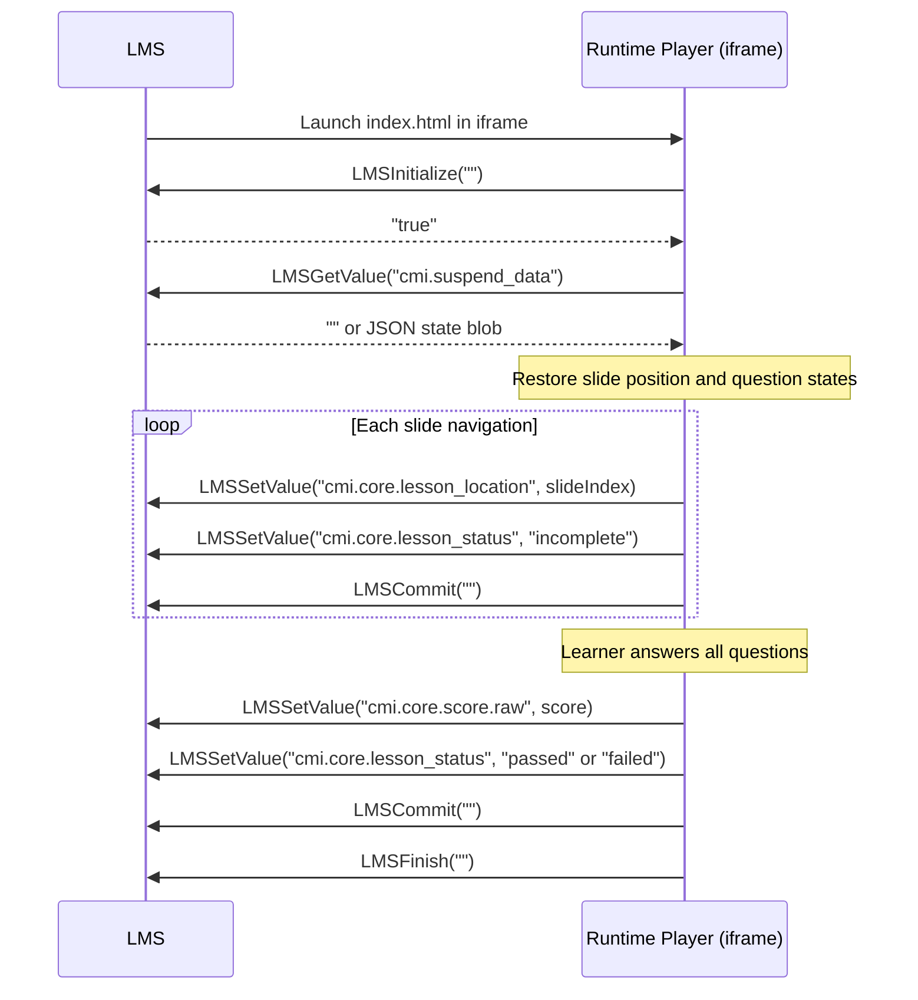

# SCORM 1.2

Export a course as a SCORM 1.2 ZIP and import it into Moodle.

---

## Communication Flow



The Runtime Player auto-detects the SCORM 1.2 API by looking for `window.API` in the parent frame hierarchy (up to 10 levels). If the LMS injects the API object before `index.html` loads, initialization is automatic.

---

## Export via API

```bash
curl -X POST http://localhost:3001/courses/64e1f2a3b4c5d6e7f8a9b0c1/export/scorm12 \
  -H "Authorization: Bearer $ACCESS_TOKEN" \
  -o my_course_scorm12.zip
```

**Rate limit:** 5 requests per 15 minutes per user.

**Response:** `200 application/zip` — file download.

The ZIP filename uses the course title with non-alphanumeric characters replaced by underscores, truncated to 64 characters: `<safe_title>_scorm12.zip`.

**ZIP contents:**

```
<safe_title>_scorm12/
├── imsmanifest.xml         # SCORM 1.2 manifest with adlcp:masteryscore
├── adlcp_rootv1p2.xsd      # schema files
├── ims_xml.xsd
├── imscp_rootv1p1p2.xsd
├── index.html              # course entry point
├── player.js               # Runtime Player bundle
├── phaser-bundle.js        # (only if course contains phaser-sim widgets)
└── assets/                 # bundled course media (PNG, JPEG, MP3, etc.)
    └── <uuid>.<ext>
```

All assets referenced in the course (images, audio, video, screenshots) are automatically collected from Garage S3, downloaded, and bundled into the ZIP. Asset paths in the course HTML are rewritten from absolute (`/assets/...`) to relative (`assets/...`) so the package works offline in the LMS.

---

## Manifest Details

The `imsmanifest.xml` sets the mastery score via `adlcp:masteryscore`:

```xml
<item identifier="ITEM_1" identifierref="RES_1" isvisible="true">
  <title>My Course</title>
  <adlcp:masteryscore>80</adlcp:masteryscore>
</item>
```

The value comes from `course.metadata.masteryScore` if set, otherwise `course.settings.passingScore`, defaulting to `80`.

---

## Import into Moodle

Moodle is available at `http://localhost:8081` in the dev Docker stack.

1. Download the SCORM ZIP:
   ```bash
   curl -X POST http://localhost:3001/courses/64e1f2a3b4c5d6e7f8a9b0c1/export/scorm12 \
     -H "Authorization: Bearer $ACCESS_TOKEN" \
     -o course_scorm12.zip
   ```

2. In Moodle, navigate to your course.

3. Turn editing on: **Gear icon → Turn editing on**.

4. Click **Add an activity or resource** → select **SCORM package** → click **Add**.

5. Set the **Name** field.

6. Under **Package file**, drag and drop `course_scorm12.zip`.

7. Expand **Grade** → set **Grading method** (e.g. "Highest attempt") and **Attempts allowed**.

8. Click **Save and display**.

9. Click the activity to launch it — the Runtime Player loads in a popup or inline frame.

10. Complete the course and click **Submit**. Verify the grade appears in the Moodle gradebook.

---

## Suspend and Resume

The Runtime Player saves the learner's position and question answers to `cmi.suspend_data` as a JSON blob on every slide navigation and score event. When the learner returns to the course, the LMS restores `suspend_data` and the player resumes from the saved slide.

`cmi.suspend_data` is limited to 4096 bytes in SCORM 1.2. Courses with many question widgets and large state objects should use SCORM 2004, which has a 64KB limit on `cmi.suspend_data`.
