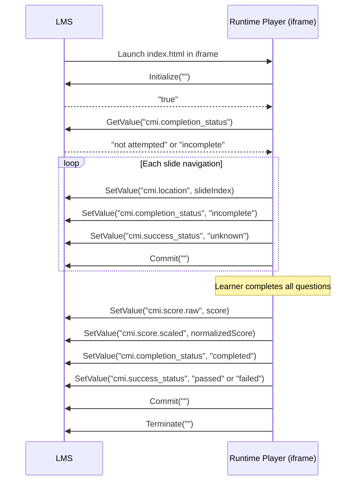

# SCORM 2004

Export a course as a SCORM 2004 4th Edition package. The packager library is fully implemented; a REST endpoint is not yet exposed — use the packager programmatically.

---

## Sequencing Flow



The Runtime Player checks for `window.API_1484_11` before `window.API`. A SCORM 2004 LMS injects `API_1484_11`; the player uses it automatically with no configuration.

---

## Differences from SCORM 1.2

| Aspect | SCORM 1.2 | SCORM 2004 4th Ed. |
|---|---|---|
| API object | `window.API` | `window.API_1484_11` |
| Initialize | `LMSInitialize("")` | `Initialize("")` |
| Finish | `LMSFinish("")` | `Terminate("")` |
| Completion | `cmi.core.lesson_status` | `cmi.completion_status` + `cmi.success_status` (separate) |
| Score | `cmi.core.score.raw` | `cmi.score.raw` + `cmi.score.scaled` |
| Location | `cmi.core.lesson_location` | `cmi.location` |
| Mastery | `adlcp:masteryscore` in manifest | `adlcp:completionThreshold` (normalized, e.g. `"0.80"`) |
| suspend_data limit | 4 096 bytes | 64 000 bytes |

---

## Manifest Structure

```xml
<manifest identifier="ELEARN_<id>" version="1"
  xmlns="http://www.imsglobal.org/xsd/imscp_v1p1"
  xmlns:adlcp="http://www.adlnet.org/xsd/adlcp_v1p3"
  xmlns:imsss="http://www.imsglobal.org/xsd/imssequencing_v1p0">

  <metadata>
    <schema>ADL SCORM</schema>
    <schemaversion>2004 4th Edition</schemaversion>
  </metadata>

  <organizations default="ORG_1">
    <organization identifier="ORG_1">
      <title>My Course</title>
      <item identifier="ITEM_1" identifierref="RES_1" isvisible="true">
        <title>My Course</title>
        <adlcp:completionThreshold>0.80</adlcp:completionThreshold>
        <imsss:sequencing>
          <imsss:controlMode choice="true" flow="true"/>
          <imsss:deliveryControls
            completionSetByContent="true"
            objectiveSetByContent="true"/>
        </imsss:sequencing>
      </item>
    </organization>
  </organizations>
```

`completionThreshold` is derived from `course.metadata.masteryScore` divided by 100, formatted to 2 decimal places. `completionSetByContent="true"` means the Runtime Player is responsible for setting `cmi.completion_status` — the LMS does not set it on its own.

---

## Using the Packager Programmatically

```typescript
import { packSCORM2004 } from '@elearn-studio/scorm-packager'
import type { CourseDoc } from '@elearn-studio/scorm-packager'
import * as os from 'os'

const zipPath = await packSCORM2004(course as CourseDoc, os.tmpdir(), {
  playerPath: '/path/to/player.js',  // optional — defaults to runtime-player dist
})
// zipPath = '/tmp/<safe_title>_scorm2004.zip'
```

The function signature matches `packSCORM12` — only the manifest output and ZIP filename differ.

---

## Phaser Simulations

If the course contains any `phaser-sim` widgets, the packager automatically includes `phaser-bundle.js` in the ZIP (if the file exists at the default path). The Runtime Player loads it lazily on demand — it is not loaded unless a Phaser widget is encountered.
