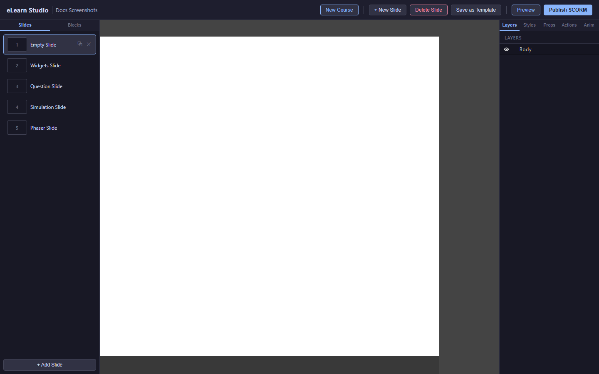
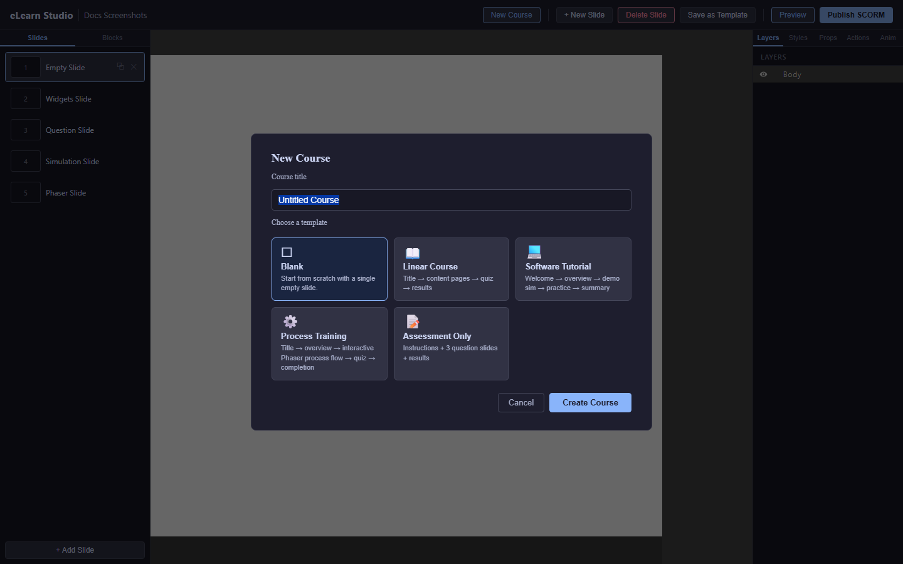

# Getting Started

eLearn Studio is a web-based course authoring tool. You build courses in your browser — adding slides, questions, simulations, and interactivity — then export them to your Learning Management System (LMS).

---

## System requirements

- A modern web browser: Chrome 120+, Firefox 120+, or Edge 120+
- A screen resolution of 1280×800 or higher (1920×1080 recommended for the editor)
- A stable internet connection (the tool saves automatically)

> ℹ️ **Note:** eLearn Studio runs on a server provided by your organization. You do not install anything on your own computer.

---

## First login

1. Open your browser and go to the eLearn Studio address provided by your administrator (for example, `http://your-server:3000`).
2. Click **Register** if this is your first time, or **Login** if you already have an account.
3. For registration, enter your email address and choose a password.
   Click **Create account**.
4. After logging in, the editor opens automatically.

*The editor on first login — the canvas is empty and ready for your first course*

---

## Creating your first course

When you first log in, eLearn Studio opens a blank course for you. To create an additional course:

1. Click **New Course** in the top toolbar.
   A dialog box appears asking for a course title.

   
   *The New Course dialog — enter a title to get started*

2. Type a name for your course (for example, "Safety Induction 2026").
3. Click **Create**.
   The editor opens with one blank slide.
4. Click the slide title "Slide 1" in the slide list on the left to rename it.
   Type your title and press **Enter**.

Your course is now ready. The editor auto-saves every 2 seconds as you work.

> 💡 **Tip:** Give your course a clear, descriptive title — it becomes the default title in your LMS after publishing.

---

## Next steps

- [Editor Overview](02-editor-overview.md) — learn the layout of the authoring interface
- [Working with Slides](03-working-with-slides.md) — add more slides and build your course structure
- [Content Blocks](04-widgets.md) — add text, images, and other content to your slides
