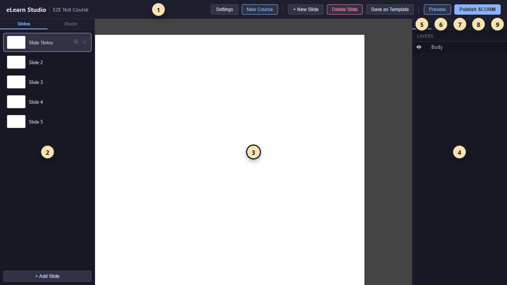

# 01 — Welcome

eLearn Studio is an authoring tool for creating interactive e-learning courses. You build a course one slide at a time, add rich content (text, images, buttons, media, questions, simulations), wire interactive logic with a visual **Actions Editor**, preview your work in a browser, and publish a SCORM package ready to upload to your Learning Management System. It is designed for trainers, instructional designers, and subject-matter experts — no programming needed.

---

## Your screen at a glance

When you open a course, the editor has **four main areas**. The right sidebar exposes **five tabs** that switch the panel underneath.

<!-- screenshot: 01-full-ui-annotated.png (1x, <600KB, full-screen capture of the editor with a sample course loaded; numbered callouts 1-9 overlaid — 1-4 mark the four main areas, 5-9 mark the five right-sidebar tabs; dark theme) -->

*The editor's four main areas plus the right sidebar's five tabs. Main areas: (1) Top toolbar; (2) Left sidebar; (3) Canvas; (4) Right sidebar. Right-sidebar tabs: (5) Layers; (6) Styles; (7) Props; (8) Actions; (9) Anim.*

### 1. Top toolbar

The strip across the very top of the screen. It contains the course title, the **Add slide** button, the **Preview** button (tries your course in a new window), the **Publish SCORM** button (packages your course for upload to your Learning Management System), and the **save indicator** that tells you whether your latest changes are synced.

### 2. Left sidebar

Two tabs:

- **Slides** — a list of every slide in your course. Click to switch between slides; drag to reorder; double-click a slide title to rename it.
- **Blocks** — the library of **content blocks** you can drag onto the canvas: Text, Image, Button, questions, simulations, and more. Grouped into categories: Basic, Navigation, Media, Assessment, Questions, Simulations.

### 3. Canvas

The 1024 × 768 area in the centre of the screen where you design each slide. Every block you place on the canvas ends up here; you position them freely by dragging, resize with the corner handles, and select them with a click.

### 4. Right sidebar

Five tabs, each showing information or settings for the **selected** block (or for the whole slide when nothing is selected):

- **Layers** — a hierarchical list of every block on the current slide. Useful when blocks overlap.
- **Styles** — visual styling for the selected block (typeface, colour, background, border, etc.).
- **Props** — the settings of the selected block: its name, content, options, scoring rules — whatever is specific to its kind.
- **Actions** — the course logic attached to this block ("When X happens → do Y"). Covered in full in [09 — Actions Editor](09-actions-editor.md).
- **Anim** — path animations for blocks that move on the canvas.

---

## Auto-save — how your work stays safe

Every change you make is saved automatically. You do not have to press a save button.

### How it works

- When you edit a block, move it, or change a setting, the editor starts a short timer.
- About **two seconds** after your last edit, all pending changes are saved to the server.
- During this window, the **save indicator** in the top toolbar briefly reads *"Saving…"*; after the save completes it returns to its usual "all synced" state.

### The close-tab warning

If you try to close the browser tab within the two-second window before auto-save fires, the browser shows its native *"Leave site? Changes you made may not be saved"* prompt. Choosing *Stay* lets auto-save complete; choosing *Leave* may lose the last second or two of edits. Anything you edited before the window started is already persisted.

### If saving fails

Network issues can interrupt a save. When that happens, a red banner labelled *Save failed* appears below the top toolbar with a **Retry** button. Click Retry to try again. Until saving recovers, navigation between slides is blocked to avoid losing edits.

> 💡 **Tip:** Watch the save indicator before closing the tab. A quick glance confirms your edits reached the server.

---

## Quick terminology

You'll meet these words everywhere in this guide. Definitions are expanded in the [20 — Glossary](20-glossary.md); this list gets you comfortable enough to read the next chapters.

- **Course** — the whole lesson you are building: a list of slides plus course-level settings.
- **Slide** — one 1024 × 768 screen of your course.
- **Block** (also *content block*) — anything you drag onto a slide: a text, an image, a button, a question, a simulation.
- **Props** — the settings panel for whichever block you currently have selected. Shown on the right sidebar.
- **Action** — something the course does automatically when a trigger happens (navigate, show a hint, play media, score a question, report to the Learning Management System).
- **Trigger** — the event that starts an action (*click*, *enterSlide*, *questionCorrect*, and others).
- **SCORM** — the industry-standard packaging format for e-learning content, used by nearly every Learning Management System to run your course.

---

## What to read next

- To build your first course right now: [02 — Getting Started](02-getting-started.md).
- If you already know your way around and want a block reference: [04 — Basic Blocks](04-blocks-basic.md).
- If you are ready to wire interactive logic: [09 — Actions Editor](09-actions-editor.md).
- To try your work in a browser: [15 — Preview](15-preview.md).
- To package and upload a finished course: [16 — Publish as SCORM](16-publish-scorm.md).
- To look up any term: [20 — Glossary](20-glossary.md).
