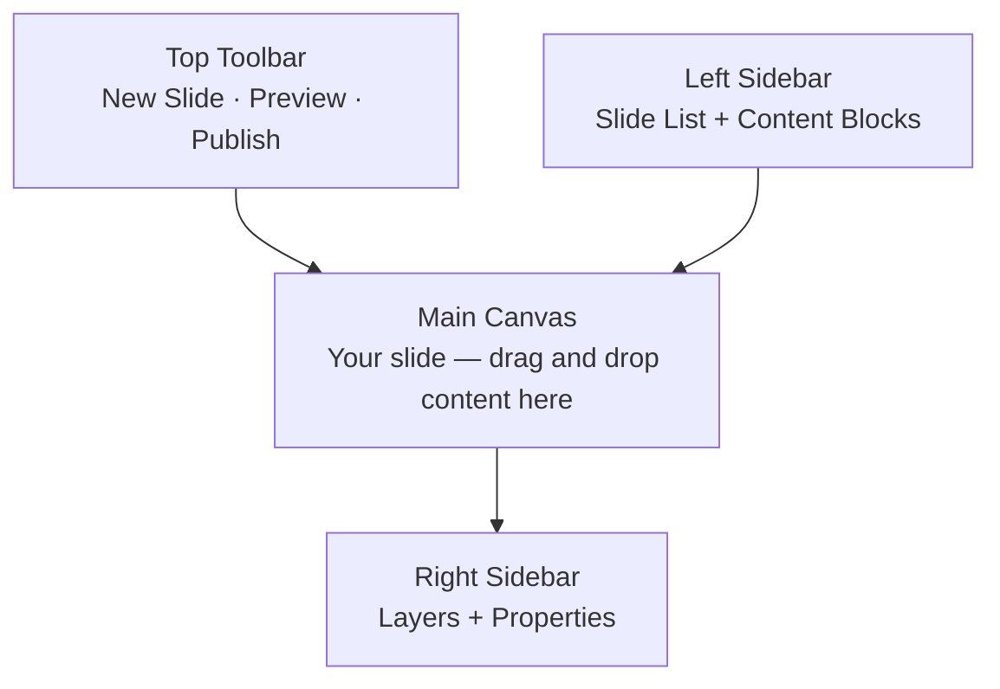
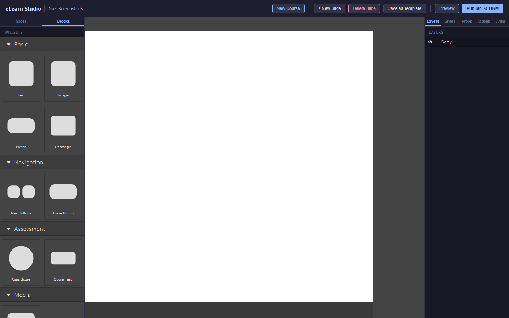
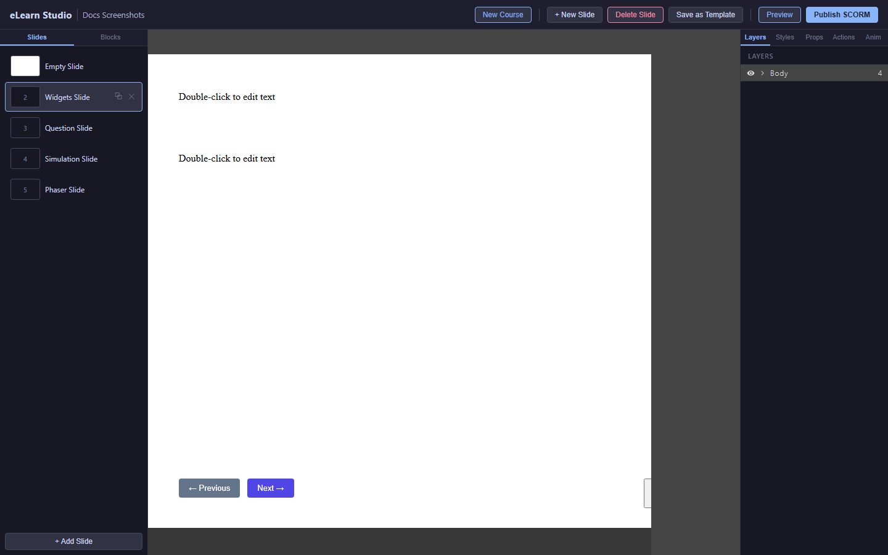
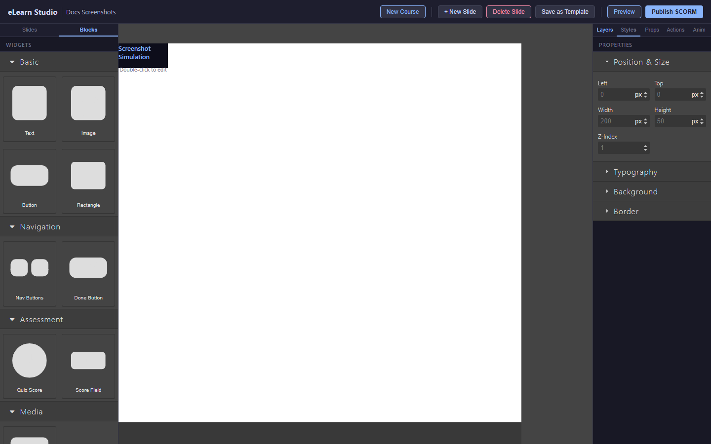

# Editor Overview

The editor is divided into four areas: the left sidebar, the main canvas, the right sidebar, and the top toolbar. Understanding each area will help you work efficiently.

*The four areas of the eLearn Studio editor*

---

## Left sidebar

The left sidebar has two tabs:

### Slide list (top tab)

The slide list shows all slides in your course in order. Click a slide to open it in the canvas.

- The currently open slide is highlighted.
- Drag a slide up or down to reorder it.
- Click the **+** button to add a new slide below the selected one.

### Content blocks (bottom tab)

The content blocks panel shows everything you can place on a slide: text boxes, images, buttons, questions, and more.

Drag a block from this panel onto the canvas to add it to your slide.

*The Content Blocks panel — drag any block onto the canvas to add it to your slide*

---

## Main canvas

The canvas is your slide. It is 1024 × 768 pixels — the same fixed size for every slide.

- Click any element on the canvas to select it.
- Drag a selected element to move it.
- Drag the handles on a selected element's edges to resize it.
- Right-click an element for options: duplicate, delete, and more.

---

## Right sidebar

The right sidebar has two tabs:

### Layers

The layers panel shows all elements on the current slide in order (front to back). Use it to:

- Select an element by clicking its name in the list.
- Reorder elements by dragging them in the list.
- Show or hide individual elements using the eye icon.

*The Layer Manager — shows all elements on the current slide*

### Properties

When you select an element on the canvas, its properties appear here. You can change position, size, color, font, and element-specific settings.

*The Properties panel — different properties appear depending on the selected element type*

---

## Top toolbar

| Button | What it does |
|---|---|
| **New Slide** | Adds a blank slide after the current slide |
| **Delete Slide** | Removes the current slide (cannot be undone) |
| **Preview** | Opens the current course in the runtime player in a new tab |
| **Publish** | Exports the course as a SCORM ZIP file for your LMS |

> ⚠️ **Important:** The **Delete Slide** action is permanent. If you delete a slide by mistake, use [Course History](10-course-history.md) to restore it.

---

## Auto-save

eLearn Studio saves your work automatically every 2 seconds. You do not need to click a Save button. The title bar shows a brief "Saved" confirmation after each auto-save.

> 💡 **Tip:** You can also press **Ctrl+Z** (Windows) or **Cmd+Z** (Mac) to undo the last change on the canvas.
