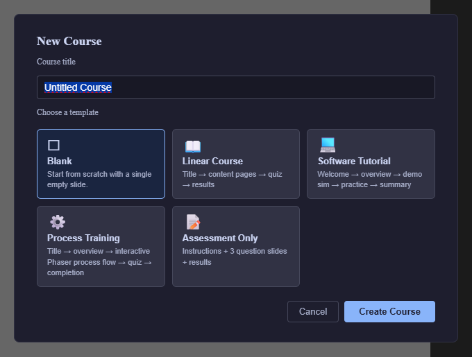
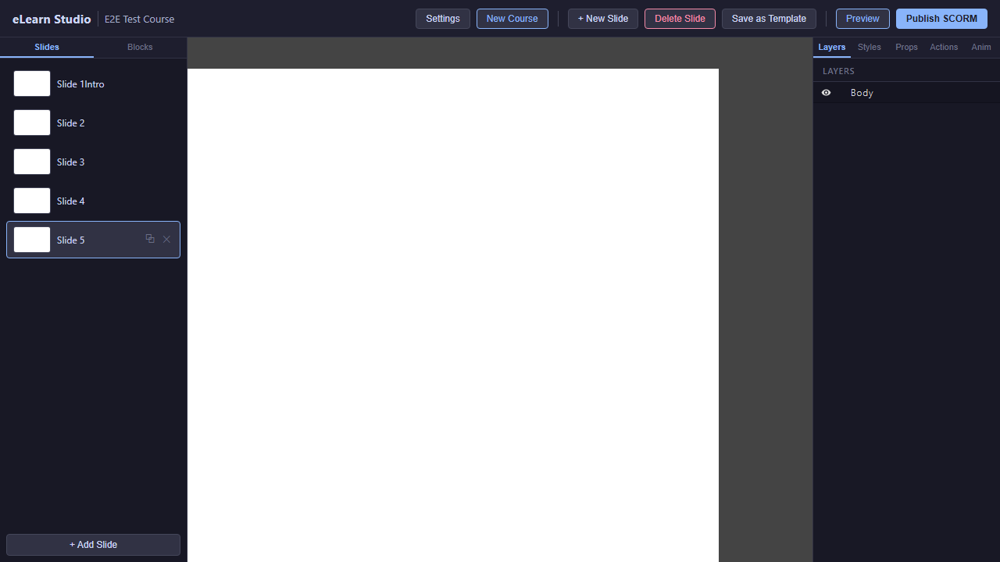

# 02 — Getting Started

This chapter walks you through the five-minute path from the moment you sign in to a finished, publishable course. Along the way you'll use every part of the editor at least once. The goal is not a polished course — it's to feel how the tool works end to end.

---

## Sign in

1. Open the site in your browser.
2. Enter your email and password on the sign-in page.
3. Click **Sign in**. You arrive at the course list (or directly at the editor if your organisation set one as the default).

> ℹ️ **Note:** If you do not have an account yet, ask your administrator to create one for you. Self-registration is controlled by your organisation's policy.

---

## Create a new course

1. From the course list (or the top toolbar), choose **New Course**.
2. Give the course a title — for example, *My First Course*.
3. The editor opens with an empty first slide already created for you.

<!-- screenshot: 02-create-course.png (1x, <300KB, New Course dialog or menu with the title field filled in; dark theme) -->

*Creating a new course. Enter a title and confirm to open the editor.*

---

## Your first slide

The first time the editor opens, you see:

- The **canvas** in the centre — an empty 1024 × 768 area.
- The **Slides** tab on the left with one entry: *Slide 1*.
- The **Blocks** tab waiting on the same sidebar.
- The **Right sidebar** empty (nothing is selected yet).

<!-- screenshot: 02-first-slide.png (1x, <300KB, editor view with an empty first slide visible on the canvas and the Slides tab showing one entry; dark theme) -->

*The editor with an empty first slide. The canvas is where you'll place blocks; the Slides tab on the left lists every slide in the course.*

---

## The five-minute path

Let's build a minimal course — title, image, Start button — and publish it.

### Step 1 — Add a title

1. In the left sidebar, open the **Blocks** tab.
2. Drag a **Text** block from the **Basic** category onto the canvas, near the top.
3. Double-click the block and type *"Welcome to my course"*.
4. Click outside the block to confirm. Your title is saved automatically.

### Step 2 — Add an image

1. Drag an **Image** block onto the canvas, below the title.
2. Double-click the image placeholder. The **Asset Library** opens.
3. Click **Upload**, pick any picture from your computer, and confirm.
4. Back on the canvas, select the image block, and in the **Props** tab on the right, type a short **Alt text** describing the picture (for accessibility).

### Step 3 — Add a Start button

1. Drag a **Button** block onto the canvas, below the image.
2. Select the button and, in the **Props** tab, set the **Label** to *"Start"*.
3. Set the **Name** (also in Props) to *StartBtn*. This name will appear in action dropdowns later.

That's one finished slide. Congratulations — you've built the smallest possible course.

> 💡 **Tip:** Every block you add triggers auto-save within two seconds. There is nothing to press to "commit" your work.

### Step 4 — Add a second slide and wire navigation

1. Click **Add slide** in the top toolbar. A blank *Slide 2* appears and becomes the active slide.
2. Drag a **Text** block onto Slide 2 and type *"Thanks for trying it out!"*.
3. Switch back to Slide 1 using the **Slides** tab on the left.
4. Select **StartBtn**, open the **Actions** tab on the right.
5. Click **+ Event** and pick **click**. A new tab titled *Click* appears.
6. Click **Add action** and pick **Navigation → Navigate**.
7. In the dropdown, pick **Next slide**. Done.

For the full Actions Editor concept and every available trigger and action, see [09 — Actions Editor](09-actions-editor.md).

### Step 5 — Try it in a browser

1. Click **Preview** in the top toolbar.
2. A new browser window opens with Slide 1. Click **Start**. You should arrive at Slide 2.
3. Close the Preview window.

If the popup did not appear, see [15 — Preview → Allowing popups](15-preview.md#allowing-popups).

### Step 6 — Publish as SCORM

1. Click **Publish SCORM** in the top toolbar. The Publish dialog opens.
2. Pick **SCORM 1.2** (the safest default — works on almost every Learning Management System).
3. Click **Publish**. A ZIP file downloads in a few seconds.
4. Upload that ZIP to your Learning Management System following its usual course-upload flow. The exact steps are LMS-specific.

For the full publishing guide including the format decision, see [16 — Publish as SCORM](16-publish-scorm.md).

---

## What just happened

In five minutes you used:

- **Slides** (Slide 1 and Slide 2) — see [03 — Slides](03-slides.md).
- **Blocks** — Text, Image, Button (the four "basic" blocks) — see [04 — Basic Blocks](04-blocks-basic.md).
- **The Asset Library** — for the image upload.
- **Props** — to set the button label, button name, image alt text.
- **The Actions Editor** — to wire *click → Navigate*.
- **Preview** — to try the course in a browser.
- **Publish SCORM** — to get a ZIP ready for your LMS.

This is the full life cycle of every course, just scaled up. Bigger courses have more slides, more blocks, more elaborate actions — but the shape of the work is always the same.

---

## What to do next

- Learn how to manage the slide list: [03 — Slides](03-slides.md).
- Explore the four basic blocks in depth: [04 — Basic Blocks](04-blocks-basic.md).
- Add your first real question: [08 — Questions](08-blocks-questions.md).
- See a complete five-slide course built end to end: [17 — Worked Example](17-worked-example.md).
- Look up any term in the [20 — Glossary](20-glossary.md).
