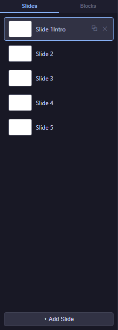

# 03 — Slides

Your course is a list of **slides**, each one a 1024 × 768 screen where you place content. This chapter shows you how to add, rename, reorder, duplicate, and delete slides, and how to recover when a slide looks broken.

<!-- screenshot: 03-slides-tab.png (1x, <300KB, left sidebar with the Slides tab active, showing a list of 5 named slides with the Add slide button visible at the top; dark theme) -->

*The Slides tab. (1) Slide list with rename, reorder, duplicate, and delete controls; (2) Add slide button in the top toolbar.*

---

## Add a slide

1. Click **Add slide** in the top toolbar.
2. A new blank slide appears at the end of the list and becomes the active slide.
3. The editor auto-saves the new slide within two seconds.

---

## Rename a slide

1. In the **Slides** tab on the left, find the slide you want to rename.
2. **Double-click** its title.
3. Type the new name and press **Enter** to confirm (or **Esc** to cancel).

The rename is saved automatically.

> 💡 **Tip:** Name your slides clearly — *Intro*, *Theory*, *Question 1*, *Results*, *Final*. Clear names make it easy to target a specific slide from a **Navigate → By name** action without counting.

---

## Reorder slides

1. In the **Slides** tab, hold down the left mouse button on a slide's entry.
2. Drag it up or down in the list until it appears in the position you want.
3. Release. The slide list updates and the new order is saved.

> ⚠️ **Important:** Reordering slides can change the behaviour of every **Navigate → By number** action in your course (since slide 3 may now be the old slide 4). Prefer **Navigate → By name** or **Next / Previous** when possible to keep your actions immune to reordering.

---

## Duplicate a slide

1. In the **Slides** tab, find the slide you want to duplicate.
2. Click its **more actions** icon (usually a small ⋮ or context menu).
3. Choose **Duplicate**.
4. A copy of the slide appears immediately after the original, with a new generated name (usually *Slide N copy*). Rename it if you like.

Duplicating copies every block on the slide, including its Actions and Props. Identifiers inside the duplicate are newly generated, so Actions that reference blocks on the original slide still point at the originals — not at the copies. Re-wire them if needed.

---

## Delete a slide

1. In the **Slides** tab, find the slide you want to delete.
2. Click its **more actions** icon.
3. Choose **Delete**.
4. Confirm the prompt.

> ⚠️ **Important:** Deleting a slide is irreversible (there is no Undo for course-level actions). Before deleting, make sure:
>
> - No other slide has a **Navigate → By name / By number** action pointing at this slide.
> - No other slide has a **Show / Hide / Play Media** action referencing a block that lives on this slide (targets on other slides do not exist at runtime anyway, but cleaning them up keeps your course tidy).

---

## Auto-save and slide operations

Every slide-level action (add, rename, reorder, duplicate, delete) is saved automatically within two seconds. You'll see the **save indicator** in the top toolbar briefly switch to *Saving…* and return to its normal state when the save completes. See [01 — Auto-save](01-welcome.md#auto-save--how-your-work-stays-safe) for the full picture.

If a save fails during a slide operation (rare, usually a brief network problem), a red banner appears below the top toolbar with a **Retry** button. Navigation between slides is blocked until the save succeeds or you click Retry. That way your work is never silently lost.

---

## Recovering from a broken slide

Occasionally you'll open a slide and the canvas appears blank or behaves strangely. This usually means one of the blocks on the slide has an inconsistent state (for example, an action pointing at a block that no longer exists).

1. Select the slide. Open the **Layers** tab on the right sidebar.
2. Every block on the slide is listed there, even if invisible on the canvas.
3. Click each entry in turn. Look for any block whose **Props** panel shows a red border or a missing field.
4. Fix the block's settings, or delete it from the Layers list if it cannot be recovered.
5. If the slide is still broken, duplicate the adjacent slide and rebuild the content — this is often faster than repairing a corrupt one.

For the full fix list: [18 — Troubleshooting](18-troubleshooting.md#10-a-specific-slide-refuses-to-load).

---

## Slide-level actions

As well as block-level actions (click, mouseEnter, etc.), each slide has its own triggers: **enterSlide** (fires when the learner arrives at the slide) and **exitSlide** (fires when they leave). Use them for setup and teardown logic — resetting variables, playing intro audio, checking the score before branching. See [10 — Slide triggers](10-actions-triggers-reference.md#slide-triggers--2-events).

---

## What to do next

- Start placing content on your slides: [04 — Basic Blocks](04-blocks-basic.md).
- Add navigation so the learner can move between slides: [05 — Navigation Blocks](05-blocks-navigation.md).
- Build a full worked example with five slides: [17 — Worked Example](17-worked-example.md).
- If a slide refuses to load: [18 — Troubleshooting](18-troubleshooting.md#10-a-specific-slide-refuses-to-load).
- Look up any term: [20 — Glossary](20-glossary.md).
