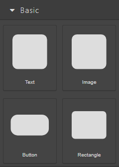
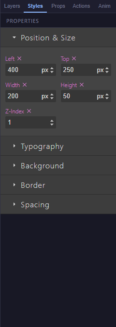
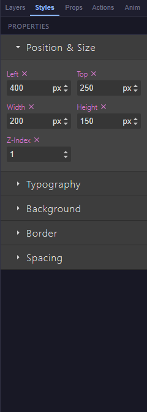
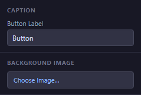

# 04 — Basic Blocks

The four blocks in the **Basic** category of the **Blocks** tab are the building bricks you use on almost every slide: **Text**, **Image**, **Button**, and **Rectangle**. This chapter shows you the settings of each one, step-by-step, with a short example.

All four live in the same place on the left sidebar:

<!-- screenshot: 04-basic-blocks-category.png (1x, <300KB, left sidebar cropped to the Basic category) -->

*The four basic blocks as they appear in the Blocks tab. Drag any of them onto the canvas.*

> 💡 **Tip:** Every block has a **Name** field in the **Props** tab. Naming your blocks now makes them much easier to find later when you wire them to [actions](09-actions-editor.md). For a refresher on terminology, see the [Glossary](20-glossary.md).

---

## Text

A block that shows written content on your slide. You edit the text directly on the canvas; the typeface, size, and colour are set from the **Styles** tab.

<!-- screenshot: 04-text-props.png (1x, <300KB, right sidebar cropped to the Props panel for a selected Text block) -->

*The Props panel for a Text block. (1) Name field; (2) standard content traits applied by the Blocks tab.*

### Props

| Field | Type | Default | Range / Notes |
|---|---|---|---|
| Name | Text | *(empty)* | Optional label. Shows up in the Actions Editor and Layers panel. |
| Content | Rich text | `Double-click to edit text` | Edited directly on the canvas by double-clicking the block. |
| Size | Width × Height | 200 × 50 px | Drag the block's corner handles to resize. |
| Font size, colour | Style | 16 px, black | Changed from the **Styles** tab when the block is selected. |

### Steps

1. Open the **Blocks** tab on the left sidebar and drag **Text** onto the canvas.
2. **Double-click** the block to enter edit mode and type your text.
3. Click anywhere outside the block to confirm. Your text is saved automatically.
4. To change the typeface, colour, or alignment, switch to the **Styles** tab on the right and adjust the settings there.

> 💡 **Tip:** Text blocks can contain rich formatting — bold, italics, and links. Select part of the text and use the small floating toolbar that appears above the block.

---

## Image

A block that displays a picture on your slide. Pictures come from the built-in **Asset Library**, which is shared across your whole course.

<!-- screenshot: 04-image-props.png (1x, <300KB, Props panel for a selected Image block with a sample picture chosen) -->

*The Props panel for an Image block. (1) Name field; (2) Alt text field for accessibility.*

### Props

| Field | Type | Default | Range / Notes |
|---|---|---|---|
| Name | Text | *(empty)* | Optional label (Props → Name). |
| Source | Picture | *(empty)* | Chosen from the **Asset Library** — see step 2 below. |
| Alt text | Text | *(empty)* | Short description of the picture for screen readers. |
| Size | Width × Height | 200 × 150 px | Resize with the corner handles. The picture keeps its aspect ratio by default. |

### Steps

1. Drag **Image** from the **Blocks** tab onto the canvas. A placeholder shape appears.
2. **Double-click** the placeholder. The **Asset Library** opens.
3. Pick an existing picture from the library, or click **Upload** to add a new one, then click to confirm your choice.
4. Select the image block again and, in the **Props** tab, type a short **Alt text** that describes the picture.

> ⚠️ **Important:** Always set an **Alt text** for every image you add. Screen-reader users rely on it to understand what the picture contains. A missing alt text does not stop the course from publishing, but it makes the course less accessible.

---

## Button

An interactive block that reacts when the learner clicks it. On its own, a button does nothing; you wire it to a behaviour in the [Actions Editor](09-actions-editor.md) — for example, navigate to the next slide, show a hint, or play a media block.

<!-- screenshot: 04-button-props.png (1x, <300KB, Props panel for a selected Button block with a custom label) -->

*The Props panel for a Button block. (1) Name field; (2) Label field — the text shown on the button.*

### Props

| Field | Type | Default | Range / Notes |
|---|---|---|---|
| Name | Text | *(empty)* | Optional label (Props → Name). |
| Label | Text | `Button` | The text the learner sees on the button. |
| Size | Width × Height | 120 × 40 px | Resize with the corner handles. |
| Background, colour, border radius | Style | Indigo, white, 4 px | Change from the **Styles** tab. |

### Steps

1. Drag **Button** from the **Blocks** tab onto the canvas.
2. Select the button and, in the **Props** tab, type the text you want in the **Label** field.
3. Open the **Actions** tab on the right sidebar. Click **Add action** and choose a **trigger** — for example, **On click**.
4. Pick an **action** (for example, **Navigate → Next slide**) and save.

> 💡 **Tip:** Keep button labels short and verb-first: *Start*, *Next*, *Show hint*, *Submit*. Long labels cause the button to wrap or clip at small sizes.

---

## Rectangle

A simple coloured shape with an optional border. Use it as a background panel behind other blocks, or as a visual divider.

<!-- screenshot: 04-rectangle-props.png (1x, <300KB, Props panel for a selected Rectangle block) -->

*The Props panel for a Rectangle block. (1) Name field. All visual settings live in the Styles tab.*

### Props

| Field | Type | Default | Range / Notes |
|---|---|---|---|
| Name | Text | *(empty)* | Optional label (Props → Name). |
| Size | Width × Height | 200 × 100 px | Resize with the corner handles. |
| Background colour | Style | Light grey | Change from the **Styles** tab. |
| Border | Style | 1 px solid grey | Change from the **Styles** tab. |

### Steps

1. Drag **Rectangle** from the **Blocks** tab onto the canvas.
2. With the rectangle selected, open the **Styles** tab on the right sidebar.
3. Set the background colour, border, and border radius you want.
4. Drag the rectangle behind the other blocks it should sit behind. If it ends up on top, open the **Layers** tab and move it below the others.

> ℹ️ **Note:** A rectangle is a visual element only — it cannot be clicked by the learner. If you need a clickable panel, use a **Button** instead.

---

## What to do next

Once you are comfortable with the four basic blocks, move on to:

- [05 — Navigation Blocks](05-blocks-navigation.md) to add Next / Previous buttons and a progress bar.
- [09 — Actions Editor](09-actions-editor.md) to make your buttons and other blocks actually do something.
- [20 — Glossary](20-glossary.md) for any term in this chapter you want to check.
