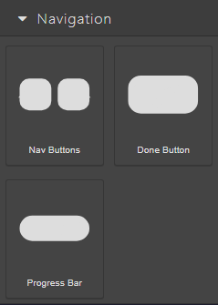
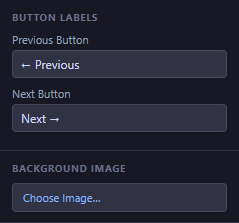
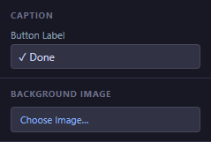
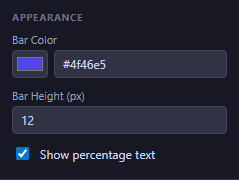

# 05 — Navigation Blocks

The blocks in the **Navigation** category help your learners move through the course and complete it: **Nav Buttons** (Previous / Next), the **Done Button** (marks the course finished and reports the final score), and the **Progress Bar** (shows how far along the learner is). Every scored course should end with a Done Button — see the important note in the [Done Button](#done-button) section below.

<!-- screenshot: 05-navigation-blocks-category.png (1x, <300KB, left sidebar cropped to the Navigation category) -->

*The three navigation blocks as they appear in the Blocks tab. Drag any of them onto the canvas.*

> 💡 **Tip:** Naming your navigation blocks in Props → Name (for example, *MainNext*, *FinishLesson*, *TopProgress*) makes them easy to reference later from the [Actions Editor](09-actions-editor.md).

---

## Nav Buttons

A pair of buttons that move the learner to the **previous** or **next** slide. The two buttons are always shown together as a single block; you edit their labels and styles individually.

<!-- screenshot: 05-navbuttons-props.png (1x, <300KB, Props panel for a selected Nav Buttons block with both child labels visible) -->

*The Props panel for a Nav Buttons block. (1) Name field; (2) Previous label; (3) Next label.*

### Props

| Field | Type | Default | Range / Notes |
|---|---|---|---|
| Name | Text | *(empty)* | Optional label for the whole pair. |
| Previous label | Text | `← Previous` | The text on the left button. |
| Next label | Text | `Next →` | The text on the right button. |
| Size | Width × Height | 240 × 50 px | Resize with the corner handles. |
| Colours, radius | Style | Grey / indigo defaults | Change from the **Styles** tab, one button at a time (click inside the pair to select a single button). |

### Steps

1. Drag **Nav Buttons** from the **Blocks** tab onto the canvas, usually at the bottom of the slide.
2. Select the block and, in the **Props** tab, adjust the **Previous label** and **Next label** if you need wording other than the defaults.
3. Drag the pair to the final position on the slide. Place it consistently in the same place on every slide so learners always find it.

> ℹ️ **Note:** You do not need to wire Nav Buttons to an action — moving to the previous / next slide is built in. The buttons are automatically disabled on the first and last slides respectively.

---

## Done Button

A single button that marks the course as finished, reports the final score to your Learning Management System, and records completion. In SCORM terms, pressing Done is what makes the LMS register "this learner finished the course".

<!-- screenshot: 05-donebutton-props.png (1x, <300KB, Props panel for a selected Done Button with a custom label) -->

*The Props panel for the Done Button. (1) Name field; (2) Label field.*

### Props

| Field | Type | Default | Range / Notes |
|---|---|---|---|
| Name | Text | *(empty)* | Optional label (Props → Name). |
| Label | Text | `✓ Done` | The text the learner sees on the button. |
| Size | Width × Height | 120 × 40 px | Resize with the corner handles. |
| Background, colour | Style | Green / white | Change from the **Styles** tab. Keep it visibly distinct from regular buttons. |

### Steps

1. On your final slide (usually a summary or results slide), drag **Done Button** onto the canvas.
2. Set a clear **Label** — for example, *Finish course* or *Submit results*.
3. Place the button somewhere visible that is clearly the end of the learner's path. Do not hide it behind a click or a dialog.

> ⚠️ **Important — Done Button and SCORM:** Without a Done Button, your Learning Management System never knows the learner finished. Scores and completion are reported only when the learner presses Done. Make sure every scored course has exactly one Done Button on its final slide. Unscored, informational courses can omit it, but then your LMS may show the course as "in progress" forever.

---

## Progress Bar

A horizontal bar at the top or bottom of a slide that fills as the learner advances through the course. The percentage is computed from the number of slides the learner has visited.

<!-- screenshot: 05-progressbar-props.png (1x, <300KB, Props panel for a selected Progress Bar block) -->

*The Props panel for a Progress Bar. (1) Name field; (2) Colour picker; (3) Height; (4) Show percent toggle.*

### Props

| Field | Type | Default | Range / Notes |
|---|---|---|---|
| Name | Text | *(empty)* | Optional label (Props → Name). |
| Colour | Colour picker | Indigo (`#4F46E5`) | Colour of the filled portion of the bar. |
| Height | Number | 12 px | 4–40 px. Taller bars are easier to see at a glance; thinner ones look more discreet. |
| Show percent | Toggle | On | When On, a small percentage (e.g. *40%*) is shown under the bar. Turn off for a cleaner look. |
| Size | Width × Height | 300 × 40 px | Resize with the corner handles. |

### Steps

1. Drag **Progress Bar** onto a slide. It is usually placed consistently at the top or the bottom of every slide.
2. Select the bar and, in the **Props** tab, pick a **Colour** that matches your course's visual style.
3. Adjust the **Height** and the **Show percent** toggle if you want a chunkier bar or a cleaner look without the percentage text.
4. Copy the block to other slides, or add it once to a slide template so it appears everywhere automatically.

> 💡 **Tip:** The percentage counts only slides the learner has *visited*, not slides they have completed. A Progress Bar shown on slide 2 of 5 reads *40%* as soon as the learner arrives, not only once they answer the questions there.

---

## What to do next

- Add questions your learners need to answer before they finish: [08 — Questions](08-blocks-questions.md).
- Wire the Done Button to a "Send to LMS" action and finish the course cleanly: [09 — Actions Editor](09-actions-editor.md).
- Check the terms in this chapter: [20 — Glossary](20-glossary.md).
