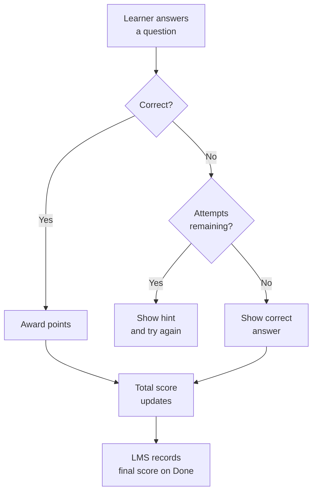
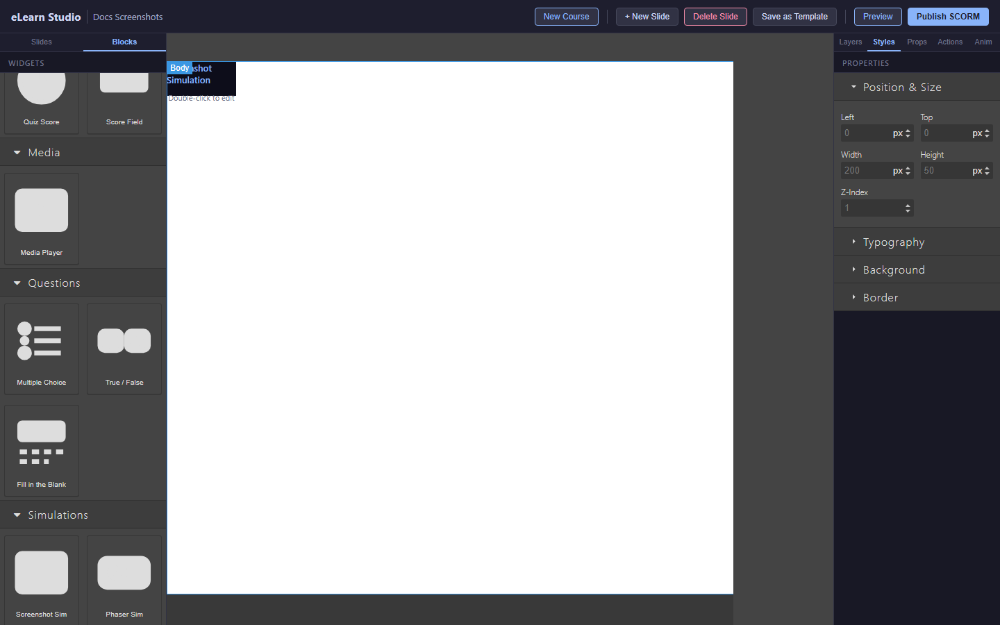
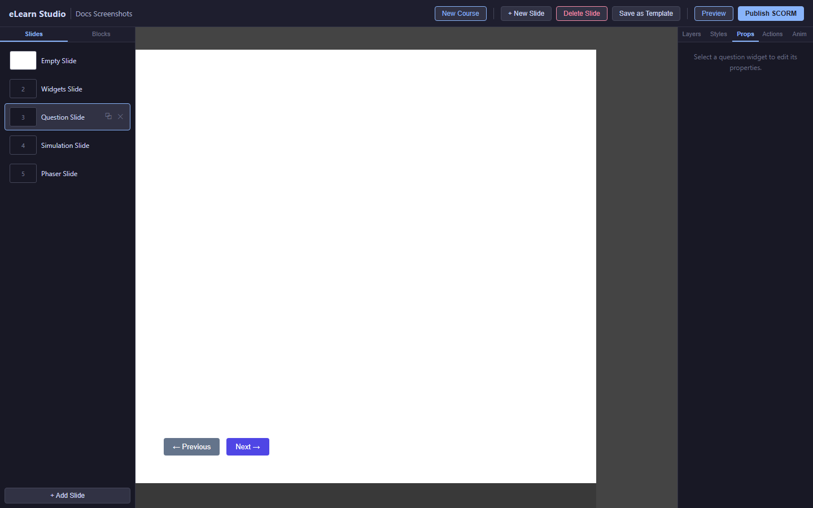

# Questions and Scoring

Questions let you test learner knowledge and track scores. eLearn Studio supports several question types, each with configurable scoring and feedback.

*How answers, scores, and feedback flow from a question to your LMS*

---

## Adding a question

1. Click the **Content Blocks** tab in the left sidebar.
2. Scroll to the **Questions** category.
3. Drag the question type you want onto the canvas.
4. The question block appears on the slide. Click it to open its settings in the Properties panel.

---

## Multiple Choice

Multiple Choice questions present a question and a set of answer options. The learner selects one (or more) correct answers.

*A Multiple Choice question with answer options and scoring settings*

**To set up a Multiple Choice question:**

1. Drag a **Multiple Choice** block onto the canvas.
2. In the Properties panel, type your question text.
3. Add answer options by clicking **+ Add option**. Type each option.
4. Click the checkbox or circle next to the correct answer(s) to mark them as correct.
5. Set the point value in the **Points** field (default: 100).
6. Optionally set a maximum number of attempts — leave at **Unlimited** to allow as many tries as needed.

*The question Properties panel — configure scoring, attempts, and feedback here*

---

## True/False

True/False questions present a statement and ask the learner to choose True or False.

1. Drag a **True/False** block onto the canvas.
2. Type the statement in the Properties panel.
3. Select whether **True** or **False** is the correct answer.
4. Set the point value and attempt limit.

---

## Fill in the Blank

Fill in the Blank questions ask the learner to type a word or phrase.

1. Drag a **Fill in the Blank** block onto the canvas.
2. Type the question text. Use `[blank]` where the answer should appear (for example: "The capital of France is `[blank]`.").
3. In the Properties panel, enter the correct answer text.
4. Optionally enable **Case-insensitive** to accept both uppercase and lowercase answers.

---

## Match Items

Match Items questions ask the learner to connect items in the left column with matching items in the right column.

1. Drag a **Match Items** block onto the canvas.
2. In the Properties panel, add pairs: type the left-column item and its correct right-column match.
3. Add as many pairs as needed by clicking **+ Add pair**.

---

## Drag Objects

Drag Objects questions ask the learner to drag items to the correct positions on a slide.

1. Drag a **Drag Objects** block onto the canvas.
2. Place the target zones on the slide where items should be dropped.
3. In the Properties panel, assign each draggable item to its correct target zone.

---

## Hotspot

Hotspot questions ask the learner to click the correct area on an image.

1. Drag a **Hotspot** block onto the canvas.
2. Upload an image in the Properties panel.
3. Draw hotspot areas on the image by clicking and dragging.
4. Mark which hotspot area is correct.

---

## Configuring feedback

Feedback appears after the learner answers. You can show immediate feedback (right after each attempt) or delayed feedback (after the learner uses all attempts or submits).

In the Properties panel for any question:

- **Correct feedback:** The message shown when the learner answers correctly.
- **Incorrect feedback:** The message shown when the learner answers incorrectly.
- **Feedback timing:** Choose **Immediate** (after each attempt) or **Delayed** (after final attempt).

---

## Setting attempt limits and weights

In the question Properties panel:

- **Points:** How many points this question is worth (default: 100). Set 0 for survey questions that are not graded.
- **Attempts:** How many times the learner can try. Set to **Unlimited** for practice, or **1** for assessment-style questions.

> 💡 **Tip:** For a 10-question course where each question is worth 100 points, the maximum score is 1000. Your LMS will convert this to a percentage automatically.

---

## Mandatory questions (linear-strict navigation)

When a course uses **Linear (strict)** navigation mode (see [Publishing — Navigation Mode](09-publishing.md#navigation-mode)), you can mark individual questions as **mandatory**. A mandatory question must be answered before the learner can advance to the next slide.

To make a question mandatory:

1. Click the question block on the canvas to select it.
2. In the Properties panel, find the **Scoring** section.
3. Enable the **Mandatory** toggle.

> ⚠️ **Note:** The Mandatory toggle only has effect when the course navigation mode is set to **Linear (strict)**. In Free navigation mode the toggle is ignored and learners can always advance.

> 💡 **Tip:** Use mandatory questions for compliance training where proof of engagement on each question is required before the learner can continue.

---

## Previewing questions

Click **Preview** in the top toolbar to open the course in the runtime player. Questions are fully interactive in preview — you can answer them and see scoring in action before publishing.
