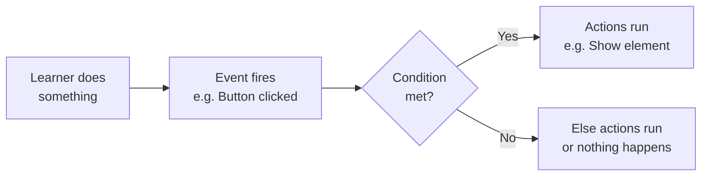
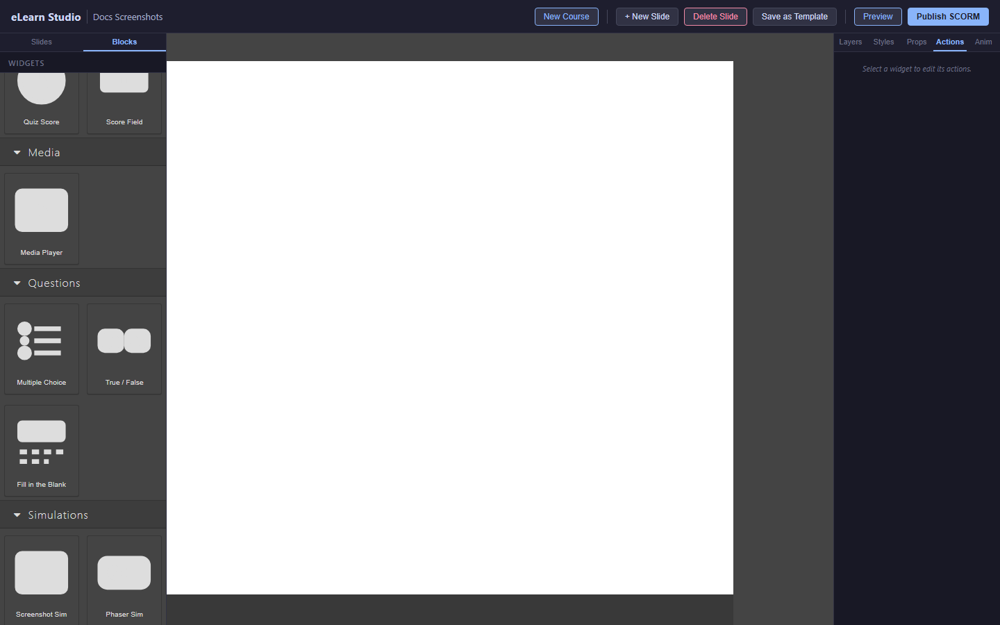
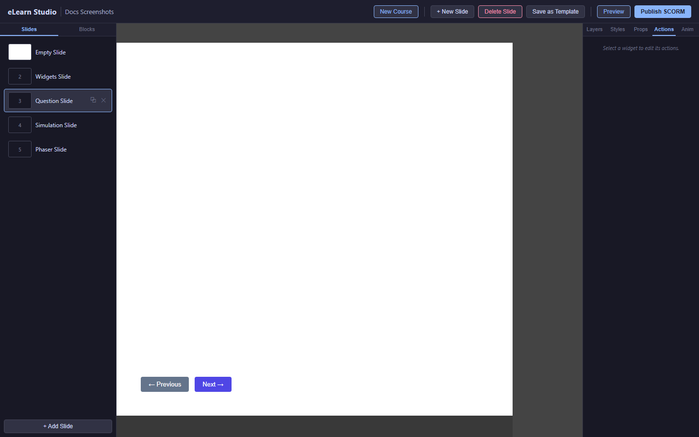

# Course Logic

Course logic lets you control what happens when a learner does something in your course — for example, showing a hint when they click the wrong answer, jumping to a different slide based on their score, or hiding a button until a video has played.

*How course logic connects learner actions to course behavior*

---

## Opening the Course Logic editor

1. Click the element you want to add logic to (for example, a button).
2. In the Properties panel on the right, scroll down to the **Course Logic** section.
3. Click **Edit Logic**.
   The Course Logic editor opens.

*The Course Logic editor — create rules that connect events to actions*

---

## Adding an action

Each logic rule has three parts:
- **When** — the event that triggers the rule (a click, a hover, the slide loading, etc.)
- **Then** — the actions that run when the event fires

To add a rule:

1. Click **+ Add Rule** in the Course Logic editor.
2. In the **When** dropdown, choose the triggering event.
3. Click **+ Add Action** in the **Then** section.
4. Choose an action from the dropdown (see the action types below).
5. Configure the action's settings.
6. Click **Save**.

---

## Action types

| Action | What it does |
|---|---|
| **Show** | Makes a hidden element visible |
| **Hide** | Hides a visible element |
| **Navigate to slide** | Jumps to a specific slide |
| **Navigate to URL** | Opens a web address in a new tab |
| **Play audio** | Plays an audio file |
| **Set variable** | Stores a value you can check later |
| **Submit score** | Sends the current score to the LMS |

---

## Adding a condition

Conditions let you run different actions based on whether something is true or false — for example, showing a congratulations message only if the learner's score is above 80%.

1. In a logic rule, click **+ Add Condition** above the **Then** section.
2. Choose what to check: a variable, the current score, or the current slide number.
3. Choose the comparison (equals, greater than, less than, etc.).
4. Enter the comparison value.
5. Add actions for the **Then** branch (condition is true) and optionally the **Else** branch (condition is false).

*A logic rule with a condition — different actions run depending on the learner's score*

---

## Practical examples

### Show a hint when an answer is wrong

1. Select your question block on the canvas.
2. Open **Course Logic → Edit Logic**.
3. Add a rule: **When** → Question Incorrect, **Then** → Show [hint text box].
4. Place a hidden text box with hint text on your slide.

### Navigate to a different slide based on score

1. Place a **Button** on your slide.
2. Open its Course Logic editor.
3. Add two rules:
   - **When** → Button clicked, **If** score ≥ 80, **Then** → Navigate to slide "Congratulations"
   - **When** → Button clicked, **If** score < 80, **Then** → Navigate to slide "Review"

### Hide navigation until a video has played

1. Place a **Next** button on your slide and hide it (right-click → Hide).
2. Select the **Media Player** on the canvas.
3. Open its Course Logic editor.
4. Add a rule: **When** → Video ended, **Then** → Show [Next button].

---

## Shared action sequences

If you find yourself setting up the same logic on multiple elements, you can save a logic rule as a shared sequence and reuse it across your course. Contact your administrator to set up shared sequences.

---

> 💡 **Tip:** Keep logic rules simple. A course with many complex rules is harder to maintain. If a rule requires more than 3 conditions, consider redesigning the learning flow instead.
