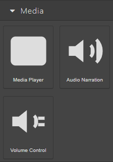
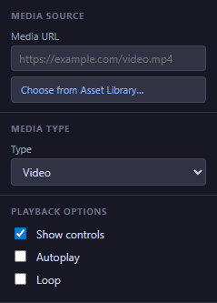
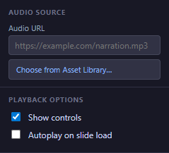
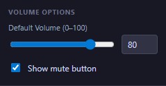

# 06 — Media Blocks

The blocks in the **Media** category add audio and video to your slides: **Media Player** (video or audio with player controls), **Audio Narration** (a voiceover track that plays alongside a slide), and **Volume Control** (a global volume slider learners can adjust at any time).

<!-- screenshot: 06-media-blocks-category.png (1x, <300KB, left sidebar cropped to the Media category) -->

*The three media blocks as they appear in the Blocks tab.*

> ℹ️ **Note:** All three blocks load files from your course's **Asset Library**. Upload the audio or video file first, then pick it from the library when you set up the block.

---

## Media Player

A block that plays an audio or video file, with familiar playback controls (play, pause, scrub, volume). Use it for tutorial videos, recorded explanations, or narrated slide shows.

<!-- screenshot: 06-mediaplayer-props.png (1x, <300KB, Props panel for a selected Media Player with a sample video chosen) -->

*The Props panel for a Media Player. (1) Name field; (2) Media URL with picker button; (3) Type selector; (4) Autoplay / Controls / Loop toggles.*

### Props

| Field | Type | Default | Range / Notes |
|---|---|---|---|
| Name | Text | *(empty)* | Optional label (Props → Name). |
| Media URL | Text + picker | *(empty)* | Choose from the **Asset Library** or type a URL. Picker accepts videos and images; for audio, use **Audio Narration** or switch Type to *Audio*. |
| Type | Video / Audio | Video | Tells the player which controls to show. Switch to *Audio* when your source is an audio file. |
| Autoplay | Toggle | Off | When On, playback starts as soon as the slide loads. Many browsers block autoplay with sound — see the callout below. |
| Show controls | Toggle | On | When On, learners see play / pause / volume / scrub controls. Turn off for a fixed background video. |
| Loop | Toggle | Off | When On, the media starts again automatically when it ends. Useful for short ambient loops. |
| Size | Width × Height | 320 × 200 px | Resize with the corner handles. |

### Steps

1. Drag **Media Player** from the **Blocks** tab onto the canvas.
2. In the **Props** tab, click **Choose from Asset Library…** next to **Media URL** and pick the file. Use **Upload** if the file is not in the library yet.
3. Set **Type** to match the file (*Video* or *Audio*).
4. Decide whether to show **Controls**, enable **Autoplay**, or **Loop** the media. Combinations can be used together (e.g. looping background video with controls hidden).

> ⚠️ **Important:** Most browsers block **Autoplay** with sound for the first visit. If you need the learner to hear the audio from the moment the slide opens, either mute the media, or let the learner start it with a button.

---

## Audio Narration

A block dedicated to voiceover audio that plays alongside a slide. Unlike the Media Player, the Audio Narration shows a small audio bar and is optimised for short narration clips. Use it to read out slide content or add commentary.

<!-- screenshot: 06-audionarration-props.png (1x, <300KB, Props panel for a selected Audio Narration block with a voiceover chosen) -->

*The Props panel for an Audio Narration block. (1) Name field; (2) Audio URL with picker; (3) Show controls; (4) Autoplay toggle.*

### Props

| Field | Type | Default | Range / Notes |
|---|---|---|---|
| Name | Text | *(empty)* | Optional label (Props → Name). |
| Audio URL | Text + picker | *(empty)* | Choose an audio file from the **Asset Library**, or type a URL. |
| Show controls | Toggle | On | When On, learners see a small play / pause / volume bar. Turn off for a hidden narration that plays automatically. |
| Autoplay | Toggle | Off | When On, the clip starts as soon as the slide loads — subject to browser autoplay rules (see callout below). |
| Size | Width × Height | 280 × 60 px | Resize with the corner handles. |

### Steps

1. Drag **Audio Narration** from the **Blocks** tab onto the canvas.
2. In the **Props** tab, use the **Audio URL** picker to choose an audio file. Upload a new file if needed.
3. Decide whether to **Show controls** and / or **Autoplay**. For narrations you want learners to hear without interaction, leave Autoplay on and Controls off.
4. For accessibility, consider showing a text version of the narration on the slide (in a separate Text block) for learners who prefer reading.

> 💡 **Tip:** Use short clips (under 30 seconds) per Audio Narration block. If you have a long narration, split it into chunks and place one on each relevant slide — learners then hear exactly the right portion for where they are.

---

## Volume Control

A small control that sets the global playback volume for every media block in the course. Useful when you want learners to be able to adjust audio levels without interacting with each Media Player.

<!-- screenshot: 06-volumecontrol-props.png (1x, <300KB, Props panel for a selected Volume Control block) -->

*The Props panel for a Volume Control. (1) Name field; (2) Default volume slider; (3) Show mute toggle.*

### Props

| Field | Type | Default | Range / Notes |
|---|---|---|---|
| Name | Text | *(empty)* | Optional label (Props → Name). |
| Default volume | Number (0–100) | 80 | The starting volume. Applies to every media block in the course. |
| Show mute | Toggle | On | When On, the block includes a mute button (speaker icon). |
| Size | Width × Height | 200 × 40 px | Resize with the corner handles. |

### Steps

1. Drag **Volume Control** onto a slide where you want learners to adjust the volume — usually in a persistent location (top or bottom of the course).
2. In the **Props** tab, set the **Default volume** to a comfortable starting level.
3. Leave **Show mute** on if you want learners to silence audio without losing their level setting.
4. Copy the block to other slides where you want the control to stay accessible, or add it once to a slide template.

> ℹ️ **Note:** The volume set with this control persists across slide navigation during the same session. If the learner sets the volume to 30% on slide 2, slide 5's Media Player will also play at 30%.

---

## What to do next

- Add a [Quiz Score](07-blocks-assessment.md) block so learners can see their running score.
- Wire a Media Player to a **Play Media** action to start playback from a button: [09 — Actions Editor](09-actions-editor.md).
- Look up any term from this chapter in the [20 — Glossary](20-glossary.md).
