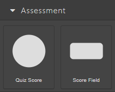
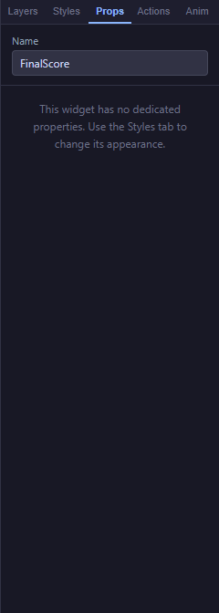
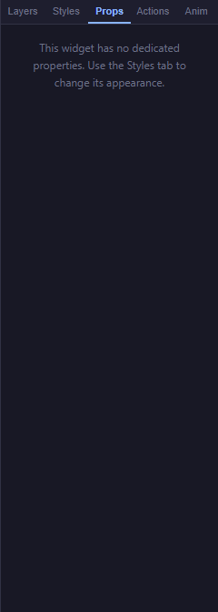

# 07 — Assessment Blocks

The blocks in the **Assessment** category let learners see how they are doing as they work through a course. **Quiz Score** shows a running tally (for example, *3 / 5*) and **Score Field** shows the current overall score with a prefix of your choosing (for example, *Score: 60*). Both update live as the learner answers questions and scoring actions run.

<!-- screenshot: 07-assessment-blocks-category.png (1x, <300KB, left sidebar cropped to the Assessment category) -->

*The two assessment blocks as they appear in the Blocks tab.*

> ℹ️ **Note:** The two blocks look similar but report different things. **Quiz Score** is designed for short quizzes (displays the running count of correct answers), while **Score Field** shows the cumulative numeric score across the whole course.

---

## Quiz Score

A compact panel that shows the learner's running quiz score: how many questions they have answered correctly out of the total asked so far. Update happens automatically when a **Score Question** or **Score Quiz** action runs.

<!-- screenshot: 07-quizscore-props.png (1x, <300KB, Props panel for a selected Quiz Score block with a custom title) -->

*The Props panel for a Quiz Score block. (1) Name field; (2) Title field — the small caption shown above the number.*

### Props

| Field | Type | Default | Range / Notes |
|---|---|---|---|
| Name | Text | *(empty)* | Optional label (Props → Name). |
| Title | Text | `Quiz Score` | The caption shown above the count. Edit it to match your quiz — for example, *Module 1 Results*. |
| Size | Width × Height | 160 × 70 px | Resize with the corner handles. |
| Font size, colour | Style | 28 px, indigo | Change from the **Styles** tab. Affects the big score number. |

### Steps

1. Drag **Quiz Score** onto a slide that summarises the quiz — usually a results slide after a set of questions.
2. In the **Props** tab, edit the **Title** to describe what the block summarises (for example, *Section 2 Results*).
3. Open the **Styles** tab if you want to change the number's typeface, size, or colour to match your visual style.
4. Make sure the slide containing this block is reached after the questions have been scored — otherwise the block shows *0 / 0*.

> 💡 **Tip:** Place a Quiz Score block on the final slide, immediately above the [Done Button](05-blocks-navigation.md#done-button). Learners see their score before finishing the course.

---

## Score Field

A thin horizontal field that shows the learner's current total score with a text prefix of your choice. For example, set the prefix to *Score: * and the block will read *Score: 60* after the learner passes that threshold. Great for persistent score displays at the top or bottom of every slide.

<!-- screenshot: 07-scorefield-props.png (1x, <300KB, Props panel for a selected Score Field block with a custom prefix) -->

*The Props panel for a Score Field block. (1) Name field; (2) Prefix field — the text shown before the score number.*

### Props

| Field | Type | Default | Range / Notes |
|---|---|---|---|
| Name | Text | *(empty)* | Optional label (Props → Name). |
| Prefix | Text | `Score: ` | The text shown before the number. Include a trailing space or separator so the value reads naturally (*Score: 40* instead of *Score:40*). |
| Size | Width × Height | 140 × 36 px | Resize with the corner handles. |
| Font size, colour | Style | 13 px, dark slate | Change from the **Styles** tab. |

### Steps

1. Drag **Score Field** onto a slide where the learner should see their running score — often the same place on every slide, such as the top-right corner.
2. In the **Props** tab, set the **Prefix** text so the read-out makes sense (for example, *Points: * or *Current score: *).
3. Resize and place the block. Keep it out of the way of the main content.
4. If you want the score to be visible on every slide, place the block once on a slide template, or copy it onto each slide.

> ⚠️ **Important:** Score Field shows the running score only — it does not change what the learner is scored on. Scoring itself happens through questions with a **weight** (see [08 — Questions](08-blocks-questions.md)) and through actions like **Score Quiz** (see [09 — Actions Editor](09-actions-editor.md)).

---

## What to do next

- Add questions with points so the two assessment blocks have something to show: [08 — Questions](08-blocks-questions.md).
- Wire scoring actions to your learners' interactions: [09 — Actions Editor](09-actions-editor.md).
- Look up any term from this chapter in the [20 — Glossary](20-glossary.md).
