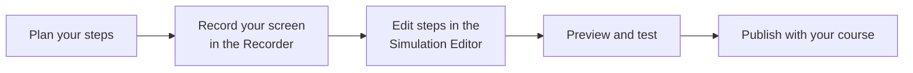
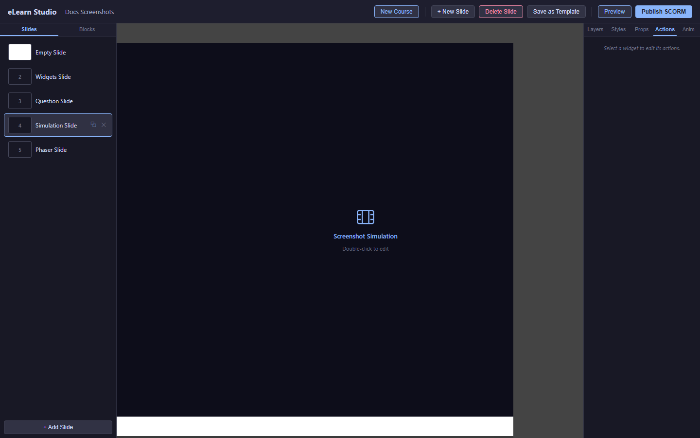
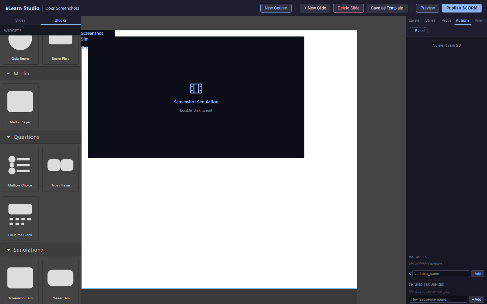

# Software Walkthroughs

A Software Walkthrough guides learners through the steps of a real task — for example, how to create a purchase order in an enterprise system like SAP or NetSuite. You record your screen while performing the steps, and eLearn Studio turns the recording into an interactive simulation.

Learners can experience a Software Walkthrough in three modes:
- **Demo** — the simulation plays automatically, showing each step
- **Practice** — learners click and interact at each step, with hints available
- **Assessment** — learners must complete each step correctly with no hints

*The Software Walkthrough creation process*

---

## Planning your simulation

Before recording, plan the steps:

1. Write out each step as a single action (for example: "Click the **New Order** button").
2. Aim for 5–15 steps — shorter simulations are more engaging.
3. Decide which mode learners will use: Demo, Practice, or Assessment.

> 💡 **Tip:** Practice recording once before creating your final simulation. This helps you avoid hesitations and mistakes that appear in the recording.

---

## Recording your screen

1. Open your course in eLearn Studio.
2. In the slide where you want to add the simulation, drag a **Software Walkthrough** block from the Content Blocks panel onto the canvas.
3. In the Properties panel, click **Open Recorder**.
4. A new window appears with a browser you can control.
5. Navigate to the application you want to record.
6. Perform each step slowly and deliberately. eLearn Studio captures each click and screenshot automatically.
7. When finished, click **Stop Recording**.
   The Simulation Editor opens.

*The Simulation Recorder — navigate and click in the built-in browser to capture steps*

---

## Editing steps in the Simulation Editor

The Simulation Editor shows each step as a screenshot with a highlighted click target.

*The Simulation Editor — each step shows the screenshot and where the learner should click*

For each step you can:

1. **Edit the instruction text** — type what the learner should do: "Click the **Save** button".
2. **Resize the hotspot** — drag the highlighted area to cover the correct click target more precisely.
3. **Add feedback** — set the message shown when the learner clicks the wrong area.
4. **Delete a step** — click the trash icon to remove a step you don't need.
5. **Reorder steps** — drag steps up or down in the step list on the left.

Click **Save** when you're finished editing.

---

## Setting the simulation mode

In the Properties panel for the Software Walkthrough block:

1. Find the **Mode** setting.
2. Choose:
   - **Demo** — the simulation runs automatically with no interaction required
   - **Practice** — learners click at each step; clicking the wrong area shows the correct location after a few tries
   - **Assessment** — learners must click correctly; wrong clicks are counted against the score
3. For Practice and Assessment modes, set the **Pass score** (percentage correct to pass).

---

## Previewing your simulation

1. Click **Preview** in the top toolbar to open the full course in the runtime player.
2. Navigate to the slide with your Software Walkthrough.
3. Interact with the simulation to test each step.

*A Software Walkthrough in Practice mode — learners click the highlighted area to proceed*

---

## Tips for good simulations

> 💡 **Tip:** Use clear, action-based instructions: "Click **Submit**" rather than "The Submit button should be clicked". Learners read instructions quickly — make them easy to follow.

> ⚠️ **Important:** If the application you're recording is updated after you create the simulation, the screenshots may no longer match the current interface. Re-record the simulation when the application changes.

> ℹ️ **Note:** Simulations are included in your SCORM export automatically. No extra steps are needed to publish them.
