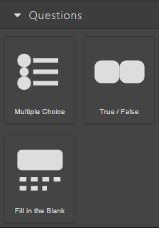
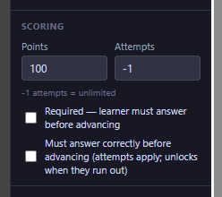
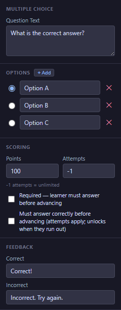
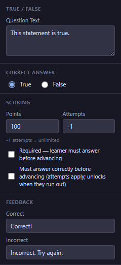
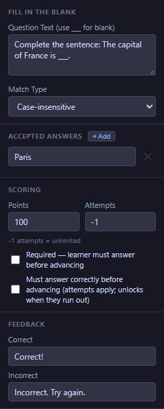

# 08 — Questions

Questions are how you check what your learners have understood. eLearn Studio has three question types: **Multiple Choice**, **True / False**, and **Fill in the Blank**. All three share the same **Scoring** and **Feedback** settings — read the [shared sections](#scoring--every-question-type) first, then jump to the question type you need.

<!-- screenshot: 08-questions-category.png (1x, <300KB, left sidebar cropped to the Questions category) -->

*The three question types as they appear in the Blocks tab.*

> ℹ️ **Note:** Every scored course should end with a [Done Button](05-blocks-navigation.md#done-button). Pressing Done is what submits the final score to your Learning Management System.

---

## Scoring — every question type

Every question has three scoring settings that work the same way regardless of question type. You configure them in the **Scoring** section of the **Props** tab.

<!-- screenshot: 08-scoring-section.png (1x, <300KB, close-up of the Scoring section of any question's Props panel, with weight + attempts + mandatory + must-answer-correctly visible) -->

*The Scoring section, shared by all three question types. (1) Points; (2) Attempts; (3) Required checkbox; (4) Must answer correctly checkbox.*

### Fields

| Field | Type | Default | Range / Notes |
|---|---|---|---|
| Points | Number | 100 | 0–100. How much this question is worth when the course is scored. If you want all questions to contribute equally, give every question the same number of points. |
| Attempts | Number | −1 | −1 for unlimited; 1 or more for a fixed number of tries. After a wrong answer, the learner can try again until they run out of attempts. After the last attempt, the question locks. |
| Required | Toggle | Off | When On, the learner must answer this question before the **Next** button unlocks. Takes effect only when the course's Navigation Mode is set to **Linear Strict**. |
| Must answer correctly | Toggle | Off | The stricter version of Required: the **Next** button stays locked until the learner answers this question **correctly**. Attempts apply — if the learner runs out of attempts without a correct answer, the course lets them move on and records the miss in their score. Takes effect only in **Linear Strict** mode. |

### How Points add up

The learner's final score is the sum of **Points** earned across every question they answer correctly. A course with four questions worth 25 points each, for example, gives 0–100 depending on how many are right. There is no need to aim for exactly 100 total — the Learning Management System normalises the final value.

> 💡 **Tip:** Keep **Attempts** at −1 (unlimited) for practice quizzes. Set it to 1 or 2 only when the question is part of a formal assessment and you want to prevent repeated guessing.

### Required questions and navigation

A **Required** question blocks the learner from moving to the next slide until they answer it. **Must answer correctly** goes one step further: the learner has to get the answer right before the course lets them continue — the classic "pass the test to move on" pattern. Both only work in **Linear Strict** navigation mode — you set that in the course settings. In the default **Free** mode, neither has any effect.

With **Must answer correctly**, the **Attempts** setting decides what happens after a wrong answer:

1. While attempts remain, the learner can change their answer and press **Submit** again.
2. If they answer correctly, the **Next** button unlocks and the question locks.
3. If they run out of attempts without a correct answer, the **Next** button unlocks anyway — the learner is never stuck — and the missed question simply counts against their final score.

> 💡 **Tip:** Combine **Must answer correctly** with 2 or 3 attempts for formal assessments. With unlimited attempts (−1), learners can keep trying until they get it right — good for practice, but it means everyone eventually passes the question.

> ⚠️ **Important:** A required question that the learner cannot possibly answer (because of a typo, a removed option, or an impossible correct answer) will lock the course. Preview every course with Required questions from start to finish before publishing.

---

## Feedback — every question type

Every question lets you set two short messages: one for a correct answer and one for an incorrect answer. These are shown to the learner immediately after they submit their answer.

| Field | Type | Default | Range / Notes |
|---|---|---|---|
| Correct | Text | `Correct!` | Shown when the learner picks the right answer. |
| Incorrect | Text | `Incorrect. Try again.` | Shown when the learner picks the wrong answer. Keep it encouraging; avoid negative tone. |

> 💡 **Tip:** Make feedback specific and useful, not just "Correct" or "Wrong". Good feedback reinforces learning — for example, *"Correct — remember, the safety valve always opens when pressure exceeds 6 bar."*

---

## Multiple Choice

A question with two or more options. The learner picks the one correct option (indicated by a filled radio button in the Props panel). Every Multiple Choice question must have at least two options.

<!-- screenshot: 08-mc-props.png (1x, <300KB, Props panel for a selected Multiple Choice block with three options, one marked correct) -->

*The Props panel for a Multiple Choice question. (1) Question text; (2) Options list with radio = correct; (3) Add / remove buttons.*

### Props

| Field | Type | Default | Range / Notes |
|---|---|---|---|
| Question text | Text area | `What is the correct answer?` | The question shown to the learner. |
| Options | List of text | Three options (A, B, C) | Add with **+ Add**. Minimum two options; remove with the trash icon (disabled when only two remain). |
| Correct option | Radio | Option A | Click the radio next to an option to mark it correct. Only one option can be correct. |
| Scoring | See [Scoring](#scoring--every-question-type) | 100 / −1 / Off | Points, Attempts, Required. |
| Feedback | See [Feedback](#feedback--every-question-type) | Default strings | Correct / Incorrect messages. |
| Size | Width × Height | 340 × 180 px | Resize with the corner handles. |

### Steps

1. Drag **Multiple Choice** from the **Blocks** tab onto the canvas.
2. In the **Props** tab, type the **Question text** for the learner.
3. Edit each option's text. Click **+ Add** to add more options (up to as many as fit on the slide).
4. Click the radio next to the option that is the correct answer.
5. Open the **Scoring** and **Feedback** sections and adjust the settings to fit this question.

> 💡 **Tip:** Keep options short and similar in length. A question where one option is obviously longer than the others often gives the correct answer away by accident.

---

## True / False

A question with two fixed answers: **True** or **False**. Simpler than Multiple Choice, but still scored and reported like any other question.

<!-- screenshot: 08-tf-props.png (1x, <300KB, Props panel for a selected True / False block) -->

*The Props panel for a True / False question. (1) Question text; (2) Correct answer toggle.*

### Props

| Field | Type | Default | Range / Notes |
|---|---|---|---|
| Question text | Text area | `This statement is true.` | The statement the learner has to judge. |
| Correct answer | True / False | True | Pick which of the two answers is correct. |
| Scoring | See [Scoring](#scoring--every-question-type) | 100 / −1 / Off | Points, Attempts, Required. |
| Feedback | See [Feedback](#feedback--every-question-type) | Default strings | Correct / Incorrect messages. |
| Size | Width × Height | 280 × 130 px | Resize with the corner handles. |

### Steps

1. Drag **True / False** from the **Blocks** tab onto the canvas.
2. In the **Props** tab, type the **Question text** as a clear statement the learner has to judge.
3. Pick **True** or **False** as the **Correct answer**.
4. Adjust **Scoring** and **Feedback** as you would for any other question.

> ℹ️ **Note:** Write True / False statements so the correct answer is unambiguous. Avoid double negatives ("it is not uncommon that…") — they confuse learners and make the correct answer feel like a guess.

---

## Fill in the Blank

A question with a blank the learner has to type into. Great for checking recall of names, numbers, short phrases, or commands.

<!-- screenshot: 08-fill-props.png (1x, <300KB, Props panel for a selected Fill in the Blank block with one accepted answer) -->

*The Props panel for a Fill in the Blank question. (1) Question text with ___ blank; (2) Accepted answers list; (3) Match type selector.*

### Props

| Field | Type | Default | Range / Notes |
|---|---|---|---|
| Question text | Text area | `Complete the sentence: The capital of France is ___.` | Use three underscores (`___`) where you want the blank to appear. |
| Accepted answers | List of text | `Paris` | Add multiple acceptable spellings — for example, `Paris` and `paris`. Any match counts as correct. |
| Match type | Exact / Case-insensitive / Regex | Case-insensitive | Controls how strictly the learner's answer is compared. See below. |
| Scoring | See [Scoring](#scoring--every-question-type) | 100 / −1 / Off | Points, Attempts, Required. |
| Feedback | See [Feedback](#feedback--every-question-type) | Default strings | Correct / Incorrect messages. |
| Size | Width × Height | 320 × 110 px | Resize with the corner handles. |

### Match types explained

- **Exact** — the answer must match one of the accepted answers letter for letter, including capitalisation. *Paris* is correct; *paris* is not.
- **Case-insensitive** (default) — capitalisation does not matter. *Paris*, *paris*, and *PARIS* all count.
- **Regex** — an advanced option for matching a pattern instead of a fixed string. Use this only when you need to accept many variations. If you are not sure what a regex is, leave this on **Case-insensitive**.

### Steps

1. Drag **Fill in the Blank** from the **Blocks** tab onto the canvas.
2. In the **Props** tab, write the **Question text**. Put three underscores (`___`) where the blank should appear.
3. Add every spelling you are willing to accept to **Accepted answers**. Common misspellings can be added here too.
4. Choose a **Match type**. Stick with **Case-insensitive** unless you have a reason to pick another.
5. Adjust **Scoring** and **Feedback** as needed.

> 💡 **Tip:** For single-word answers, always accept the common misspellings you expect. A learner who types *Pariss* may have simply mistyped — accepting it prevents frustration and keeps the course about learning, not about spelling.

---

## What to do next

- Add a [Quiz Score](07-blocks-assessment.md) block so the learner sees their running score.
- Wire a **Submit** button to the **Score Question** action for each question: [09 — Actions Editor](09-actions-editor.md).
- Finish with a [Done Button](05-blocks-navigation.md#done-button) so the score reaches your Learning Management System.
- Look up any term from this chapter in the [20 — Glossary](20-glossary.md).
