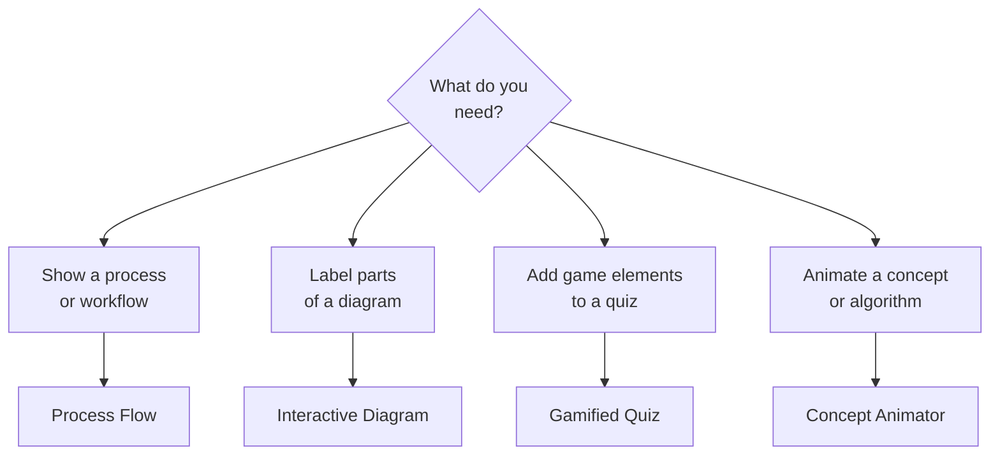
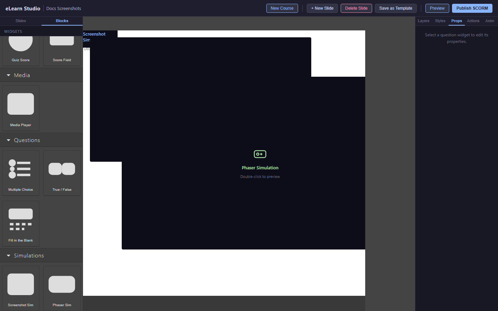

# Interactive Scenarios

An Interactive Scenario is an animated, interactive experience built directly in eLearn Studio — no recording required. Use Interactive Scenarios for process flows, labeled diagrams, gamified quizzes, and animated concepts.

*Choose an Interactive Scenario type based on your learning goal*

---

## Adding an Interactive Scenario

1. In the Content Blocks panel, scroll to the **Simulations** category.
2. Drag an **Interactive Scenario** block onto the canvas.
3. In the Properties panel, select the scenario type you want to build.
4. Click **Open Editor** to configure the scenario.

---

## Process Flow

A Process Flow shows a series of steps connected by arrows — for example, a new employee onboarding process, a customer service escalation path, or an incident response workflow.

*A Process Flow scenario — learners click through each step in the flow*

**To build a Process Flow:**

1. Click **+ Add Step** to add nodes to the flow.
2. For each node, enter:
   - The step label (for example: "Ticket created")
   - An optional instruction or question for Practice mode
3. Connect nodes by clicking the arrow tool and drawing from one node to another.
4. Add labels to connections (for example: "Urgent" or "Standard").
5. Set the scenario mode: **Demo** (plays automatically) or **Practice** (learner clicks through steps and answers questions).

---

## Interactive Diagram

An Interactive Diagram places clickable labels on an image — for example, parts of a machine, regions of a map, or sections of a safety sign.

*An Interactive Diagram — learners click labeled areas to learn about each part*

**To build an Interactive Diagram:**

1. Click **Upload Background Image** and upload your diagram image.
2. Click **+ Add Hotspot** to place a labeled area on the image.
3. For each hotspot, enter:
   - The label (for example: "Emergency stop button")
   - An information popup (optional): shown when the learner clicks the hotspot
4. Set the scoring mode: **Informational** (no score) or **Quiz** (learner must identify the correct hotspot).

---

## Gamified Quiz

A Gamified Quiz wraps your quiz questions in game mechanics — a countdown timer, lives (limited wrong answers), and a combo multiplier for consecutive correct answers. Use it to increase engagement in knowledge-check activities.

**To build a Gamified Quiz:**

1. Select **Gamified Quiz** as the scenario type.
2. Add your questions by clicking **+ Add Question**.
3. Configure the game settings in the Properties panel:
   - **Time limit** per question (in seconds)
   - **Lives** — how many wrong answers before the quiz ends (for example: 3)
   - **Combo multiplier** — bonus points for consecutive correct answers

---

## Concept Animator

A Concept Animator visualizes a step-by-step process — for example, how a sorting algorithm works, or how a network packet travels through a system. Steps advance on click.

**To build a Concept Animator:**

1. Select **Concept Animator** as the scenario type.
2. Add steps. Each step consists of:
   - A visual state (you define the position and appearance of each element)
   - A narration or instruction text shown below the animation
3. Learners click **Next** to advance through each animated step.

---

## Tips for Interactive Scenarios

> 💡 **Tip:** Process Flows work best with 6–12 steps. Larger flows become hard to read on a single slide.

> 💡 **Tip:** For Interactive Diagrams, use high-resolution images so hotspot labels remain readable when the slide is resized.

> ℹ️ **Note:** Interactive Scenarios are included in your SCORM export automatically. No extra steps are needed to publish them.
