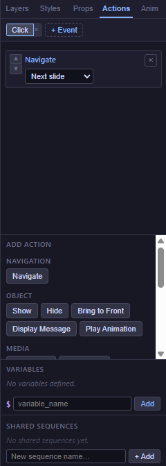
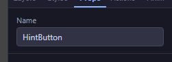
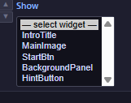

# 09 — Actions Editor

The **Actions Editor** is where you add course logic — the behaviour that turns a static set of slides into an interactive lesson. You don't need to know how to code. The whole system is built around a single idea: **"When X happens → do Y."**

<!-- screenshot: 09-actions-tab.png (1x, <300KB, right sidebar with the Actions tab active on a selected button, showing one configured sequence) -->

*The Actions tab with a simple "On click → Navigate: Next slide" sequence configured. (1) Event tabs (one per trigger); (2) Action list for the selected event; (3) Add action button.*

> 💡 **Tip:** Before you start wiring actions, give every block you plan to reference a clear **Name** in the **Props** tab. Thanks to a recent improvement, the dropdowns inside the Actions Editor show these names — not hard-to-read internal IDs — so naming your blocks makes every later step easier. See the [Naming blocks](#naming-your-blocks) section below.

---

## The "When X → do Y" model

Every piece of course logic you write has two parts:

- **Trigger** — the event that starts it. Examples: the learner **clicks** a button, **arrives** at a slide, **answers a question correctly**.
- **Action** — what the course does in response. Examples: **go to the next slide**, **show a hint**, **play an audio narration**, **set a variable**.

A trigger plus one or more actions makes an **action sequence**. You can have many sequences on the same block, each attached to a different trigger — for example, a button might **show a hint** when the learner hovers over it and **navigate to the next slide** when the learner clicks it.

### A quick example

> When the learner **clicks** the Submit button → **score the question** → if the score is at least 60 → **navigate to the results slide**.

That sentence maps directly to an action sequence:

- Trigger: `click` on the Submit button.
- Action 1: `Score Question` with the question's Name as target.
- Action 2: `If / Else` with the expression `$score >= 60`.
- Nested action (inside the *If*): `Navigate` to the "Results" slide.

Don't worry about the details yet — the full reference is in [10 — Triggers & Actions Reference](10-actions-triggers-reference.md), and ready-to-copy patterns are in [11 — Expressions, Recipes & Shared Sequences](11-actions-expressions-recipes.md).

---

## Where the Actions Editor lives

The Actions Editor appears in the **right sidebar** when you select a block on the canvas, or when you want to set up slide-level events.

- **Block-level actions** — select the block (for example, a button) and open the **Actions** tab on the right.
- **Slide-level actions** — select nothing on the canvas, open the **Actions** tab, and you'll see the triggers available for the whole slide (**enterSlide**, **exitSlide**).

---

## Adding your first action sequence

Let's wire a button to navigate to the next slide.

1. On a slide, drag a **Button** onto the canvas and select it.
2. In the **Props** tab, give the button a clear **Name** — for example, *StartButton*. (Optional but strongly recommended, see below.)
3. Open the **Actions** tab on the right sidebar.
4. Click **+ Event** and pick **click** from the list. A new tab titled *Click* appears with an empty action list.
5. Click **Add action** inside the tab. A row with a category picker appears.
6. Pick **Navigation → Navigate** from the menu. New fields appear on the row.
7. In the first dropdown, pick **Next slide**. You're done — the button now moves the learner forward.

Auto-save persists your changes as soon as you stop editing. Test it with **Preview** in the top toolbar.

> ℹ️ **Note:** You don't need to wire *Next* and *Previous* for built-in [Nav Buttons](05-blocks-navigation.md#nav-buttons) — those move the learner automatically. Use *Navigate* when you want a button to jump to a specific slide, go to the next one from a custom button, or branch based on a condition.

---

## Naming your blocks

Every block has a **Name** field in the **Props** tab. It has no visual effect, but it's the single most useful habit for building maintainable courses.

<!-- screenshot: 09-widget-name-field.png (1x, <300KB, Props panel showing the Name field filled in with a human-readable name like 'HintButton') -->

*The Name field in the Props tab. Give it a clear, descriptive value.*

When you pick a block as the target of an action (for example, in a *Show* or *Play Media* action), the Actions Editor shows a dropdown of the blocks on the current slide. **The dropdown displays the Name you set in Props**, making it easy to find exactly the right block.

<!-- screenshot: 09-widget-dropdown-names.png (1x, <300KB, Show-action widget dropdown open, showing several named entries like 'HintButton', 'MainImage', 'SubmitBtn') -->

*The widget target dropdown. Blocks with a Name in Props show up with that name, making the list easy to scan.*

If you leave Name empty, the dropdown falls back to the block's internal identifier — a short, cryptic string like `c32kq3`. That still works technically, but it makes the Actions Editor harder to use, especially on slides with many blocks.

> 💡 **Tip:** A good naming convention: verb-first for buttons (*StartQuiz*, *ShowHint*, *FinishCourse*), noun-first for non-interactive blocks (*IntroText*, *DiagramImage*, *ScorePanel*). Consistency beats cleverness.

---

## What counts as a "sequence"

Inside each trigger tab, the actions run **in order, top to bottom**. You can reorder them by dragging, and you can mix different action types freely — a single sequence might *play a sound*, *show a congratulations message*, and *navigate* to the next slide, all in that order.

Some action types (like **If / Else** and **Loop**) contain other actions inside them. The [Actions Reference](10-actions-triggers-reference.md) lists every action with its parameters and examples.

---

## What to do next

- Look up every available trigger and every available action: [10 — Triggers & Actions Reference](10-actions-triggers-reference.md).
- Copy and adapt ready-made patterns (counters, branching, hint reveal, gated navigation): [11 — Expressions, Recipes & Shared Sequences](11-actions-expressions-recipes.md).
- See the full end-to-end example of a five-slide course wired with actions: [17 — Worked Example](17-worked-example.md).
- Look up any term in the [20 — Glossary](20-glossary.md).
