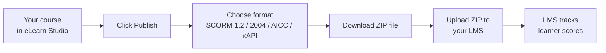
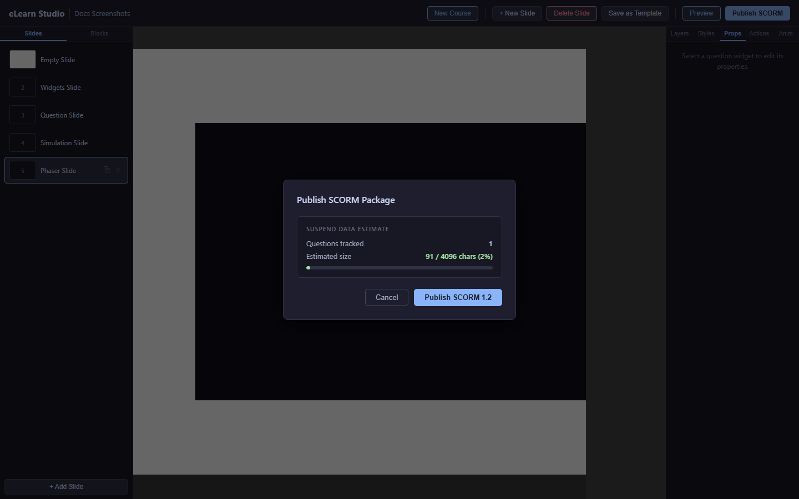

# Publishing

Publishing exports your course as a file that you upload to your Learning Management System (LMS). The most common format is SCORM (Sharable Content Object Reference Model) — the industry standard for e-learning packages that every major LMS supports. Your LMS tracks learner progress and scores automatically once the course is uploaded.

*The publishing process — from course to LMS in four steps*

---

## Choosing a format

| Format | When to use |
|---|---|
| **SCORM 1.2** | Works with almost every LMS. Choose this if you're not sure. |
| **SCORM 2004** | Choose this if your LMS administrator recommends it. Supports more advanced tracking. |
| **AICC** | Choose this only if your LMS specifically requires AICC format. |
| **xAPI** | Choose this for modern LRS (Learning Record Store) platforms that support xAPI statements. |

> 💡 **Tip:** When in doubt, use **SCORM 1.2**. It is the most widely supported format and works with Moodle, Cornerstone, SAP SuccessFactors, and most other LMS platforms.

---

## Exporting your course

1. Click the **Publish** button in the top toolbar.
2. The **Export** dialog opens.

   
   *The Export dialog — choose your format and click Export*

3. Select the format you want (SCORM 1.2, SCORM 2004, AICC, or xAPI).
4. Click **Export**.
5. A ZIP file downloads to your computer automatically.

The ZIP file contains everything your LMS needs to run the course: the slides, all media files, questions, and simulations.

---

## Importing into Moodle

These steps apply to Moodle 4.x. Other platforms (Blackboard, Canvas, Cornerstone, TalentLMS, SAP SuccessFactors) have a similar upload flow — check your LMS documentation for the exact steps.

1. Log in to your Moodle site as a teacher or administrator.
2. Open the course where you want to add the activity.
3. Turn on editing mode by clicking **Turn editing on**.
4. In the section where you want to add the course, click **Add an activity or resource**.
5. Select **SCORM package** and click **Add**.
6. In the settings page, scroll to **Package file** and click **Choose a file**.
7. Click **Upload a file**, then select the ZIP file you downloaded from eLearn Studio.
8. Click **Upload this file**.
9. Scroll down and click **Save and return to course**.

The course is now available in Moodle. Learners can open it, complete it, and Moodle records their score automatically.

---

## Testing without an LMS

You can preview your course directly in eLearn Studio without exporting:

1. Click **Preview** in the top toolbar.
2. The course opens in a new browser tab in the runtime player.
3. Complete the course to check that scores and navigation work correctly.

> ⚠️ **Important:** In Preview mode, scores are not recorded anywhere — it is for testing only. Scores are only tracked when learners access the course through your LMS.

---

## Navigation mode

The **Navigation Mode** setting controls how learners move through your course. You configure it in the **Course Settings** dialog (click the gear icon in the top toolbar).

| Mode | Behaviour |
|---|---|
| **Free** (default) | Learners can navigate to any slide at any time using the table of contents or Next/Previous buttons. No restrictions. |
| **Linear (strict)** | Learners must complete each slide in order. They cannot jump to an arbitrary slide. If a slide contains mandatory questions, the learner must answer them before the Next button becomes active. |

### How navigation mode affects the exported package

When you publish a course in **SCORM 2004** format, eLearn Studio writes the navigation mode into the manifest as `imsss:controlMode` attributes:

| Mode | `imsss:controlMode` |
|---|---|
| Free | `choice="true" flow="true"` |
| Linear (strict) | `choice="false" choiceExit="false" flow="true"` |

With `choice="false"` the LMS table of contents does not allow learners to jump directly to an item. `flow="true"` keeps sequential Next/Previous navigation active.

> ℹ️ **SCORM 1.2 note:** SCORM 1.2 does not support `imsss` sequencing elements. In SCORM 1.2, the linear-strict gate is enforced entirely inside the Runtime Player — the LMS table of contents is not affected.

---

## Re-publishing after changes

You can publish your course as many times as needed. Each export creates a fresh ZIP file with your latest changes.

After re-uploading to your LMS:
- **Moodle:** Moodle detects the updated package automatically. Existing learner completions are preserved.
- **Other LMS platforms:** Check your LMS documentation — some platforms require you to reset completions or create a new activity for major updates.

---

> ℹ️ **Note:** Your course stays saved in eLearn Studio after publishing. You can always go back, make changes, and re-publish.
