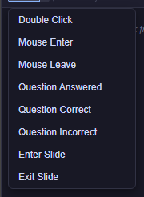
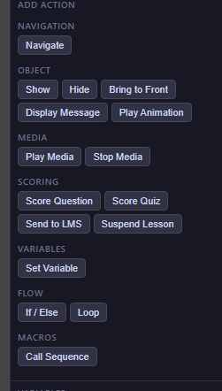
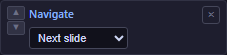
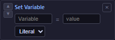
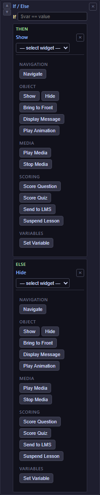

# 10 — Triggers & Actions Reference

This chapter lists every **trigger** (event that starts a sequence) and every **action** (step that runs inside a sequence) available in eLearn Studio. Use it as a lookup reference — the concept of *"When X → do Y"* is introduced in [09 — Actions Editor](09-actions-editor.md).

<!-- screenshot: 10-event-selector.png (1x, <300KB, Actions tab with the "+ Event" dropdown open, showing the list of available triggers) -->

*The + Event picker in the Actions tab. Every available trigger is shown here.*

---

## Triggers

Triggers come in two families: **block triggers** (they fire when something happens to the block that hosts them — a click, a correct answer) and **slide triggers** (they fire when the learner arrives at or leaves the slide). Both kinds are added the same way: select a block, open the **Actions** tab, and add the trigger — slide triggers simply react to the slide's lifecycle instead of the hosting block. You can add any number of triggers to the same block — each one gets its own tab inside the Actions panel, and its own sequence of actions.

### Widget triggers — 7 events

| Trigger | Fires when… | Common use |
|---|---|---|
| **click** | The learner clicks the block. | Buttons, icons, or any interactive content. |
| **doubleClick** | The learner double-clicks the block. | Advanced interactions; rare in normal authoring. |
| **mouseEnter** | The learner's cursor moves *onto* the block. | Show a tooltip, highlight, or preview. |
| **mouseLeave** | The learner's cursor moves *off* the block. | Hide a tooltip or revert a highlight. |
| **questionAnswered** | The learner submits an answer to a question block (correct or wrong). | Run scoring, show feedback, increment a counter. |
| **questionCorrect** | The learner answers a question correctly. | Celebrate, reveal a reward, mark a checkpoint. |
| **questionIncorrect** | The learner answers a question incorrectly. | Show a hint, reduce a lives counter, play a sound. |

> ℹ️ **Note:** The three *question* triggers only appear on question blocks ([Multiple Choice](08-blocks-questions.md#multiple-choice), [True / False](08-blocks-questions.md#true--false), [Fill in the Blank](08-blocks-questions.md#fill-in-the-blank)).

### Slide triggers — 2 events

| Trigger | Fires when… | Common use |
|---|---|---|
| **enterSlide** | The slide opens (learner just arrived). | Reset state, play intro audio, log a variable, start a timer. |
| **exitSlide** | The learner moves away from the slide. | Stop a playing audio, save progress, tear down a timer. |

> 💡 **Tip:** When you want an action to run for *every* slide in the course, a slide template is more maintainable than copying an *enterSlide* sequence onto each slide. Ask your developer about slide templates if you need that.

---

## Actions — 15 items

Actions are grouped into six categories. Every action takes parameters, shown on the action's row in the Actions panel.

<!-- screenshot: 10-action-palette.png (1x, <300KB, Actions tab with the action picker expanded, showing all 15 actions grouped by category) -->

*The action picker. Each category groups related actions.*

### Navigation

#### Navigate
**Moves the learner to another slide.**

| Parameter | Options | Notes |
|---|---|---|
| Target | Next slide / Previous slide / First slide / Last slide / By name / By number | Most courses use *Next slide* and *Previous slide*. |
| Slide title | Text | Only shown when Target = *By name*. Type the exact slide title. |
| Slide number | Number | Only shown when Target = *By number*. Slides are numbered from 1. |

*Example:* On the final question's `questionCorrect` → `Navigate → By name → Results`.

<!-- screenshot: 10-action-navigate.png (1x, <300KB, close-up of a Navigate action row with Target = By name and a slide title filled in) -->

*A Navigate action. When Target is "By name", a second field appears for the slide title.*

---

### Object

#### Show
**Makes a hidden block visible.**

| Parameter | Type | Notes |
|---|---|---|
| Widget | Dropdown | Picks the block to show. The dropdown displays the block's **Name** (from Props → Name) — see [Naming your blocks](09-actions-editor.md#naming-your-blocks). |

*Example:* On `click` of a Hint button → `Show → HintText`.

#### Hide
**Makes a visible block disappear.**

| Parameter | Type | Notes |
|---|---|---|
| Widget | Dropdown | Picks the block to hide. |

*Example:* On `enterSlide` → `Hide → NextButton` (and later show it again with a condition).

#### Bring to Front
**Moves a block above every other block on the slide.** Useful when blocks overlap and you need a specific one on top.

| Parameter | Type | Notes |
|---|---|---|
| Widget | Dropdown | Picks the block to lift to the top. |

#### Display Message
**Opens a modal dialog with a short message.** The learner must close it before continuing.

| Parameter | Type | Notes |
|---|---|---|
| Title | Text (optional) | Shown in the dialog's header. |
| Message | Text area | The body of the dialog. |

*Example:* On `questionIncorrect` → `Display Message → "Close, but not quite. Check your units."`

---

### Media

#### Play Media
**Starts playback of a Media Player or Audio Narration block.**

| Parameter | Type | Notes |
|---|---|---|
| Media widget | Dropdown | Picks the media block to play. |

#### Stop Media
**Pauses and rewinds playback of a media block.**

| Parameter | Type | Notes |
|---|---|---|
| Media widget | Dropdown | Picks the media block to stop. |

*Example:* On `exitSlide` → `Stop Media → BackgroundNarration`.

---

### Scoring

#### Score Question
**Evaluates one question and adds or subtracts points.** Wire this to each question's Submit button, or to the question block's own `questionAnswered` trigger.

| Parameter | Type | Notes |
|---|---|---|
| Question widget | Dropdown | Picks the question block to score. |

#### Score Quiz
**Computes the total score across every question scored so far** and updates the built-in `$score` variable and any [Quiz Score](07-blocks-assessment.md#quiz-score) / [Score Field](07-blocks-assessment.md#score-field) blocks.

*No parameters.*

*Example:* On the **Done Button**'s `click` → `Score Quiz` → `Send to LMS` → `Navigate → Last slide`.

#### Send to LMS
**Reports the current score and completion status to the Learning Management System via SCORM.** Run this once at the end of the course (on the Done Button). See [16 — Publish as SCORM](16-publish-scorm.md) for details on how the LMS reads the result.

*No parameters.*

#### Suspend Lesson
**Saves the learner's progress and exits the course.** Use when you want to offer a "Save and quit" button that lets the learner resume later.

*No parameters.*

---

### Variables

#### Set Variable
**Creates or updates a named value** the course remembers for the current learner.

| Parameter | Type | Notes |
|---|---|---|
| Name | Text | The variable name (without the `$`). Example: `attempts`. |
| Value | Text | The new value. Can be a literal (e.g. `0`, `"yes"`) or an expression when Value type = *Expr*. |
| Value type | Literal / Expression | *Literal* means take the value as-is. *Expression* means evaluate it first — e.g. `$attempts + 1`. |

*Example 1 (literal):* On `enterSlide` → `Set Variable → attempts = 0` (Literal).
*Example 2 (expression):* On `questionIncorrect` → `Set Variable → attempts = $attempts + 1` (Expression).

<!-- screenshot: 10-action-setvariable.png (1x, <300KB, close-up of a Set Variable row with an expression example) -->

*A Set Variable action with Value type = Expression. The syntax of the expression is explained in [11 — Expressions, Recipes & Shared Sequences](11-actions-expressions-recipes.md).*

---

### Object (continued) — animation

#### Play Animation
**Plays a path animation on a block.** Requires the block to have at least one animation configured in the **Anim** tab.

| Parameter | Type | Notes |
|---|---|---|
| Widget | Dropdown | Picks the block whose animation to play. |
| Animation name | Text (optional) | The specific animation to play. Leave blank to play the first one defined on the block. |

---

### Flow

#### If / Else
**Branches on a condition.** Actions placed inside the *If* run when the condition is true; actions inside the *Else* (if present) run when it is false.

| Parameter | Type | Notes |
|---|---|---|
| Expression | Text | A condition such as `$score > 80` or `$answered == true`. See the [Expression language](11-actions-expressions-recipes.md#expression-language). |

*Example:* On the Done Button's `click` → `If $score >= 70` → `Navigate → CongratsSlide`; *Else* → `Navigate → ReviewSlide`.

<!-- screenshot: 10-action-ifelse.png (1x, <300KB, an If / Else action with nested actions in both branches) -->

*An If / Else action with one action in each branch.*

#### Loop
**Repeats a set of actions** either a fixed number of times (*Repeat N times*) or until a condition becomes false (*While condition*).

| Parameter | Options | Notes |
|---|---|---|
| Mode | Repeat N times / While condition | Pick one. |
| Count | Number | Only when Mode = *Repeat N times*. |
| Condition | Text | Only when Mode = *While condition*. Same syntax as *If / Else*. |

*Example:* On `enterSlide` → `Loop → Repeat 3 times` → `Set Variable hintsLeft = 3`. (Trivial, but shows the shape.)

> ⚠️ **Important:** A *While* loop with a condition that never becomes false will lock the course. Always ensure the loop body updates the variable the condition tests.

---

### Macros

#### Call Sequence
**Runs a shared sequence you've defined once at course level.** Use this when the same set of actions is needed on many different triggers — for example, "reset all hint variables" or "report to LMS with a fallback".

| Parameter | Type | Notes |
|---|---|---|
| Sequence name | Dropdown | Lists every shared sequence defined in the **Shared Sequences** library. See [11 — Shared sequences (macros)](11-actions-expressions-recipes.md#shared-sequences-macros). |

---

## Quick reference card

| Category | Actions |
|---|---|
| **Navigation** | Navigate |
| **Object** | Show · Hide · Bring to Front · Display Message · Play Animation |
| **Media** | Play Media · Stop Media |
| **Scoring** | Score Question · Score Quiz · Send to LMS · Suspend Lesson |
| **Variables** | Set Variable |
| **Flow** | If / Else · Loop |
| **Macros** | Call Sequence |

---

## What to do next

- Copy-paste ready recipes (counters, branching, gated navigation): [11 — Expressions, Recipes & Shared Sequences](11-actions-expressions-recipes.md).
- See actions in action — a five-slide worked example: [17 — Worked Example](17-worked-example.md).
- Back to the conceptual overview: [09 — Actions Editor](09-actions-editor.md).
- Look up any term: [20 — Glossary](20-glossary.md).
