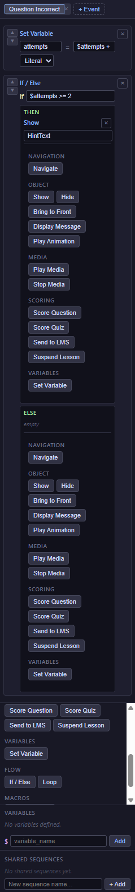
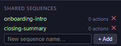

# 11 — Expressions, Recipes & Shared Sequences

This chapter covers the three things you need when you start writing real logic: the tiny **expression language** used in conditions, a collection of **ready-to-copy recipes** for patterns you'll reuse, and how to save sequences as reusable **macros** (also called *shared sequences*). Start with the expression language, then jump to whichever recipe matches what you want to build.

---

## Expression language

Expressions are the short sentences you type into the condition box of an **If / Else** or **While loop**, or into a **Set Variable** value when the type is *Expression*. They let the course compare values and make decisions.

### The pieces

An expression is usually made of **two values** joined by a **comparison**:

```
<value>  <comparison>  <value>
```

- **Values** can be:
  - A **variable**, starting with a dollar sign: `$score`, `$attempts`, `$answered`.
  - A **number**: `60`, `100`, `0`.
  - A **text** in double or single quotes: `"yes"`, `'maybe'`.
  - The words `true` or `false`.
- **Comparisons** read naturally:
  - `==` — equal to
  - `!=` — not equal to
  - `>` — greater than
  - `>=` — greater than or equal to
  - `<` — less than
  - `<=` — less than or equal to
- To **negate** a value (turn true into false), put `!` in front: `!$done`.

### Real-life examples

| You want to check… | Write |
|---|---|
| The score is at least 60. | `$score >= 60` |
| The learner has used all 3 hints. | `$hintsUsed == 3` |
| The answer was not yet marked. | `$answered == false`, or just `!$answered` |
| The passing grade wasn't reached. | `$score < 70` |
| The learner picked the long lesson path. | `$lessonMode == "long"` |
| A loop should keep running while a counter is below ten. | `$i < 10` |

### Rules to remember

- **Variables always start with `$`** in expressions. A variable called `score` is written `$score`.
- **No arithmetic.** Expressions can compare, but they cannot do math. To increment a counter, use the **Set Variable** action with *Value type = Expression*: `$attempts + 1`.
- **No combined conditions (`and` / `or`).** To check two things at once, use two nested **If / Else** actions. The [Attempt counter recipe](#recipe-1--attempt-counter-with-a-limit) below shows the pattern.

> 💡 **Tip:** The expression field shows a small red border when your syntax is wrong. Look at it while you type — a green border means the condition is valid.

---

## Recipes

The five patterns below cover the vast majority of what authors need. Every recipe is a **ready-to-copy template**: replace the names in `*emphasis*` with your own block and variable names.

### Recipe 1 — Attempt counter with a limit

**Goal:** let the learner retry a question up to three times, then show a hint.

**Setup:**
- A Multiple Choice question named *MainQuestion*.
- A hidden Text block named *HintText* (set it to invisible in the [Layers](20-glossary.md#layers) panel, or by default via *Hide* on `enterSlide`).

**On the slide — trigger `enterSlide`:**
1. `Set Variable → attempts = 0` (Literal).

**On the *MainQuestion* block — trigger `questionIncorrect`:**
1. `Set Variable → attempts = $attempts + 1` (Expression).
2. `If $attempts >= 3`
   - `Show → HintText`

**Why it works:** every wrong answer bumps the counter; once it hits 3, the hint appears. The counter resets when the learner re-enters the slide.

<!-- screenshot: 11-recipe-attempts.png (1x, <300KB, Actions panel on a question block showing the questionIncorrect tab with Set Variable + If nested Show) -->

*The attempt counter recipe, configured on the question block's questionIncorrect trigger.*

---

### Recipe 2 — Decision tree by score

**Goal:** after scoring the quiz, send strong learners to a congratulations slide and the others to a review slide.

**Setup:**
- A final quiz slide.
- A **Done Button** named *FinishBtn*.
- A *CongratsSlide* and a *ReviewSlide* elsewhere in the course.

**On *FinishBtn* — trigger `click`:**
1. `Score Quiz`
2. `Send to LMS`
3. `If $score >= 70`
   - `Navigate → By name → CongratsSlide`
   - `Else` → `Navigate → By name → ReviewSlide`

**Why it works:** `Score Quiz` updates the built-in `$score` variable; the next *If / Else* then branches on it. `Send to LMS` is safe to run either way.

---

### Recipe 3 — Progressive hint reveal

**Goal:** show one extra hint each time the learner clicks *Hint*, up to three.

**Setup:**
- A *HintBtn* button.
- Three Text blocks *Hint1*, *Hint2*, *Hint3* — all hidden by default.

**On the slide — trigger `enterSlide`:**
1. `Set Variable → hintCount = 0`
2. `Hide → Hint1`
3. `Hide → Hint2`
4. `Hide → Hint3`

**On *HintBtn* — trigger `click`:**
1. `Set Variable → hintCount = $hintCount + 1` (Expression)
2. `If $hintCount == 1`
   - `Show → Hint1`
3. `If $hintCount == 2`
   - `Show → Hint2`
4. `If $hintCount == 3`
   - `Show → Hint3`
   - `Hide → HintBtn`   *(optional: lock further hints)*

**Why it works:** each click bumps the counter and the matching *If* reveals the corresponding hint. Wrapping a final *Hide* on the button prevents a fourth click.

---

### Recipe 4 — Gated navigation (answer-to-advance)

**Goal:** hide the **Next** button on the slide until the learner has answered the question, no matter if right or wrong.

**Setup:**
- A Multiple Choice question *MainQuestion*.
- A custom button *NextBtn* (separate from built-in Nav Buttons).

**On the slide — trigger `enterSlide`:**
1. `Hide → NextBtn`

**On *MainQuestion* — trigger `questionAnswered`:**
1. `Show → NextBtn`

**On *NextBtn* — trigger `click`:**
1. `Navigate → Next slide`

**Why it works:** `questionAnswered` fires for both correct and incorrect answers, so the button appears either way. Replace it with `questionCorrect` if you want to gate only on success.

> ℹ️ **Note:** For a simpler version, set the question's [Required](08-blocks-questions.md#scoring--every-question-type) toggle to On and the course's **Navigation Mode** to **Linear Strict** — you then don't need to write any actions at all. Use this recipe when you want more control (e.g. a custom Next button with a different label).

---

### Recipe 5 — Branching lesson path

**Goal:** let the learner pick at slide 2 which version of the lesson they see — short or long — and then navigate them accordingly from slide 4.

**Setup:**
- Two buttons on slide 2: *ShortPathBtn* and *LongPathBtn*.
- A slide 4 with a Done button or auto-forward.
- A *ShortLessonSlide* and a *LongLessonSlide* in the course.

**On *ShortPathBtn* — trigger `click`:**
1. `Set Variable → lessonMode = "short"` (Literal)
2. `Navigate → Next slide`

**On *LongPathBtn* — trigger `click`:**
1. `Set Variable → lessonMode = "long"` (Literal)
2. `Navigate → Next slide`

**On slide 4 — trigger `enterSlide`:**
1. `If $lessonMode == "short"`
   - `Navigate → By name → ShortLessonSlide`
   - `Else` → `Navigate → By name → LongLessonSlide`

**Why it works:** the learner's choice on slide 2 is remembered in `$lessonMode`; slide 4's `enterSlide` checks it and redirects. The variable persists across the entire session.

---

## Shared sequences (macros)

If you find yourself copying the same actions onto many blocks or many slides, turn the actions into a **shared sequence** (sometimes called a *macro*) and **Call Sequence** from wherever you need them.

<!-- screenshot: 11-shared-sequences-library.png (1x, <300KB, Shared Sequence Library panel with at least two named sequences) -->

*The Shared Sequence Library. Each entry is a named, reusable sequence you can call from anywhere.*

### When to use shared sequences

- **Reset logic** you need on every `enterSlide` of a set of slides (e.g. "reset all hint variables").
- **LMS reporting** that bundles *Score Quiz* + *Send to LMS* + a safety *Display Message*.
- **Complex branching** that applies to many buttons (e.g. "finish path: report score and go to the appropriate end slide").

### Creating a shared sequence

1. Open the **Shared Sequences Library** panel (usually a button in the top toolbar or the left sidebar).
2. Click **+ New sequence** and give it a clear **Name** — for example, *ResetHints*.
3. Add the actions you want the sequence to run. These actions do NOT have a trigger — the trigger comes from whatever place calls the sequence.
4. Save.

### Calling a shared sequence

1. In the Actions panel of any block or slide, click **Add action**.
2. Pick **Macros → Call Sequence**.
3. In the **Sequence name** dropdown, pick the sequence you saved (e.g. *ResetHints*).

The sequence runs in place, exactly as if its actions had been inlined at that point.

> 💡 **Tip:** A shared sequence can itself call another shared sequence. This lets you compose high-level behaviours (e.g. *FinishCourseWithReport*) from smaller building blocks.

---

## What to do next

- See all five recipes combined in a full example course: [17 — Worked Example](17-worked-example.md).
- Back to the Actions concept intro: [09 — Actions Editor](09-actions-editor.md).
- Lookup every action and parameter: [10 — Triggers & Actions Reference](10-actions-triggers-reference.md).
- Check any term: [20 — Glossary](20-glossary.md).
