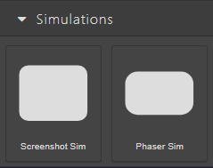

# 12 — Simulations Overview

A **simulation** is an interactive activity where the learner practises a task before doing it for real. eLearn Studio offers two kinds of simulation, each suited to a different teaching goal. This chapter helps you choose between them; the next two chapters show you how to build each one.

<!-- screenshot: 12-simulations-category.png (1x, <300KB, left sidebar cropped to the Simulations category showing both block icons) -->

*The two simulation blocks as they appear in the Blocks tab.*

---

## The two kinds of simulation

### Software Walkthrough

A **Software Walkthrough** guides the learner through a real-world software task by replaying screenshots of the application. The learner clicks, hovers, or types where the author has marked a hotspot; the simulation advances one step at a time.

You can build one in three ways: record the steps live from the real application, import a previous recording session, or upload screenshots manually one at a time. All three paths land in the same step list — see [13 — Software Walkthrough](13-software-walkthrough.md) for the details.

**Use it when** you need to teach *"how to do X in this specific tool"* — for example: open a support ticket, complete a form, run a report, follow a safety procedure on a dashboard.

**Keyword:** *guided imitation*. The learner imitates the exact steps of a real task.

Full chapter: [13 — Software Walkthrough](13-software-walkthrough.md).

### Interactive Scenario

An **Interactive Scenario** is an animated activity powered by a game engine. Instead of replaying screenshots, the learner interacts with nodes, diagrams, or quiz-style game mechanics. You configure the scenario visually with structured builders (nodes, edges, hotspots, quiz questions), or directly in the **Scene Definition** field for advanced cases.

**Use it when** you need to teach concepts, decision-making, or process understanding that don't map to a real application — for example: a triage decision tree, labelling an anatomical diagram, a timed knowledge-check game.

**Keyword:** *active exploration*. The learner explores a custom environment and makes decisions.

Full chapter: [14 — Interactive Scenario](14-interactive-scenario.md).

---

## Decision table — which one to use

| Teaching goal | Choose… | Why |
|---|---|---|
| "Show me exactly how to complete this task in Software X." | Software Walkthrough | Real screenshots make the transfer to production immediate. |
| "Teach me to recognise the parts of a machine." | Interactive Scenario → *Interactive Diagram* | Hotspots over a labelled diagram fit the goal naturally. |
| "Train me to make the right call under pressure." | Interactive Scenario → *Gamified Quiz* | Timer + lives + scoring match the pressure of a real decision. |
| "Practise a step-by-step process like ticket triage." | Interactive Scenario → *Process Flow* | Nodes and edges model the process visually, with checkpoints. |
| "Demonstrate a physics concept visually." | Interactive Scenario → *Physics Demo* | Built-in physics engine animates the concept automatically. |
| "Animate a concept sequence (growth of a plant, data flow)." | Interactive Scenario → *Concept Animator* | Frame-by-frame animation optimised for abstract concepts. |
| "Let the learner try the real app safely before going live." | Software Walkthrough | Screenshots of the production app are the closest you can get to the real thing without risk. |

---

## Both simulations share three modes

Whichever type you pick, each simulation supports the same three modes. You set the mode once per simulation in its Props panel.

| Mode | Behaviour | When to use |
|---|---|---|
| **Demo** | The simulation plays automatically without learner input. | A quick walkthrough on an intro slide. |
| **Practice** | The learner interacts; wrong steps show a hint and allow retry. | Formative learning — most course simulations. |
| **Assessment** | The learner interacts; wrong steps count against the score; no hints. | Graded evaluation near the end of the course. |

Both simulation types also use a **Passing Score** setting (0–100). It defines what counts as success for scoring purposes.

---

## What to do next

- To build a **Software Walkthrough**: [13 — Software Walkthrough](13-software-walkthrough.md).
- To build an **Interactive Scenario**: [14 — Interactive Scenario](14-interactive-scenario.md).
- Look up any term from this chapter in the [20 — Glossary](20-glossary.md).
