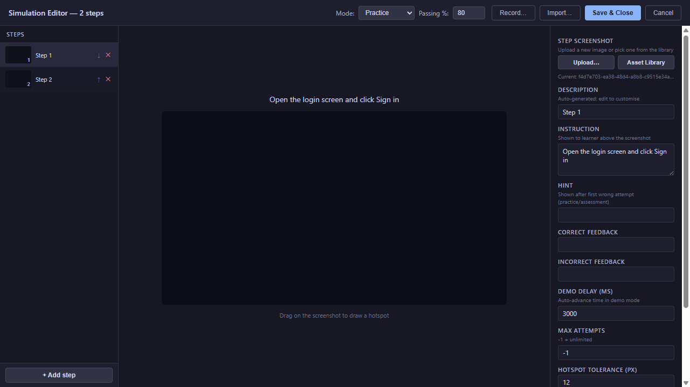
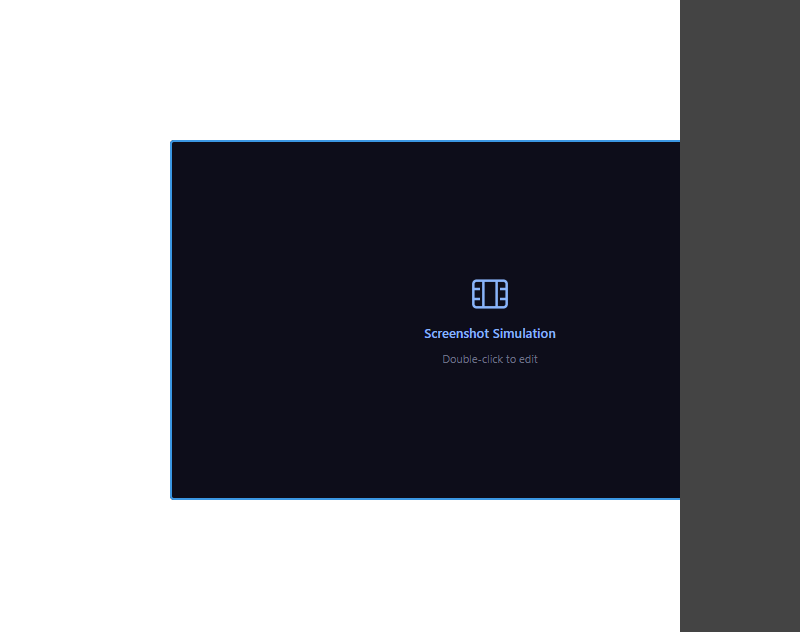
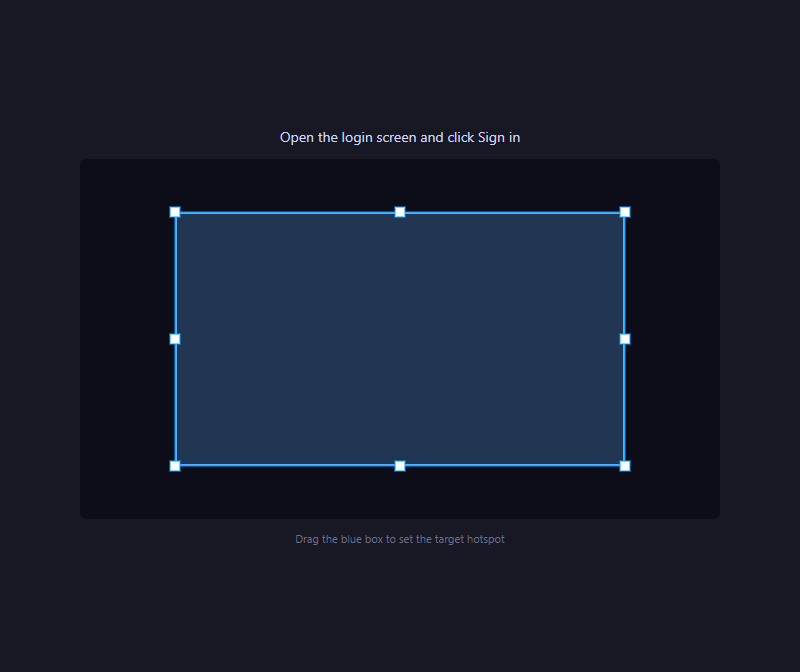

# 13 — Software Walkthrough

A **Software Walkthrough** is a guided sequence of screenshots that teaches the learner to use a real application, one step at a time. The author captures screens from the real tool, marks a hotspot on each one (the area the learner must click, hover over, or type into), and writes an instruction. At runtime, the learner works through the steps in order, with mode-specific feedback.

<!-- screenshot: 13-overview.png (1x, <300KB, Software Walkthrough overlay open on a sample session, showing the three-column layout: step list, screenshot canvas with hotspot, step form) -->

*The Software Walkthrough editor. (1) Step list on the left; (2) screenshot with hotspot overlay in the centre; (3) step form on the right; (4) header with mode and passing score.*

---

## The block

The **Software Walkthrough** (also labelled **Screenshot Sim** in the Blocks tab) lives in the **Simulations** category. When you drag it onto the canvas, it shows a dark placeholder with a film-strip icon. Double-click it to open the full editor overlay.

<!-- screenshot: 13-block-placeholder.png (1x, <300KB, canvas with a Software Walkthrough block placed, showing the placeholder graphic) -->

*A Software Walkthrough block on the canvas before editing. Double-click to open the editor.*

---

## Creating a walkthrough

1. Drag **Screenshot Sim** from the **Blocks** tab onto your slide.
2. Resize and position the block where you want the simulation to appear at runtime.
3. **Double-click** the block. The Software Walkthrough editor opens full-screen.
4. The editor shows three columns: the **step list**, the **screenshot canvas** with hotspot overlay, and the **step form**. Above them, the header shows the Mode selector, the Passing Score input, and four buttons: **Record…** (capture steps live from a real application), **Import…** (open a previous recording session), **Save & Close**, and **Cancel**.

### Adding steps

Each step is one screen the learner sees. You add steps in one of three ways: record them live from a real application, import a previous recording, or upload screenshots manually one at a time.

1. With the editor open, click **+ Add step** at the bottom of the step list.
2. In the right panel's **Step screenshot** field, click **Upload…** to pick an image from your computer, or **Asset Library** to pick one already in the course.
3. The screenshot appears in the centre canvas.
4. Edit the step's fields in the right panel — see [Step fields](#step-fields) below.
5. Save the step.

Repeat for every step of the task. Steps run in the order shown in the left column — drag them up or down to reorder, or use the ↑ ↓ buttons on each step (keyboard: focus a step and press Alt+↑ / Alt+↓).

> 💡 **Tip:** To capture many steps quickly from a real tool, click **Record…** in the header and follow the recorder. Each click in the recorded application becomes one step in the walkthrough, with the screenshot pre-filled. You can then edit instructions, hints, and hotspots step by step.

---

## Marking a hotspot

A **hotspot** is the region of the screenshot the learner has to interact with. You draw it over the screenshot and set how the learner should interact (click, hover, or type).

<!-- screenshot: 13-hotspot-editor.png (1x, <300KB, centre canvas of the editor with a screenshot loaded and a rectangular hotspot drawn over a button on the screenshot) -->

*Drawing a rectangular hotspot over the target area of the screenshot. (1) Hotspot rectangle; (2) tolerance controls the click-accuracy tolerance.*

1. Select the step in the step list.
2. In the centre canvas, drag a rectangle over the area on the screenshot the learner must interact with.
3. Adjust the rectangle's size by dragging its corner handles. Leave a small margin around the target so the hotspot is forgiving.
4. In the step form, choose the **Interaction type**: *Click*, *Hover*, or *Type text*.
5. If the interaction is *Type text*, fill in the **Expected text** (the string the learner must type to succeed).
6. Save the step.

> ℹ️ **Note:** If you need to redo a hotspot, click the **Clear hotspot** button in the step form. The rectangle resets and you can drag a new one on the screenshot.

> 💡 **Tip:** A hotspot should be slightly larger than the visible target. A button that looks like 30 × 20 px is often easier to hit as a 40 × 30 px hotspot. This respects the **tolerance** the simulation allows.

---

## Step fields

Every step has a common set of fields you configure in the right panel.

| Field | What it does | Notes |
|---|---|---|
| **Step screenshot** | The image the learner sees for this step. | Set with the **Upload…** or **Asset Library** buttons above the field. |
| **Description** | Internal description of the step. Not shown to the learner. | Auto-generated when the step is recorded or uploaded; edit to customise. |
| **Instruction** | The text shown to the learner, telling them what to do. | Short and specific — e.g. *"Click the New Ticket button."* |
| **Hint** | Shown after the learner's first wrong attempt, in Practice mode. | Keep it supportive, not sarcastic. |
| **Correct feedback** | Shown after a correct action. | Short confirmation — *"Good. Now…"* |
| **Incorrect feedback** | Shown after a wrong action (in Assessment mode) or after the last allowed attempt. | Explain *why* the answer was wrong. |
| **Demo delay (ms)** | How long (in milliseconds) the step is shown in Demo mode before auto-advancing. | Typical values: 2 000–5 000 ms. |
| **Max attempts** | How many tries the learner has before the step is marked wrong. `-1` = unlimited. | Use a finite number in Assessment mode. |
| **Hotspot tolerance (px)** | How many pixels of slack the hotspot allows around its edges. | Higher tolerance = more forgiving click target. |
| **Hotspot** | The target rectangle drawn on the screenshot. | The **Clear hotspot** button resets it so you can redraw. |
| **Interaction type** | Click / Hover / Type text. | Determines what the learner must do on the hotspot. |
| **Expected text** | For *Type text* interactions: the literal text the learner must type. | Only visible when Interaction type = *Type text*. |

---

## Mode and passing score

The editor header has two global controls that apply to every step of the walkthrough.

### Mode

| Mode | Learner experience |
|---|---|
| **Demo** | Plays automatically. No input required. Each step shows for its *Demo delay*, then auto-advances. |
| **Practice** | Learner interacts on each step. Wrong attempts show the **Hint** and allow retry up to **Max attempts**. |
| **Assessment** | Learner interacts on each step. Wrong attempts count against the final score. No hints. |

### Passing Score

A number from 0 to 100 that defines success for the whole walkthrough. The learner passes if their final score (computed from correct steps) is at least this value.

> ℹ️ **Note:** In Demo mode the Passing Score has no effect — demos are always successful since the learner does not interact.

---

## Saving and previewing

1. When you've added all the steps you need, set the **Mode** and **Passing Score** in the header.
2. Click **Save & Close** to return to the slide editor.
3. The block on the canvas now represents the saved simulation. Use the [Preview](15-preview.md) button in the top toolbar to see how it plays for a learner.

> ⚠️ **Important:** Always preview a walkthrough end-to-end before publishing. Step ordering problems, wrong hotspot regions, or unreachable steps are invisible from the step list — they only surface during real playback.

---

## What to do next

- If you need an animated, game-like activity instead: [14 — Interactive Scenario](14-interactive-scenario.md).
- Try your simulation in a browser: [15 — Preview](15-preview.md).
- Look up any term in the [20 — Glossary](20-glossary.md).
