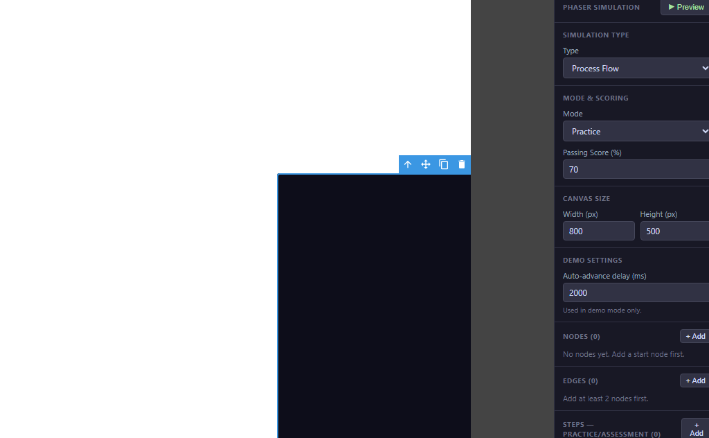
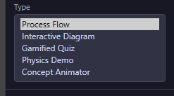
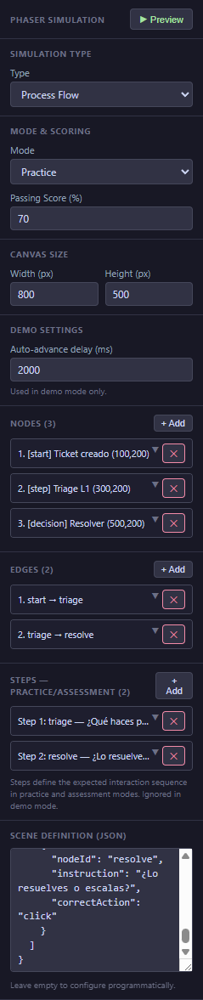
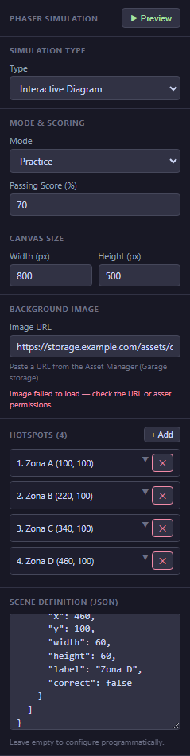
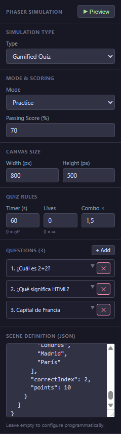
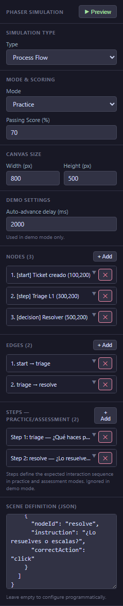

# 14 — Interactive Scenario

An **Interactive Scenario** is an animated, game-like activity powered by a game engine. Instead of replaying screenshots (as a [Software Walkthrough](13-software-walkthrough.md) does), the learner interacts with custom nodes, diagrams, or quiz mechanics you design visually in the Props panel. This chapter covers the five scenario types, how to build each one, and an important limitation you should be aware of in the current version.

<!-- screenshot: 14-block-placeholder.png (1x, <300KB, canvas with an Interactive Scenario block placed, showing the dark placeholder with the controller icon) -->

*An Interactive Scenario block on the canvas. Double-click to open its preview; design its content from the Props panel on the right.*

---

> ⚠️ **Known limit in v0.5.62 — please read.** The underlying game-engine runtime is still a generic placeholder: every scenario you publish today plays as a simple dark canvas with the scenario name, and completes automatically after two seconds (with score 100 in Demo and Practice modes, and the Passing Score you set in Assessment mode). **However, every scene definition you create is saved and exported correctly.** When the full scenario renderer ships in a future update, your authored scenes will start rendering as designed — no rework needed. The authoring UI (nodes, edges, hotspots, quiz questions) is fully functional right now.

---

## The five scenario types

Pick the type that matches your teaching goal.

<!-- screenshot: 14-builder-types.png (1x, <300KB, Props panel for a selected Phaser Sim with the Sim Type dropdown open, showing all five types) -->

*The five scenario types, picked in the Props panel.*

| Type | Use it for | Structured builder? |
|---|---|---|
| **Process Flow** | A step-by-step process with clickable nodes — ticket triage, safety procedures, branching decisions. | Yes — nodes, edges, steps. |
| **Interactive Diagram** | Labelling the parts of an image or diagram; anatomy, machine parts, maps. | Yes — background image + hotspots. |
| **Gamified Quiz** | Time-pressured multiple choice with lives, combos, and scoring. | Yes — question list, timer, lives. |
| **Physics Demo** | Visual demonstrations of physics concepts (pendulums, collisions, gravity). | Raw Scene Definition only. |
| **Concept Animator** | Frame-by-frame animation of an abstract concept (data flow, cell division, growth). | Raw Scene Definition only. |

---

## Creating a scenario

1. Drag **Phaser Sim** (labelled *Interactive Scenario*) from the **Simulations** category onto your slide.
2. Select the block. In the **Props** tab, pick the **Sim Type** that matches your teaching goal.
3. Set the **Mode** (*Demo* / *Practice* / *Assessment*), the **Passing Score** (0–100), and the **Canvas** size (Width × Height). Default is 800 × 500 px.
4. Fill in the scenario-specific section that appears below (nodes for Process Flow, hotspots for Interactive Diagram, questions for Gamified Quiz) — see the per-type sections below.
5. Optionally, open the **Scene Definition** field and edit the raw scene as text. This is always available as an advanced fallback.
6. Click **Preview** at the top of the Props panel to open the preview modal and inspect the saved configuration.

---

## Process Flow

A chain of **nodes** connected by **edges**. Each node is a step of a process (start, step, decision, end). Each edge shows the path from one node to the next, with an optional label. You add **steps** (instructions) attached to specific nodes that the learner is asked to complete.

### Props-panel builder

The builder has three sub-sections:

- **Nodes** — each node has an `id`, `x` / `y` position on the canvas, a `label`, and a `type` (`start`, `step`, `decision`, or `end`).
- **Edges** — each edge has an `id`, a `from` node, a `to` node, and an optional `label`.
- **Steps** — each step points to a node, shows an `instruction` to the learner, and sets the `correctAction` (`click` or `hover`).

### Complete scene definition (copy-paste)

```json
{
  "simType": "process-flow",
  "nodes": [
    { "id": "start",   "x": 100, "y": 200, "label": "Ticket created",  "type": "start" },
    { "id": "triage",  "x": 320, "y": 200, "label": "Triage L1",       "type": "step" },
    { "id": "resolve", "x": 540, "y": 200, "label": "Resolve",         "type": "decision" }
  ],
  "edges": [
    { "id": "e1", "from": "start",  "to": "triage" },
    { "id": "e2", "from": "triage", "to": "resolve", "label": "urgent" }
  ],
  "steps": [
    { "id": "s1", "nodeId": "triage",  "instruction": "What do you do first?",             "correctAction": "click" },
    { "id": "s2", "nodeId": "resolve", "instruction": "Decide whether to escalate or fix.", "correctAction": "click" }
  ]
}
```

<!-- screenshot: 14-processflow-builder.png (1x, <300KB, right sidebar showing the ProcessFlow builder section with 3 nodes and 2 edges configured, matching the JSON above) -->

*The Process Flow builder. (1) Nodes list; (2) Edges list; (3) Steps list.*

> 💡 **Tip:** Position nodes with enough horizontal space (at least 200 px apart) so the learner can clearly distinguish one from the next. Place the *start* node on the left and the *end* node on the right for a natural reading order.

---

## Interactive Diagram

A background image with clickable **hotspots** on top of it. Each hotspot is a circular region with a `label`, a `description`, and optionally marked as `isCorrect` (for scoring).

### Props-panel builder

- **Background image URL** — pick an image from the Asset Library, or type a URL.
- **Hotspots** — a list of circles. Each hotspot has an `id`, an `x` / `y` centre, a `radius`, a `label`, a `description`, and the optional `isCorrect` flag.

### Complete scene definition (copy-paste)

```json
{
  "simType": "interactive-diagram",
  "backgroundImageUrl": "/assets/engine-diagram.png",
  "width": 800,
  "height": 500,
  "hotspots": [
    { "id": "h1", "x": 220, "y": 160, "radius": 28, "label": "Piston",    "description": "Converts pressure into motion.",                "isCorrect": false },
    { "id": "h2", "x": 410, "y": 180, "radius": 32, "label": "Crankshaft","description": "Transforms linear motion into rotation.",        "isCorrect": true  },
    { "id": "h3", "x": 560, "y": 220, "radius": 24, "label": "Flywheel",  "description": "Stores rotational kinetic energy.",             "isCorrect": false },
    { "id": "h4", "x": 640, "y": 120, "radius": 20, "label": "Intake",    "description": "Where the air-fuel mixture enters the cylinder.","isCorrect": false }
  ]
}
```

<!-- screenshot: 14-diagram-builder.png (1x, <300KB, right sidebar showing the Diagram builder with a background image URL set and four hotspots configured) -->

*The Interactive Diagram builder. (1) Background image URL; (2) Hotspots list with isCorrect flag.*

> ℹ️ **Note:** Only one hotspot should have `isCorrect: true` per learning goal. If you need several correct hotspots (e.g. *"Click every valve"*), mark them all as correct — the scoring counts any number of correct hotspots chosen.

---

## Gamified Quiz

A timed multiple-choice game with lives and a combo multiplier. Good for fast recall under pressure.

### Props-panel builder

- **Questions** — a list of quiz questions. Each question has an `id`, a `text`, `options` (an array of strings), a `correctIndex` (which option is right), and a `pointValue`.
- **Timer** — total seconds for the whole quiz (optional).
- **Initial lives** — how many mistakes the learner can make before the game ends (optional).
- **Combo multiplier** — score multiplier for consecutive correct answers (optional).

### Complete scene definition (copy-paste)

```json
{
  "simType": "gamified-quiz",
  "timerSeconds": 60,
  "initialLives": 3,
  "comboMultiplier": 1.5,
  "questions": [
    {
      "id": "q1",
      "text": "Which port does HTTPS use by default?",
      "options": ["21", "80", "443", "8080"],
      "correctIndex": 2,
      "pointValue": 10
    },
    {
      "id": "q2",
      "text": "Which of these is NOT a primary colour?",
      "options": ["Red", "Green", "Blue", "Yellow"],
      "correctIndex": 3,
      "pointValue": 5
    },
    {
      "id": "q3",
      "text": "What does 'CPU' stand for?",
      "options": ["Central Power Unit", "Central Processing Unit", "Core Processor Utility", "Compute Parallel Unit"],
      "correctIndex": 1,
      "pointValue": 10
    }
  ]
}
```

<!-- screenshot: 14-quiz-builder.png (1x, <300KB, right sidebar showing the Gamified Quiz rules section with timer, lives, combo multiplier, and three questions configured) -->

*The Gamified Quiz builder. (1) Timer / lives / combo settings; (2) Question list.*

---

## Physics Demo and Concept Animator

These two scenario types do **not** have a structured builder yet — you author them directly in the **Scene Definition** field as raw text. Use them when you have a very specific visual requirement that the other three types don't cover.

For both types, the scene definition starts with:

```json
{
  "simType": "physics-demo"
}
```

or

```json
{
  "simType": "concept-animator"
}
```

and continues with the structure your scenario needs (see your scenario author's specification).

> ⚠️ **Important:** Because of the known runtime limit noted at the top of this chapter, neither Physics Demo nor Concept Animator yet render the full animation — both play as the generic placeholder for now, just like the other three types. Your scene definition is saved and exported correctly.

---

## The Scene Definition field — your advanced fallback

Every scenario type has a **Scene Definition** text box in the Props panel. It shows the raw data of the current scenario — the same data the structured builders edit above. For Process Flow, Interactive Diagram, and Gamified Quiz, you rarely need to touch it; for Physics Demo and Concept Animator, it is where you do all your work.

<!-- screenshot: 14-json-example.png (1x, <300KB, Props panel with the Scene Definition field visible, showing formatted JSON of a Process Flow example) -->

*The Scene Definition field. For advanced cases or when you want to copy a scene between projects.*

### How to use it

1. Scroll to the bottom of the Props panel.
2. Paste a complete scene definition (for example, any of the snippets above) into the field.
3. The change is saved automatically; the structured builder updates to match.

---

## Mode and Passing Score

Exactly like Software Walkthrough, every Interactive Scenario has a Mode and a Passing Score setting at the top of its Props panel.

| Mode | Behaviour (post-v0.5.62) |
|---|---|
| **Demo** | Auto-completes after 2 seconds with score 100. |
| **Practice** | Auto-completes after 2 seconds with score 100. |
| **Assessment** | Auto-completes after 2 seconds with score equal to the Passing Score. |

> ℹ️ **Note:** The Mode values above are how the placeholder behaves in v0.5.62. When the full renderer ships, learners will interact in real time and the score will reflect their performance.

---

## What to do next

- Try the scenario in a browser: [15 — Preview](15-preview.md).
- Publish your course with the scenario included: [16 — Publish as SCORM](16-publish-scorm.md).
- If the Software Walkthrough approach fits your task better: [13 — Software Walkthrough](13-software-walkthrough.md).
- Look up any term in the [20 — Glossary](20-glossary.md).
