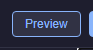
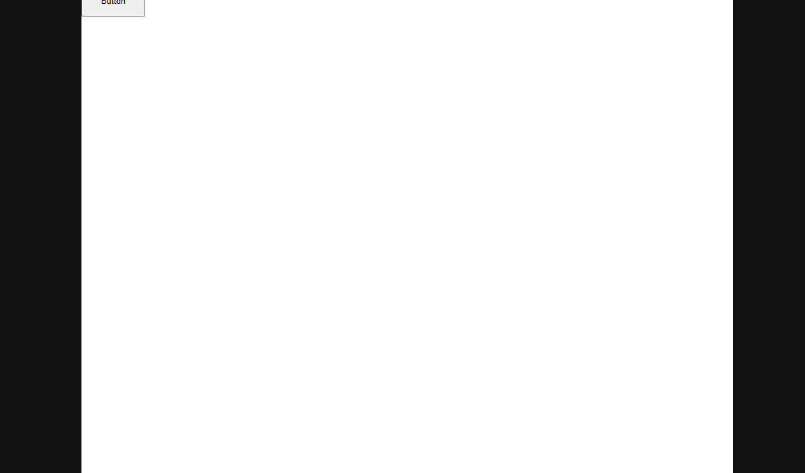

# 15 — Preview

**Preview** opens your course in a new browser window exactly as a learner would see it, without publishing. Use it whenever you want to try a slide, test an action you just wired, or check that a question is graded the way you expect. Preview is free, unlimited, and does not touch your Learning Management System.

<!-- screenshot: 15-preview-button.png (1x, <300KB, top toolbar cropped to show the Preview button, next to Publish SCORM) -->

*The Preview button in the top toolbar. Click it any time you want to try your course.*

---

## What Preview does

When you click **Preview**:

1. A new browser window opens and loads the course player.
2. The player starts from the slide you have selected in the editor.
3. Every block, action, question, and simulation behaves the way it will for a real learner.

### No need to save first

Preview uses the version of the course that is **currently open in the editor**, including any edits you have made since the last auto-save. You do **not** need to manually save before previewing — changes are picked up immediately from the editor's in-memory state.

### Every action works

Actions you have wired — *Navigate*, *Show / Hide*, *Play Media*, *Set Variable*, *If / Else* branches, shared sequences — all run exactly as they will in the published course. The only difference from a real learner's experience is that nothing is reported to your Learning Management System (there is no LMS behind Preview).

<!-- screenshot: 15-popup-rendered.png (1x, <300KB, preview popup window with a sample slide rendered, showing a title, an image, and a Next button) -->

*The Preview popup window. (1) The current slide rendered in full player mode; (2) built-in nav controls (depending on your course's navigation settings).*

---

## Using Preview

1. Select the slide you want to start from in the **Slides** tab. (If you start from slide 3, Preview opens at slide 3.)
2. Click **Preview** in the top toolbar.
3. A new browser window appears with your course running.
4. Click through the course as a learner would. Test the actions you just configured.
5. When you are done, close the Preview window. You do not need to return to the editor — the editor has kept your place.

> 💡 **Tip:** Preview is the single most effective way to catch problems before publishing. Make it part of your regular authoring rhythm — every time you add a non-trivial action, click Preview and try it.

---

## Allowing popups

Preview opens in a new window, so your browser must allow popups for the site. Most browsers block popups by default; they also show a small icon in the address bar when a popup is blocked.

### If the Preview window does not appear

1. Look at the address bar of your current window. If you see a small popup-blocked icon, click it.
2. Choose **Always allow popups from this site** (wording varies by browser).
3. Close that prompt and click **Preview** again — the window should now appear.

If the option is not available in your browser, open your browser settings and add the site to the list of sites that may show popups. The exact wording depends on the browser.

> ⚠️ **Important:** The browser opens a popup only when you click Preview yourself. Automated tools that open Preview without a user click will be blocked every time — this is a browser-level protection that cannot be bypassed.

---

## When Preview shows an error

Occasionally the Preview popup opens but shows an error banner instead of your course. This happens when the course has a configuration problem that prevents the player from rendering at all — for example, a required field missing from a slide, or a broken scene definition on an [Interactive Scenario](14-interactive-scenario.md).

### What to do

1. Close the Preview popup.
2. Go back to the editor and look at the **Props** and **Actions** panels of each slide for anything marked in red (invalid values, unfinished edits).
3. Check that every block referenced by an action still exists on the slide — if you deleted a block but left an action pointing to it, the action cannot resolve its target.
4. Fix the problem, then click **Preview** again.

> ℹ️ **Note:** Preview runs the course fully inside your browser — no server, no LMS. It is the safest way to try things; nothing it does affects learners or scores in a real LMS.

---

## What Preview does not do

- **Preview does not report scores to your LMS.** Scores are only reported when the course is published as SCORM and a learner opens it inside the LMS. See [16 — Publish as SCORM](16-publish-scorm.md).
- **Preview does not persist suspend data.** When you close the Preview window, the course's session state is discarded. A real learner's session state is saved by the LMS.
- **Preview does not replicate LMS look-and-feel.** Your LMS may wrap the course in its own header, sidebar, or completion controls. Preview shows the course alone.

---

## What to do next

- Once Preview looks the way you want, publish the course: [16 — Publish as SCORM](16-publish-scorm.md).
- If Preview is showing stale data, try adding a new slide or editing a block — the editor's auto-save ensures the next Preview picks up every change: [03 — Slides](03-slides.md).
- Look up any term in the [20 — Glossary](20-glossary.md).
