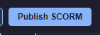
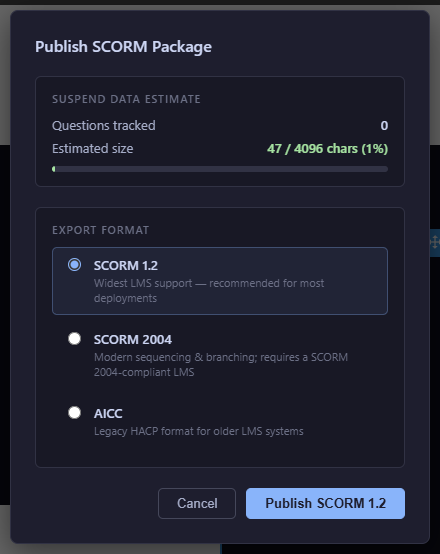
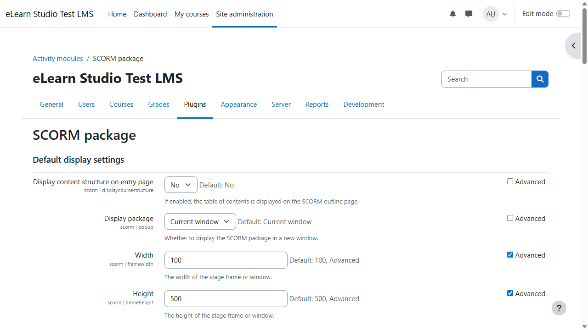

# 16 — Publish as SCORM

When your course is ready, **publish** it to produce a ZIP file you can upload to your Learning Management System. The file contains everything a learner needs (slides, images, audio, logic) and reports the learner's progress and score to the LMS via **SCORM**, the standard packaging format for e-learning content.

<!-- screenshot: 16-publish-button.png (1x, <300KB, top toolbar cropped to show the Publish SCORM button) -->

*The Publish SCORM button in the top toolbar. Click it when you are ready to package your course.*

---

## Before you publish — the Done Button recap

For your LMS to record completion and scores, your course must include a **Done Button** on its final slide. Pressing Done is what tells the LMS *"this learner has finished"*. A course without a Done Button often shows up as "in progress" forever in the LMS, and the final score may never reach it.

See [05 — Navigation Blocks → Done Button](05-blocks-navigation.md#done-button) for the full explanation and setup.

> ⚠️ **Important:** Preview the course from the first slide all the way through to pressing the Done Button before you publish. This catches the most common publishing problem: a course that runs but never completes.

---

## Choose a format — a three-question decision guide

eLearn Studio publishes in three formats: **SCORM 1.2**, **SCORM 2004**, and **AICC**. They all do the same thing at a high level — package your course for an LMS — but they differ in age and in what each LMS supports. Ask yourself these three questions, in order, to pick the right one.

### 1. Has your LMS administrator recommended a format?

If someone in your organisation responsible for the LMS has told you which format to use, **follow their recommendation**. You can stop here. The three questions below are only for the case where nobody has told you what to use.

### 2. Are you publishing to a general-purpose LMS?

Examples of general-purpose learning platforms: **Moodle**, **Canvas**, **Blackboard**, **Totara**, **TalentLMS**, **LearnDash**, **Docebo**, **Cornerstone**, and most modern LMSs.

**→ Choose SCORM 1.2.** It is the most widely supported format and works on practically every LMS in use today. If you are not sure, this is the safe default.

### 3. Do you work in a regulated or legacy environment that asked for AICC?

Some older or industry-specific environments (regulated training, aviation, some government systems) require **AICC** for historical reasons.

**→ Choose AICC only if your LMS or compliance policy explicitly requires it.** Otherwise, skip this option.

### What about SCORM 2004?

Pick **SCORM 2004** only when your LMS administrator recommends it or your LMS documentation lists it as the preferred format. SCORM 2004 gives the LMS slightly richer information (more detailed tracking of partial progress and interactions), but not every LMS supports it correctly.

### Quick summary

| If… | Choose |
|---|---|
| Your LMS administrator has recommended a format | Whichever they said |
| You publish to Moodle, Canvas, Blackboard, or another general LMS | **SCORM 1.2** |
| Your LMS administrator recommends SCORM 2004 | **SCORM 2004** |
| Your LMS requires AICC specifically | **AICC** |
| You are not sure, and nobody has told you | **SCORM 1.2** |

---

## Publishing step by step

<!-- screenshot: 16-publish-dialog.png (1x, <300KB, Publish SCORM dialog open, showing the three format radio buttons and the Publish button) -->

*The Publish dialog. (1) SCORM 1.2 radio; (2) SCORM 2004 radio; (3) AICC radio; (4) Publish button.*

1. Make sure every slide is the way you want it. Run [Preview](15-preview.md) one last time from the first slide to the Done Button.
2. In the top toolbar, click **Publish SCORM**. The Publish dialog opens.
3. Pick a **format** using the radio buttons (see the decision guide above). The Publish button's label updates with the format you chose — for example, *Publish SCORM 1.2*.
4. Click **Publish**. A status section appears and shows progress: *Generating SCORM package…*
5. When packaging finishes, the status reads *Download ready* and a ZIP file starts downloading. The filename includes your course title and the date.
6. Click **Close** to dismiss the dialog.

### If publishing fails

If the status area shows an error instead of *Download ready*, read the message. The two most common causes:

- **A slide references an asset that has been deleted.** Go to that slide, find the broken reference, and replace the image or audio. Then publish again.
- **A question has an empty answer or no correct option marked.** Open the question's Props panel and complete the missing fields.

Fix the problem, then click **Publish** again.

---

## Upload the ZIP file to your LMS

The exact steps depend on which LMS you use, but the overall flow is the same.

<!-- screenshot: 16-lms-upload-placeholder.png (1x, <300KB, representative LMS admin page showing "Upload SCORM package" or equivalent; use any general LMS admin UI) -->

*Uploading a SCORM package to an LMS (representative example — your LMS may look different).*

1. Sign in to your LMS as an author or administrator.
2. Go to the place where courses are managed. This is often called *Course management*, *Content library*, or *SCORM packages*.
3. Choose **Upload SCORM package** (the exact wording varies — some LMSs call it *Import content* or *New activity*).
4. Select the ZIP file you just downloaded from eLearn Studio.
5. The LMS unpacks the ZIP, creates a new activity, and usually shows a success message.
6. Publish or enrol learners as your LMS requires.

> 💡 **Tip:** Always try the uploaded course yourself first, with a test learner account, before enrolling real learners. Catch any LMS-specific issue before it reaches your audience.

### What learners see

- When a learner opens the course from the LMS, their session starts from slide 1 (or from where they left off, if they returned after suspending).
- Their interactions are tracked by the LMS: progress, score, completion status.
- When they press **Done**, the LMS records completion and the final score.

---

## What if the same course needs to be published again?

After changes, publish again and upload the new ZIP to your LMS. Most LMSs have a *Replace content* option that preserves existing learner enrolments while updating the course. Check your LMS documentation for the exact steps.

> ⚠️ **Important:** If a learner is mid-way through a course when you replace it, their session state may not map cleanly onto the new version (slides added, removed, or renumbered). Announce planned updates so learners can finish the current version first where possible.

---

## What to do next

- See the complete life cycle of a course built and published from scratch: [17 — Worked Example](17-worked-example.md).
- If something unexpected happens at publish time or in the LMS: [18 — Troubleshooting](18-troubleshooting.md).
- Look up any term in the [20 — Glossary](20-glossary.md).

---

## Technical notes (optional)

*You can skip this section. It is only for readers who need to know what the ZIP actually contains.*

Every SCORM package is a ZIP file with your course's HTML and assets, plus a manifest file that the LMS reads to understand the structure. The three formats differ in how they describe that structure:

- **SCORM 1.2** uses a simple manifest and a small set of tracking fields. Introduced 2001, still the most compatible.
- **SCORM 2004** uses a richer manifest that supports more detailed interaction tracking and sequencing rules.
- **AICC** is an older format that pre-dates SCORM and uses a different file layout.

eLearn Studio generates each format automatically from the same course — you do not edit the manifest yourself.
