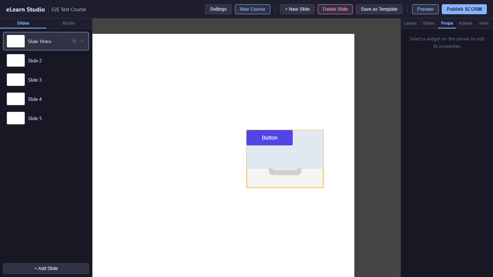
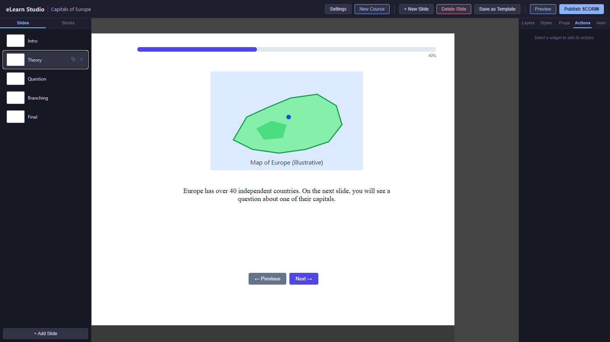
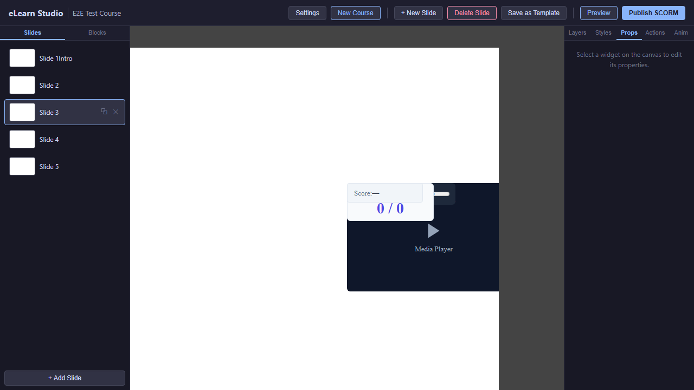
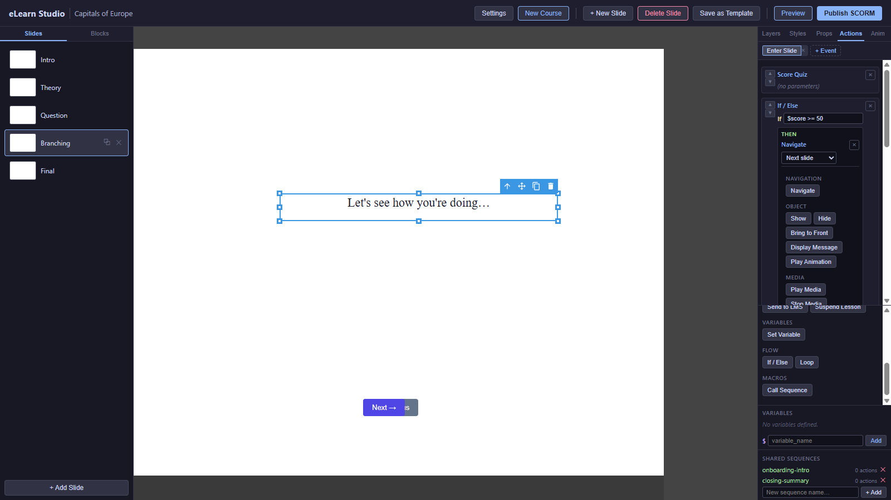
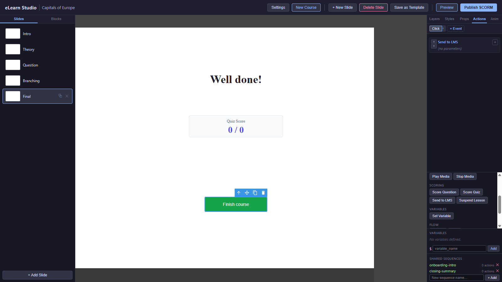

# 17 — Worked Example

This chapter walks you through building a complete five-slide course from scratch, using every concept you've met so far — slides, blocks, actions, expressions, questions, scoring, and publishing. Treat it as a recipe: follow the steps in order, replace the sample text with your own content, and by the end you will have a working, publishable course.

The course teaches *"Capitals of Europe"* — a simple knowledge-check you can adapt to any topic.

### Course outline

1. **Intro** — title and a Start button.
2. **Theory** — an image, an explanation, and navigation.
3. **Question** — one Multiple Choice question.
4. **Branching** — the course decides whether the learner moves on or sees a review message.
5. **Final** — the running score, a Done button, and the report to your Learning Management System.

> 💡 **Tip:** Give every block you create a clear **Name** in the **Props** tab. You'll reference these names from the Actions Editor. See [09 — Naming your blocks](09-actions-editor.md#naming-your-blocks).

---

## Before you start

1. Sign in and create a new course titled *Capitals of Europe*.
2. The first slide is created automatically.
3. Open the **Slides** tab on the left sidebar and add four more slides so you have slides 1 through 5. Rename them (double-click in the slide list):
   - Slide 1 → *Intro*
   - Slide 2 → *Theory*
   - Slide 3 → *Question*
   - Slide 4 → *Branching*
   - Slide 5 → *Final*

---

## Slide 1 — Intro

### What it teaches

The course title and a single button that starts the lesson.

### Blocks to place

| Block | Props values |
|---|---|
| **Text** | Name: *IntroTitle*. Content: *"Capitals of Europe — Quick Quiz"*. Styled at 36 px, centred, dark colour. |
| **Text** | Name: *IntroSubtitle*. Content: *"Test how well you know the capitals of European countries."*. Styled at 18 px, grey. |
| **Button** | Name: *StartBtn*. Label: *"Start"*. Placed centre-bottom. |

### Actions to wire

On **StartBtn** — trigger `click`:

1. `Navigate → Next slide`

<!-- screenshot: 17-slide-1-final.png (1x, <300KB, full canvas + right sidebar visible with Actions tab on StartBtn showing the Navigate action configured; dark theme; realistic content as above) -->

*Slide 1 with the title, subtitle, and Start button placed and wired.*

For block placement details: [04 — Basic Blocks](04-blocks-basic.md). For the action: [10 — Navigate](10-actions-triggers-reference.md#navigate).

---

## Slide 2 — Theory

### What it teaches

A short piece of theory the learner reads before answering, with consistent navigation.

### Blocks to place

| Block | Props values |
|---|---|
| **Image** | Name: *MapImage*. Source: a map of Europe from your Asset Library. Alt text: *"Map of European countries."* |
| **Text** | Name: *TheoryText*. Content: *"Europe has over 40 independent countries. On the next slide, you will see a question about one of their capitals."*. Styled at 18 px. |
| **Nav Buttons** | Name: *TheoryNav*. Default labels *← Previous* and *Next →*. Placed bottom. |
| **Progress Bar** | Name: *CourseProgress*. Colour indigo. Height 12 px. Show percent on. Placed top. |

### Actions to wire

No custom actions needed on this slide — the **Nav Buttons** and **Progress Bar** work out of the box.

<!-- screenshot: 17-slide-2-final.png (1x, <300KB, full canvas + right sidebar with the Theory slide completed: map image, paragraph, Nav Buttons, Progress Bar showing ~40%; dark theme) -->

*Slide 2 with the map, theory text, navigation, and progress bar.*

For blocks: [05 — Navigation Blocks](05-blocks-navigation.md).

---

## Slide 3 — Question

### What it teaches

A single Multiple Choice question with scoring and feedback.

### Blocks to place

| Block | Props values |
|---|---|
| **Multiple Choice** | Name: *Q1Capital*. Question text: *"What is the capital of Germany?"*. Options: *Berlin* (correct), *Munich*, *Frankfurt*, *Hamburg*. Points: 100. Attempts: 2. Required: Off. Feedback correct: *"Correct! Berlin has been Germany's capital since 1990."*. Feedback incorrect: *"Not quite. Try again — think of Germany's largest city."* |
| **Nav Buttons** | Name: *QuestionNav*. Default labels. Placed bottom. |
| **Progress Bar** | Copy from Slide 2 (or use a course-wide template). |

### Actions to wire

On **Q1Capital** — trigger `questionCorrect`:

1. `Score Question → Q1Capital`

<!-- screenshot: 17-slide-3-final.png (1x, <300KB, full canvas + right sidebar with the question block rendered showing 4 radio options, Props panel showing scoring/feedback settings; dark theme) -->

*Slide 3 with the Multiple Choice question wired to Score Question on correct answer.*

For the question settings: [08 — Questions](08-blocks-questions.md). For the scoring action: [10 — Score Question](10-actions-triggers-reference.md#score-question).

> ℹ️ **Note:** With **Points: 100** and only one question, the learner's score is binary — either 100 (correct) or 0 (incorrect). That's intentional for this example. A longer course would have several questions, each contributing a smaller weight.

---

## Slide 4 — Branching

### What it teaches

The course makes a decision: successful learners move straight to the final slide; others see a short review message and cannot advance.

### Blocks to place

| Block | Props values |
|---|---|
| **Text** | Name: *BranchingNote*. Content: *"Let's see how you're doing…"*. Styled centred, 22 px. |
| **Nav Buttons** | Name: *BranchingNav*. Default labels. Placed bottom. |

### Actions to wire

Select the ***BranchingNote*** block and add the **Enter Slide** event:

1. `Score Quiz`  *(refreshes the running `$score` variable)*
2. `If $score >= 50`
   - `Navigate → By name → Final`
   - `Else` →
     - `Display Message → title: "Review needed", message: "Your score is below 50. Please go back and try the question again."`
     - `Hide → BranchingNav`   *(prevents the learner from advancing via Next)*

> ℹ️ **Note:** Events like **Enter Slide** always live on a block of your choosing — any block on the slide works. They run when the learner arrives at the slide, no matter which block hosts them. Pick a block that makes the logic easy to find later, like the slide's main text.

> 💡 **Tip:** If all you need is "the learner cannot continue until they answer correctly", you don't need this branching at all — turn on **Must answer correctly before advancing** in the question's Scoring section (see [08 — Questions](08-blocks-questions.md)). Use the branching pattern above when you want richer behaviour, like custom messages or jumping to a different slide.

<!-- screenshot: 17-slide-4-final.png (1x, <300KB, full canvas + right sidebar with the Actions panel showing the enterSlide trigger and the If/Else structure with nested actions in both branches; dark theme) -->

*Slide 4 with the enterSlide branching logic configured. (1) enterSlide tab; (2) Score Quiz; (3) If branch with Navigate; (4) Else branch with Display Message + Hide.*

For the branching pattern: [11 — Recipe 2: Decision tree by score](11-actions-expressions-recipes.md#recipe-2--decision-tree-by-score). For the expression syntax: [11 — Expression language](11-actions-expressions-recipes.md#expression-language).

> ⚠️ **Important:** The `Score Quiz` step at the start of the sequence is what populates `$score` from the learner's answer on Slide 3. Without it, the `If` would check an empty value and always go down the *Else* branch.

---

## Slide 5 — Final

### What it teaches

The running score is shown, the learner presses **Done**, and the course is reported to the Learning Management System as complete.

### Blocks to place

| Block | Props values |
|---|---|
| **Text** | Name: *FinalTitle*. Content: *"Well done!"*. Styled at 36 px, centred. |
| **Quiz Score** | Name: *FinalScore*. Title: *"Your score"*. Placed centre. |
| **Done Button** | Name: *FinishBtn*. Label: *"Finish course"*. Placed centre-bottom, visually distinct. |

### Actions to wire

On **FinishBtn** — trigger `click`:

1. `Send to LMS`

<!-- screenshot: 17-slide-5-final.png (1x, <300KB, full canvas + right sidebar with the final slide: title "Well done!", Quiz Score showing a sample score, Done Button wired to Send to LMS; dark theme) -->

*Slide 5 with the running score, Finish button, and the Send to LMS action wired to the Done Button click.*

For scoring blocks: [07 — Assessment Blocks](07-blocks-assessment.md). For the Done Button's importance: [05 — Done Button](05-blocks-navigation.md#done-button). For the action: [10 — Send to LMS](10-actions-triggers-reference.md#send-to-lms).

---

## How to test it

1. From the editor, click **Preview** in the top toolbar. The course opens in a new browser window from Slide 1.
2. Click **Start**. You should arrive at Slide 2.
3. Click **Next**. You should reach the question on Slide 3.
4. Pick **Berlin** and click **Next**. You should skip the review and arrive at Slide 5 with a score of 100.
5. Close the Preview window, go back to the editor, and try the wrong-answer path: pick *Munich* on Slide 3 and click Next. You should land on Slide 4 with the *"Review needed"* message and no way to advance.

For everything Preview can and cannot do: [15 — Preview](15-preview.md).

> 💡 **Tip:** Run Preview both paths (correct and wrong answer) at least once before you publish. The two paths are the two learner experiences — you want to see both yourself before your audience does.

---

## How to publish it

1. Check your course meets the basics: every slide has content, no Props field shows a red border, the Done Button is on Slide 5.
2. Click **Publish SCORM** in the top toolbar.
3. Pick the format your LMS expects — if you are not sure, SCORM 1.2 works almost everywhere.
4. Click **Publish**. Wait for the ZIP file to download.
5. Upload the ZIP to your LMS following its usual course-upload flow.

For the full publish guide: [16 — Publish as SCORM](16-publish-scorm.md).

---

## What to do next

- If something doesn't behave the way you expect, check [18 — Troubleshooting](18-troubleshooting.md).
- Extend the course: add a second question, a shared sequence for "reset state", or a branching quiz with several paths. See [11 — Expressions, Recipes & Shared Sequences](11-actions-expressions-recipes.md).
- Look up any term in the [20 — Glossary](20-glossary.md).
